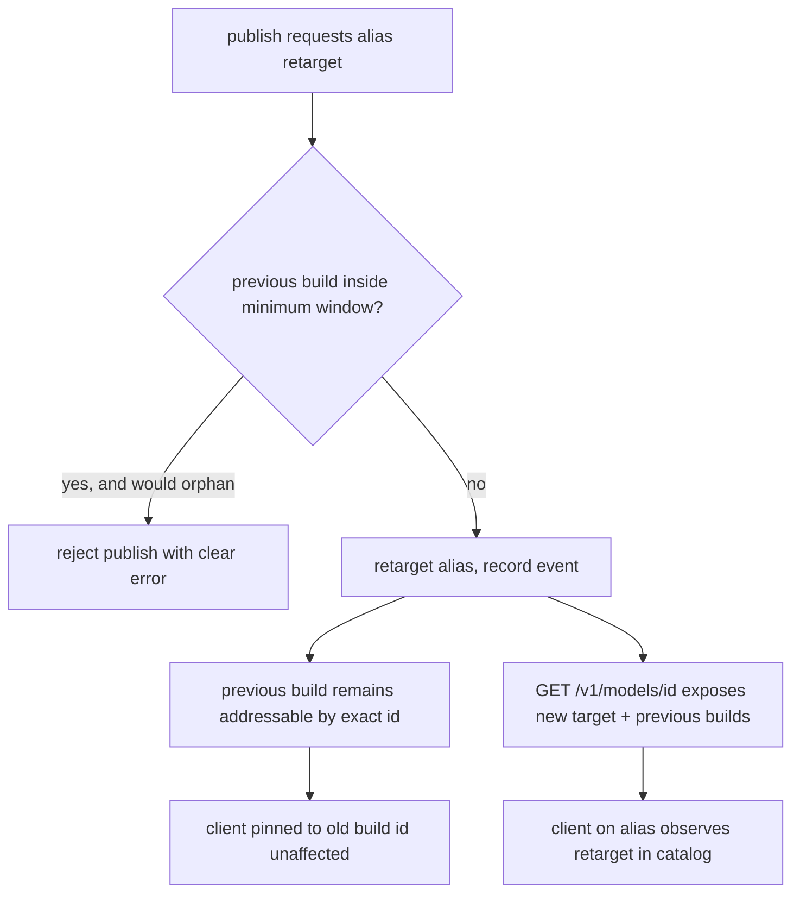

# ORP-080: Canonical-slug / alias stability guarantees

> Last updated: 2026-09-25 · commit `b6f9574ed`

Darkbloom's model aliases retarget between builds with no published stability contract, so an unchanged model id can silently change output behavior. Part of the OpenRouter-perspective review; see the [review index](../README.md).

## What

OpenRouter assigns each model a `canonical_slug` that persists across version changes, giving integrators a stable identifier contract (OpenRouter models API, https://openrouter.ai/docs/api-reference/list-available-models). Darkbloom resolves aliases to concrete builds in `resolveRequestedModel` (`coordinator/api/consumer.go`), and aliases keep Previous builds that power `maybeFallbackAlias` — so retargeting is a designed feature. What is missing is the published contract: when may an alias retarget to a new build, is the old build id kept addressable, for how long, and does the catalog expose the mapping? The publish flow (`scripts/publish-model.sh`) performs retargets with no enforced rules, and `handleListModels` (`coordinator/api/models_endpoints.go`) exposes builds only behind `?include_builds=1` with no statement of their stability.

## Why

A silent alias retarget changes output behavior under an unchanged model id — the hardest class of regression for integrators to catch, because nothing in their request or logs changed. Without a written contract, every integrator must either pin build ids blindly or accept unannounced behavior changes.

## Prompt

Write and enforce an alias stability contract. Goal: (1) a reference doc under `docs/reference/` states the contract — an alias may retarget only at publish events, the previous build id remains addressable for a defined minimum window, the catalog always exposes which build an alias currently resolves to, and consumers pinning an exact build id are never migrated; (2) the publish flow enforces the contract mechanically — `scripts/publish-model.sh` refuses a retarget that would orphan a previous build inside its minimum window, and records the retarget event; (3) the single-model response from `handleGetModel` includes the alias's current build target and its previous builds, so clients can observe retargets without diffing listings. Constraints: (1) the contract doc is the source of truth and every enforced rule in the publish flow cites it; (2) the minimum addressability window is a coordinator config value, not a hardcode; (3) `maybeFallbackAlias` behavior is unchanged — the contract constrains publish-time retargeting, not runtime fallback; (4) the catalog additions are additive fields, consistent with `?include_builds=1` output. Files to touch: new `docs/reference/model-alias-stability.md`, `scripts/publish-model.sh` (retarget validation), `coordinator/api/models_endpoints.go` (current-target/previous-builds in `handleGetModel`), `coordinator/api/types/types.go` (fields), plus tests. Acceptance criteria: the doc exists and is indexed; a publish that violates the window fails with a clear error; `GET /v1/models/{id}` shows the alias's current build and previous builds; tests pin the publish-time validation.

## Workflow

1. Read `resolveRequestedModel` and `maybeFallbackAlias` in `coordinator/api/consumer.go` to pin current retarget semantics.
2. Read `scripts/publish-model.sh` to find where an alias's target build is written.
3. Draft `docs/reference/model-alias-stability.md`: retarget timing, addressability window, observability, pinning guarantee.
4. Add the window to coordinator config.
5. Implement publish-time validation in `scripts/publish-model.sh` citing the doc.
6. Add current-target and previous-builds fields to `handleGetModel` output via `coordinator/api/types/types.go`.
7. Index the new doc in `docs/reference/README.md` and run `make docs-check`.
8. Add tests: publish validation accept/reject, catalog field output.
9. Run `make coordinator-test`.

## Loop

Run `make coordinator-test` and `make docs-check`. Check: a scripted publish inside the window that would orphan the previous build is refused; one outside the window succeeds; `handleGetModel` output reflects the retarget after a successful publish. Definition of done: tests and docs lint green, the enforced rules match the written contract rule for rule.

## Graph

```mermaid
flowchart LR
  DOC[alias stability contract doc] --> PUB[scripts/publish-model.sh validation]
  PUB --> REG[(model registry)]
  REG --> RES[resolveRequestedModel]
  RES --> PREV[Previous builds]
  PREV --> FB[maybeFallbackAlias]
  REG --> GET[handleGetModel target + previous builds]
  GET --> CAT[/v1/models/id]
```

## Layout

- Add `docs/reference/model-alias-stability.md` — the published contract.
- Modify `docs/reference/README.md` — index entry.
- Modify `scripts/publish-model.sh` — retarget window validation.
- Modify `coordinator/api/models_endpoints.go` — alias target/previous builds in `handleGetModel`.
- Modify `coordinator/api/types/types.go` — new response fields.
- Add/extend tests in `coordinator/api`.
- No UI surface.

## Flow



Severity: low · Effort: S
