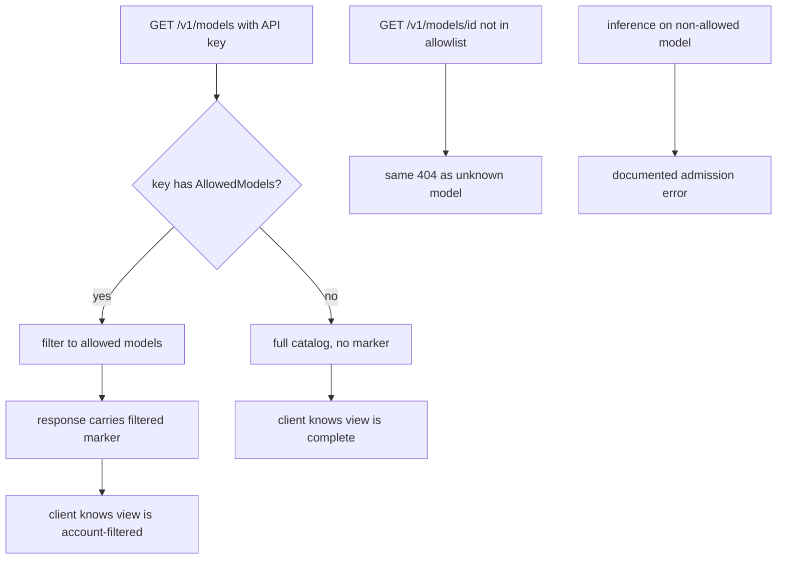

# ORP-081: Account-filtered models view parity

> Last updated: 2026-09-25 · commit `b6f9574ed`

Darkbloom already filters the model listing by the caller's API-key allowlist, but the behavior is undocumented and unpinned by tests, so it reads as a bug to consumers. Part of the OpenRouter-perspective review; see the [review index](../README.md).

## What

OpenRouter's `GET /api/v1/models/user` returns the account-filtered model view explicitly, so a caller can always tell "this model does not exist" from "this model is not available to my key" (OpenRouter models API, https://openrouter.ai/docs/api-reference/list-available-models). Darkbloom's per-key `AllowedModels` (`coordinator/api/types`, `APIKeyResponse`) already filters both the listing in `handleListModels` (`coordinator/api/models_endpoints.go`) and inference admission — but there is no documented contract for the filtered view, no dedicated account-view endpoint, and no test pinning the behavior. A consumer whose key is allowlisted sees a model vanish from `/v1/models` and 404 from `/v1/models/{id}` with no explanation.

## Why

Undocumented allowlist filtering is a bug report generator: "model exists but 404s for me" costs support time and erodes trust in the catalog, because the caller cannot distinguish filtering from removal. An explicit, documented, test-pinned account view converts the confusion into a contract.

## Prompt

Document and pin the account-filtered models view. Goal: (1) the filtering contract is written down — when a key has `AllowedModels` set, `/v1/models` returns only those models, `/v1/models/{id}` for a non-allowed model returns the same 404 as an unknown model (no existence leak), and inference on a non-allowed model fails with the documented admission error; (2) the behavior is pinned by tests at all three surfaces; (3) the model entry or a response-level marker indicates when the listing is filtered, so a client can tell it is seeing an account view rather than the full catalog. Constraints: (1) do not change the filtering semantics — this issue is documentation, an explicit marker, and test pinning, not a redesign; (2) the filtered-vs-unfiltered marker must not reveal how many models were filtered out (no existence/count leak across the allowlist boundary); (3) keys without `AllowedModels` see the unfiltered catalog with no marker; (4) anonymous requests follow whatever the current behavior is and the doc states it. Files to touch: `coordinator/api/models_endpoints.go` (filtered-view marker in `handleListModels`/`handleGetModel`), `coordinator/api/types/types.go` (marker field), the relevant `docs/reference/` API-contracts page and `docs/consumer/models.md` (document the contract), plus tests in `coordinator/api`. Acceptance criteria: tests pin filtering for listing, single-model get, and inference admission; the response marks filtered views without leaking counts; the docs describe the contract and the marker; all existing behavior is unchanged for unfiltered keys.

## Workflow

1. Read the `AllowedModels` enforcement in `handleListModels` and `handleGetModel` (`coordinator/api/models_endpoints.go`) and at inference admission (`coordinator/api/consumer.go`).
2. Read `APIKeyResponse` in `coordinator/api/types` for the allowlist shape.
3. Add a response-level filtered marker to the listing output.
4. Write unit tests pinning: filtered listing, 404 on non-allowed model get, admission failure on non-allowed inference, unfiltered behavior for keys without an allowlist.
5. Document the contract in the API-contracts reference page and `docs/consumer/models.md`.
6. Run `make coordinator-test` and `make docs-check`.

## Loop

Run `make coordinator-test` (or `go test ./coordinator/api/...` while iterating) and `make docs-check` after the doc edits. Check: the three pinning tests fail if the filtering is removed (delete the filter locally to confirm the tests catch it); the marker appears only for allowlisted keys; no count or model-name leak across the boundary. Definition of done: tests green, docs lint green, contract documented and behavior pinned.

## Graph

```mermaid
flowchart LR
  KEY[API key AllowedModels] --> LIST[handleListModels filter]
  KEY --> GET[handleGetModel 404 parity]
  KEY --> ADM[inference admission]
  LIST --> MARK[filtered-view marker]
  MARK --> RESP[/v1/models response]
  DOC[reference docs] --> CONTRACT[pinned contract]
  LIST --> CONTRACT
```

## Layout

- Modify `coordinator/api/models_endpoints.go` — filtered-view marker.
- Modify `coordinator/api/types/types.go` — marker field on the listing response.
- Modify the API-contracts page under `docs/reference/` — document the filtering contract.
- Modify `docs/consumer/models.md` — consumer-facing description.
- Add/extend tests in `coordinator/api`.
- No UI surface.

## Flow



Severity: low · Effort: S
