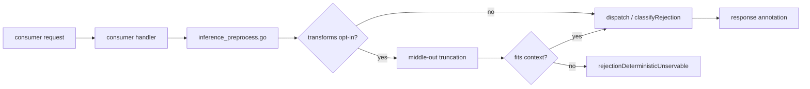
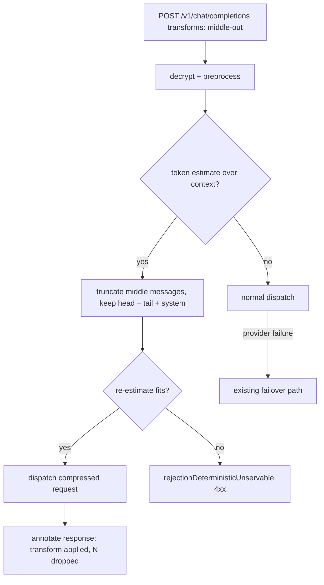

# ORP-082: Middle-out context-compression transform

> Last updated: 2026-09-25 · commit `b6f9574ed`

Darkbloom rejects context overflow deterministically and offers the caller no opt-in recovery; OpenRouter's message transforms truncate oversized message lists instead of failing. Part of the OpenRouter-perspective review; see the [review index](../README.md).

## What

OpenRouter's message transforms include "middle-out" context compression, which removes middle messages to fit the context window and auto-defaults ON for endpoints with 8k context or less (https://openrouter.ai/docs/guides/features/message-transforms). Darkbloom treats context overflow as a deterministic rejection class: `coordinator/api/dispatch.go` (`classifyRejection` → `rejectionDeterministicUnservable`) fails the request rather than compressing it. There is no transform layer anywhere in request preprocessing — `coordinator/api/inference_preprocess.go` handles body size caps and media only, and no truncation stage exists before dispatch. The caller must shorten the prompt client-side and retry.

## Why

Long-running agent sessions overflow the context window mid-task, and today the request simply dies. The agent then has to implement its own summarization or truncation logic against an opaque token limit, which most callers do badly or not at all — the result is abandoned sessions and retry storms against an endpoint that can never serve the request as submitted.

## Prompt

Implement an opt-in `transforms: ["middle-out"]` request option that compresses oversized message lists instead of failing with context overflow. Goal: when a request carries the option and its message list exceeds the target model's context budget, the coordinator removes middle messages (keeping a configurable head and tail, always preserving the system message and the most recent turns) until the estimated token count fits, then dispatches the compressed request. Constraints: (1) off by default — requests without the option keep today's deterministic-rejection behavior exactly (`classifyRejection` → `rejectionDeterministicUnservable`); (2) compression runs in the coordinator after decryption and before dispatch, never on the provider; (3) the response must disclose that compression occurred (e.g. a response field or header naming the transform applied and the number of messages dropped), so callers never silently lose context; (4) token estimation must be conservative — if the compressed estimate still does not fit, fall through to the existing rejection path rather than dispatching a request the provider will reject; (5) billing accounts for the compressed prompt, not the original. Files to touch: `coordinator/api/consumer.go` (option parsing on all four entrypoints: `handleChatCompletions`, `handleCompletions`/`handleGenericInference`, `handleAnthropicMessages`), `coordinator/api/inference_preprocess.go` (compression stage after media/size handling), `coordinator/api/dispatch.go` (fit check before `classifyRejection`), plus a new focused file for the truncation logic and tests. Acceptance criteria: an opted-in oversized request is compressed head+tail, dispatched, and annotated; an identical request without the option still fails deterministically; a request that cannot fit even after maximal compression fails with the existing rejection class.

## Workflow

1. Read the rejection classification path in `coordinator/api/dispatch.go` (`classifyRejection`, `rejectionDeterministicUnservable`) and the preprocessing in `coordinator/api/inference_preprocess.go`.
2. Define the `transforms` request field and parse it in `coordinator/api/consumer.go` for all four entrypoints.
3. Implement head+tail truncation with conservative token estimation in a new focused file, preserving the system message and latest turns.
4. Wire the compression stage into preprocessing, gated on the option.
5. Add the fit check before dispatch: compressed-fit → dispatch with annotation; still-oversized → existing deterministic rejection.
6. Add response disclosure of the applied transform.
7. Add unit tests: option parsing, truncation math, system-message preservation, still-oversized fallback, no-op without the option.
8. Run `make coordinator-test`.

## Loop

Run `make coordinator-test` (or `go test ./coordinator/api/...` while iterating). Check: truncation tests cover single-message, two-message, and long-list inputs; the no-option path is byte-identical in behavior to today; compressed requests carry the disclosure annotation. Run `make e2e-integration` if the harness can drive an oversized prompt against a small-context model, and confirm the request succeeds with the option and fails deterministically without it. Definition of done: coordinator tests green, overflow becomes recoverable only for opted-in callers, every compressed response is annotated.

## Graph

## Layout

- Modify `coordinator/api/consumer.go` — parse `transforms` on all four entrypoints.
- Modify `coordinator/api/inference_preprocess.go` — compression stage wiring.
- Modify `coordinator/api/dispatch.go` — pre-classification fit check.
- Add a new file for the truncation algorithm and its tests under `coordinator/api/`.
- No UI surface.

## Flow

Severity: medium · Effort: M
