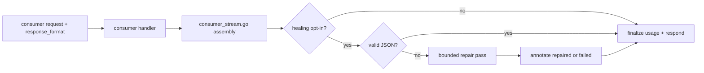
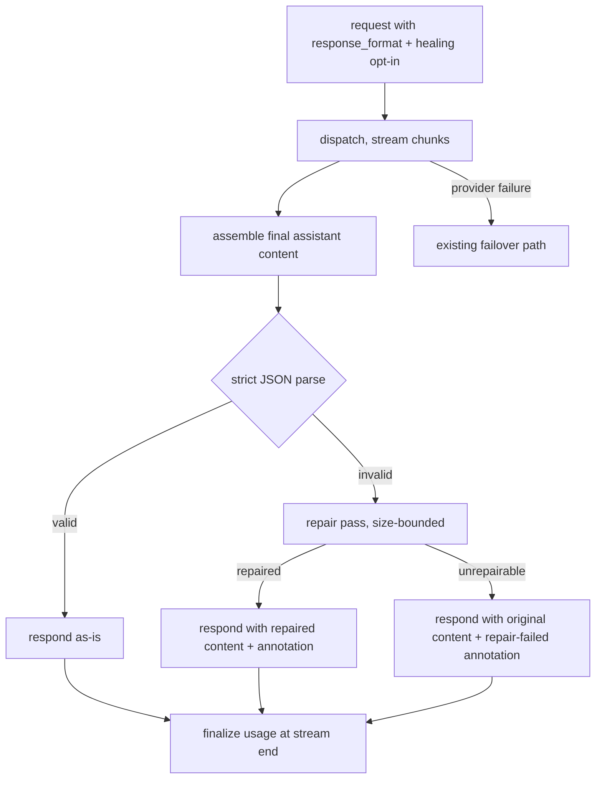

# ORP-083: Response-healing (JSON repair) plugin

> Last updated: 2026-09-25 · commit `b6f9574ed`

Darkbloom returns malformed model output as-is even when the caller constrained the response to JSON; OpenRouter's `response-healing` plugin repairs near-valid JSON on the fly. Part of the OpenRouter-perspective review; see the [review index](../README.md).

## What

OpenRouter's plugins run once per request; `response-healing` repairs near-valid JSON — unterminated strings, trailing commas, truncated objects — so structured output parses cleanly (https://openrouter.ai/docs/guides/features/plugins). Darkbloom has no plugin or post-processing layer: streaming is SSE with deferred commit and usage is finalized authoritatively at stream end in `coordinator/api/consumer_stream.go`, and the assembled assistant content passes to the caller unmodified. There is no stage in `coordinator/api/` request preprocessing or response finalization that inspects or repairs output (`inference_preprocess.go` handles body size caps and media only).

## Why

Structured-output pipelines break on one malformed token. A caller that requested `response_format: json_object` and receives `{"a": 1,}` must either retry the whole inference — paying for a second generation — or ship its own repair heuristics. A coordinator-side repair pass rescues the overwhelmingly common near-valid case without a re-dispatch.

## Prompt

Implement an opt-in response-healing pass for requests that set `response_format`. Goal: when a request opts in (e.g. a `plugins: ["response-healing"]`-style request field) and asks for JSON output, the coordinator assembles the final assistant content, attempts strict JSON parsing, and if it fails applies a bounded repair pass (close unterminated strings and objects, strip trailing commas, trim non-JSON preamble/postamble) before the response is finalized; the repaired content is what the caller receives. Constraints: (1) opt-in only — default streaming and non-streaming behavior is byte-identical to today; (2) repair runs on the coordinator over the assembled stream before usage finalization in `coordinator/api/consumer_stream.go`, so usage accounting sees the final content; (3) for streaming responses the repaired content is delivered in the final chunk(s) or the stream is completed normally and the healing applies to the buffered content — pick one behavior and document it; (4) repair must be a pure, deterministic function with a hard size bound — never dispatch to an external service; (5) annotate the response when repair changed the content so callers can audit; (6) if repair cannot produce valid JSON, return the original content unmodified with the annotation saying repair failed — never fail the whole request. Files to touch: `coordinator/api/consumer.go` (option parsing alongside `response_format`), `coordinator/api/consumer_stream.go` (post-assembly repair hook before finalization), plus a new focused file for the repair function and tests. Acceptance criteria: near-valid JSON (trailing commas, unterminated strings) is repaired and parses; already-valid JSON passes through untouched; unrepairable content passes through annotated; requests without the option are unchanged.

## Workflow

1. Read the stream finalization path in `coordinator/api/consumer_stream.go` and the `response_format` handling in `coordinator/api/consumer.go`.
2. Define the plugin opt-in field and parse it in `coordinator/api/consumer.go`.
3. Implement the JSON repair function as a pure, size-bounded transform in a new file.
4. Wire the repair hook after stream assembly, before usage finalization.
5. Add the changed/failed annotation to the response shape.
6. Define and document the streaming delivery behavior for healed content.
7. Add unit tests: repair table (each defect class), pass-through cases, annotation, option parsing, size bound.
8. Run `make coordinator-test`.

## Loop

Run `make coordinator-test` (or `go test ./coordinator/api/...` while iterating). Check: the repair table covers each defect class and adversarial inputs (deeply nested, max-size, invalid UTF-8); pass-through is byte-identical when repair is a no-op; usage accounting still finalizes exactly once per stream. If the E2E harness can force a malformed model response (stub provider), run `make e2e-integration` to verify the healed payload end to end. Definition of done: coordinator tests green, healing is strictly opt-in, no request fails because of the repair pass.

## Graph

## Layout

- Modify `coordinator/api/consumer.go` — plugin option parsing.
- Modify `coordinator/api/consumer_stream.go` — post-assembly repair hook before finalization.
- Add a new file for the JSON repair function and its tests under `coordinator/api/`.
- No UI surface.

## Flow

Severity: low · Effort: M
