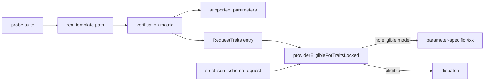
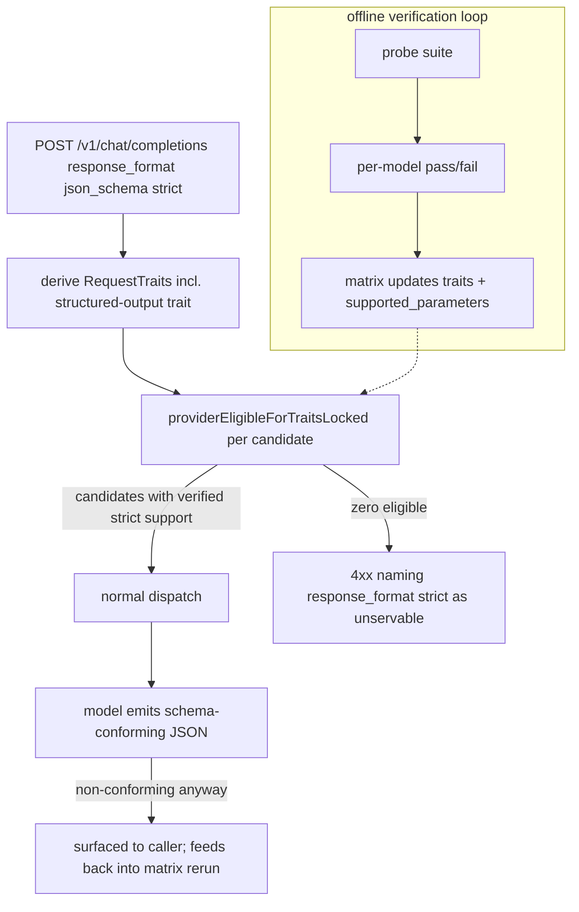

# ORP-084: Structured-outputs strict-mode verification matrix

> Last updated: 2026-09-25 · commit `b6f9574ed`

Darkbloom asserts structured-output support per model by convention rather than by verified behavior; OpenRouter's structured-outputs contract includes explicit `strict` semantics and `require_parameters` gating. Part of the OpenRouter-perspective review; see the [review index](../README.md).

## What

OpenRouter documents structured outputs via `response_format: {type: json_object | json_schema, strict}` with `require_parameters` to fail requests no provider can honor (https://openrouter.ai/docs/features/structured-outputs). Darkbloom's capability model derives request traits centrally in `coordinator/registry/request_traits.go` (`RequestTraits`, with gating in `providerEligibleForTraitsLocked`), but which catalog models actually honor `response_format` strictly — emitting schema-conforming JSON rather than best-effort JSON — is not tested per model. The `tool_choice: "auto"` incident (incident report `docs/reports/2026-07-30-auto-tool-schema-rejection-root-cause.md`) is the template for how these assertions break: a parameter was assumed supported and silently rejected standard input per model until the failure surfaced in production.

## Why

"Supported" is currently asserted, not verified. A caller building on `json_schema` + `strict` discovers non-compliance only when its parser rejects live output, per model, in production. A verification matrix turns an invisible per-model risk into a published, testable contract.

## Prompt

Build an audit and test matrix for structured-output strictness across the catalog. Goal: for each catalog model, run a fixed probe suite (valid schema adherence, `json_object` without schema, strict rejection of extra fields, nested schema, enum fields) through the real pipeline, record which models honor `response_format` strictly, publish the results in the model's `supported_parameters` (ORP-073), and fence models that fail via trait gating in `coordinator/registry/request_traits.go` so a strict request never routes to a model that will ignore it. Constraints: (1) probes run against the real chat-template path — the same path `TemplateRenderCheck` exercises — since a broken template fences all request shapes for that provider/model pair anyway; (2) results are data (a checked-in matrix or registry field), not code branches per model; (3) gating reuses the existing trait machinery (`RequestTraits`, `providerEligibleForTraitsLocked`) — do not build a parallel capability table; (4) when no eligible model can honor a strict `response_format`, the failure must name the unsupported parameter (see ORP-006's hard-gate contract) rather than a generic capacity error. Files to touch: `coordinator/registry/request_traits.go` (structured-output trait + gating), the probe/audit harness (new, plus tests), the model-registry surface that backs `supported_parameters`, and `coordinator/api/consumer.go` only if the failure mapping needs it. Acceptance criteria: every catalog model has a verified strict-mode result; a strict `json_schema` request never dispatches to a model recorded as failing; results are visible in `supported_parameters`; re-running the probe suite reproduces the matrix deterministically.

## Workflow

1. Read `RequestTraits` and `providerEligibleForTraitsLocked` in `coordinator/registry/request_traits.go` and the 2026-07-30 incident report for the failure template.
2. Define the probe suite: fixed prompts + schemas per strictness behavior, with deterministic pass/fail criteria.
3. Add a `structured_outputs_strict` (or equivalent) trait to `RequestTraits` and gate on it in `providerEligibleForTraitsLocked`.
4. Build the audit harness that runs the probes per catalog model and emits the matrix.
5. Publish results into the registry surface behind `supported_parameters`.
6. Map the no-eligible-model failure to a parameter-specific error.
7. Add unit tests for the trait gating; add probe fixtures with recorded outputs for models without live hardware.
8. Run `make coordinator-test`; run the audit against dev hardware for the live matrix.

## Loop

Run `make coordinator-test` (or `go test ./coordinator/registry/...` while iterating on gating). Check: gating tests cover trait present/absent, mixed-eligibility fleets, and the no-eligible-model failure path; the probe fixtures replay deterministically. Run `make e2e-integration` with a strict `json_schema` request against a dev provider to confirm a compliant model passes and a fenced model is never dispatched. Re-run the audit harness after any catalog or template change. Definition of done: matrix published, gating enforced by tests, probe suite reproducible.

## Graph

## Layout

- Modify `coordinator/registry/request_traits.go` — structured-output trait and gating.
- Add a probe/audit harness (new directory or file) plus fixtures and tests.
- Modify the model-registry surface backing `supported_parameters`.
- Possibly modify `coordinator/api/consumer.go` — failure mapping for no-eligible-model.
- No UI surface in this issue; the console surfaces `supported_parameters` under ORP-073.

## Flow

Severity: medium · Effort: M
