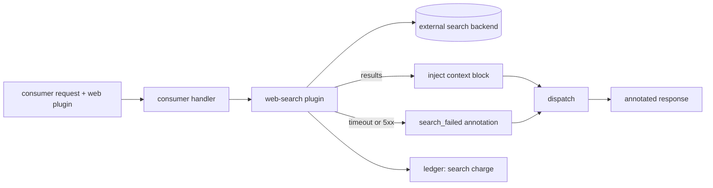
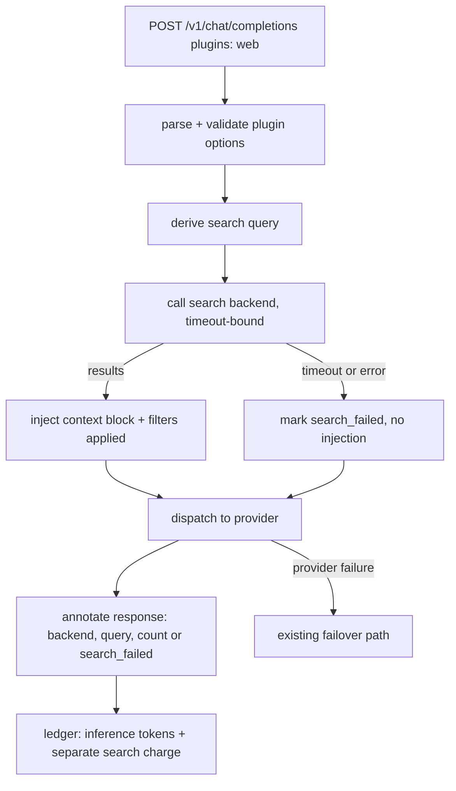

# ORP-085: Provider-agnostic web-search plugin

> Last updated: 2026-09-25 · commit `b6f9574ed`

Darkbloom has no way to ground a request in live web results; OpenRouter's `web` / `openrouter:web_search` plugin attaches search results as context before inference. Part of the OpenRouter-perspective review; see the [review index](../README.md).

## What

OpenRouter's plugins include a web-search plugin that runs once per request, fetches search results for the user's query, and injects them into the prompt before dispatch, with per-request pricing and domain filters (https://openrouter.ai/docs/guides/features/plugins). Darkbloom has no plugin layer at all: no web search stage exists anywhere in `coordinator/api/` request preprocessing (`inference_preprocess.go` handles body size caps and media), and the pipeline — shared by all four entrypoints in `coordinator/api/consumer.go` (`handleChatCompletions`, `handleCompletions`/`handleGenericInference`, `handleAnthropicMessages`) — goes from decrypt to dispatch with no external calls.

## Why

RAG-via-search is table stakes on aggregators; its absence blocks a whole use-case class (fresh-facts assistants, research agents). The design tension must be stated plainly: search queries derived from the prompt leave the private lane to a third-party search backend, which cuts against Darkbloom's private-inference premise. The feature is therefore strictly opt-in per request, off by default, and must disclose on every response that an external search occurred and what was sent.

## Prompt

Implement a provider-agnostic, opt-in web-search plugin. Goal: when a request carries the plugin option (e.g. `plugins: [{id: "web", ...}]`), the coordinator derives a search query from the request, calls a configurable search backend, injects the top results as context (a system-style block before the user messages) before dispatch, applies per-request pricing for the search, and annotates the response with what was searched and where. Constraints: (1) strictly opt-in per request — never enabled by account default without an explicit user action, and never silently on; (2) privacy disclosure is part of the contract: the API documentation and every annotated response must state that the query left the private lane and name the search backend; (3) support domain allow/deny filters and a max-results knob in the plugin options; (4) search failure must not fail the inference request — degrade to dispatching without injected context, annotated as `search_failed`; (5) the search call is coordinator-side only, with a hard timeout and result-size bound, and result text is treated as untrusted prompt content; (6) pricing for the search is recorded distinctly from inference tokens in the ledger. Files to touch: `coordinator/api/consumer.go` (option parsing on all four entrypoints), a new plugin module (query derivation, backend client, injection, annotation), `coordinator/payments` or the pricing surface (per-request search pricing), plus tests. Acceptance criteria: an opted-in request returns with injected context and a search annotation; a search-backend outage still returns inference output annotated `search_failed`; no request without the option ever triggers a search call; the ledger records the search charge separately.

## Workflow

1. Read the shared pipeline in `coordinator/api/consumer.go` and preprocessing in `coordinator/api/inference_preprocess.go` to find the injection seam.
2. Define the plugin option schema (id, max results, domain filters) and parse it on all four entrypoints.
3. Implement the search backend client with timeout and size bounds in a new module.
4. Implement query derivation and result injection as a context block.
5. Add response annotation (searched backend, query, result count, or `search_failed`).
6. Wire per-request search pricing into the ledger as a distinct line item.
7. Add unit tests: option parsing, injection shape, failure degradation, no-option no-call, pricing.
8. Run `make coordinator-test`; run `make e2e-integration` with a stubbed search backend.

## Loop

Run `make coordinator-test` (or `go test ./coordinator/api/...` while iterating). Check: no-option requests make zero outbound calls (assert with a counting transport in tests); backend timeout and 5xx both degrade to `search_failed`; injected context respects the size bound. Run `make e2e-integration` with a stub search server to verify the end-to-end annotated response and the separate ledger entry. Definition of done: coordinator tests green, E2E passes with the stub, every searched response carries the disclosure annotation, and the privacy trade-off is documented in the API reference.

## Graph

## Layout

- Modify `coordinator/api/consumer.go` — plugin option parsing on all four entrypoints.
- Add a new plugin module under `coordinator/` (query derivation, backend client, injection, annotation) plus tests.
- Modify the pricing/ledger surface under `coordinator/payments/` — per-request search charge.
- API reference documentation update for the option and its privacy disclosure.
- No UI surface in this issue; a console toggle is a follow-up decision because of the privacy trade-off.

## Flow

Severity: low · Effort: L
