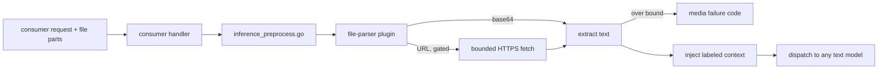
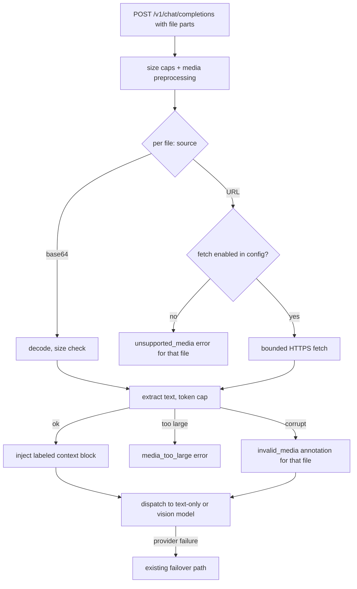

# ORP-086: File-parser / PDF input plugin

> Last updated: 2026-09-25 · commit `b6f9574ed`

Darkbloom accepts images only on vision-capable models and has no document path at all; OpenRouter's `file-parser` plugin extracts text from PDFs for any model. Part of the OpenRouter-perspective review; see the [review index](../README.md).

## What

OpenRouter's plugins include `file-parser`, which accepts `file` content parts (URL or base64) and extracts text via selectable PDF engines so any model — including text-only ones — can consume documents (https://openrouter.ai/docs/guides/features/plugins). Darkbloom supports multimodal input only as images on vision-capable models (one-image-at-a-time vision tower, `VisionTowerBudget`), with failure codes for media problems (`invalid_media`, `media_too_large`, `unsupported_media` in `coordinator/api/inference_error_sanitize.go`). Request preprocessing in `coordinator/api/inference_preprocess.go` handles body size caps and media, but there is no file or PDF parsing stage anywhere in `coordinator/api/`.

## Why

PDF input on any model is a top OpenRouter plugin; callers with document-QA workloads cannot use Darkbloom for them at all — they must extract text client-side and hand-manage chunking against the context window. The privacy note from the web-search issue applies in weaker form here: extraction must happen coordinator-side inside the trust boundary, never by forwarding the document to a third-party parsing service, because document bytes are prompt content under the private-inference premise.

## Prompt

Implement an opt-in file-parser plugin that accepts `file` content parts and injects extracted text as prompt context. Goal: when a request carries file parts (base64 inline or URL) and the plugin option, the coordinator fetches/reads the file, extracts text (PDF first; plain text and markdown pass through), and injects the result as a labeled context block before the user messages, so text-only models can answer questions about documents. Constraints: (1) extraction runs coordinator-side with in-process or sandboxed parsers — the document never leaves the trust boundary to a third-party service; (2) hard bounds: max file size, max extracted-text tokens, max files per request, all returning the existing media-style failure vocabulary (`invalid_media`, `media_too_large`, `unsupported_media` per `coordinator/api/inference_error_sanitize.go`) when exceeded; (3) URL fetching is allowlist-scheme (`https` only), timeout- and size-bound, and off by default at the coordinator config level because server-side fetch is an SSRF surface; (4) extracted text is untrusted content — injected with clear delimiters; (5) extraction failure degrades per file: a failed file is reported in the annotation and remaining files still process; (6) vision-capable models keep their existing image path untouched — this plugin is for documents, not a replacement for the vision tower. Files to touch: `coordinator/api/consumer.go` (content-part and option parsing on all four entrypoints: `handleChatCompletions`, `handleCompletions`/`handleGenericInference`, `handleAnthropicMessages`), `coordinator/api/inference_preprocess.go` (wiring the extraction stage after size caps), a new parser module, plus tests. Acceptance criteria: a base64 PDF on a text-only model returns an answer grounded in the document text; an oversized or corrupt file returns the matching media failure code; URL fetching respects the config gate and bounds; image input on vision models is unchanged.

## Workflow

1. Read media handling in `coordinator/api/inference_preprocess.go` and the failure vocabulary in `coordinator/api/inference_error_sanitize.go`.
2. Define the `file` content-part shape and plugin option; parse on all four entrypoints in `coordinator/api/consumer.go`.
3. Implement the extraction module: base64 decode, bounded HTTPS fetch (config-gated), PDF text extraction, size/token caps.
4. Wire extraction into preprocessing after body-size caps, before dispatch.
5. Map bound violations and corrupt input onto the existing media failure codes.
6. Add per-file failure annotation to the response.
7. Add unit tests: extraction of fixture PDFs, each bound, corrupt input, fetch gate, image-path regression.
8. Run `make coordinator-test`; run `make e2e-integration` with a fixture document.

## Loop

Run `make coordinator-test` (or `go test ./coordinator/api/...` while iterating). Check: fixture PDFs extract deterministically; every bound has a test hitting it; corrupt and truncated files map to `invalid_media`; the SSRF gate defaults to off and tests prove no fetch occurs when disabled. Run `make e2e-integration` with a small fixture PDF against a text-only model to verify grounded output end to end. Definition of done: coordinator tests green, E2E document test passes, documents never leave the coordinator to third-party services, and all bounds are enforced with the existing media failure vocabulary.

## Graph

## Layout

- Modify `coordinator/api/consumer.go` — `file` content-part and plugin option parsing on all four entrypoints.
- Modify `coordinator/api/inference_preprocess.go` — extraction stage wiring.
- Modify `coordinator/api/inference_error_sanitize.go` — only if a new sanitized media failure variant is needed.
- Add a new parser module under `coordinator/` (decode, fetch, extract, caps) plus fixture-based tests.
- No UI surface.

## Flow

Severity: low · Effort: L
