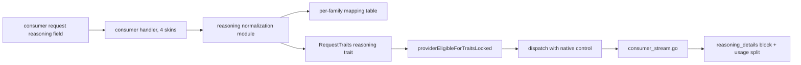
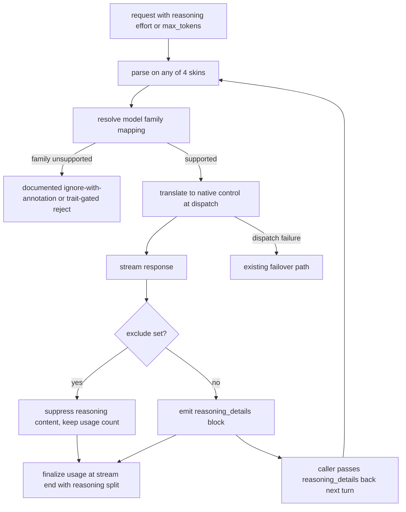

# ORP-087: Unified reasoning-effort normalization

> Last updated: 2026-09-25 · commit `b6f9574ed`

Darkbloom exposes no single reasoning control — each model family's mechanism must be invoked differently by the caller; OpenRouter's unified `reasoning` field maps one request shape to per-provider mechanisms. Part of the OpenRouter-perspective review; see the [review index](../README.md).

## What

OpenRouter's reasoning-tokens feature defines one request field, `reasoning: {effort | max_tokens, exclude}`, mapped per provider to that provider's native mechanism, with a `reasoning_details` array in the response that callers can preserve and pass back across turns (https://openrouter.ai/docs/use-cases/reasoning-tokens). Darkbloom's request-trait system (`coordinator/registry/request_traits.go`, `RequestTraits`) derives traits centrally but has no normalized reasoning field: whether and how a caller controls thinking effort depends on the model family's own conventions, and there is no standardized response block carrying reasoning content or its preservation metadata across the four API skins in `coordinator/api/consumer.go` (`handleChatCompletions`, `handleCompletions`/`handleGenericInference`, `handleAnthropicMessages`).

## Why

Reasoning controls currently differ per model family, so multi-model callers must special-case each family in their client code, and switching models silently drops or misinterprets the reasoning setting. Without a preservable reasoning-details block, multi-turn agent loops also lose reasoning context between turns or re-send it in ad-hoc formats.

## Prompt

Implement a unified `reasoning` request field normalized across model families. Goal: a caller sets `reasoning: {effort: "low"|"medium"|"high"}` or `reasoning: {max_tokens: N}` (plus optional `exclude: true`) once, and the coordinator maps it to the target model family's native mechanism at dispatch time; responses carry a `reasoning_details`-style block that callers can pass back verbatim on subsequent turns to preserve reasoning context. Constraints: (1) the mapping table is data-driven per model family (a checked-in table or registry field), not per-model `if` chains in handler code; (2) a model family with no reasoning mechanism must either ignore the field with an annotation or reject it via trait gating (`RequestTraits`, `providerEligibleForTraitsLocked`) — pick one behavior, document it, and test it; (3) the field works identically on all four entrypoints, including the Anthropic skin, where it maps to that API's native thinking shape; (4) reasoning tokens must be accounted for in usage finalized at stream end (`coordinator/api/consumer_stream.go`), reported distinctly from output tokens where the underlying engine exposes the split; (5) `exclude: true` suppresses reasoning content in the response while still counting it in usage. Files to touch: `coordinator/api/consumer.go` (field parsing on all four skins), `coordinator/registry/request_traits.go` (reasoning trait + gating), a new normalization module (family mapping), `coordinator/api/consumer_stream.go` (reasoning block in the stream/final response), plus tests. Acceptance criteria: one `reasoning` field reaches each supported family's native control; an unsupported family follows the documented ignore-or-reject behavior; `reasoning_details` round-trips across turns; usage reports the reasoning split on supporting engines.

## Workflow

1. Read `RequestTraits` and trait gating in `coordinator/registry/request_traits.go` and the stream finalization in `coordinator/api/consumer_stream.go`.
2. Define the `reasoning` request field and the `reasoning_details` response shape.
3. Build the per-family mapping table and the normalization module.
4. Parse the field on all four entrypoints in `coordinator/api/consumer.go`; map the Anthropic skin both directions.
5. Add the reasoning trait and gate in `providerEligibleForTraitsLocked`.
6. Emit `reasoning_details` in streaming and non-streaming responses; accept it back on follow-up turns.
7. Wire reasoning-token accounting into stream-end usage finalization.
8. Add unit tests per family plus cross-skin parity tests; run `make coordinator-test`.

## Loop

Run `make coordinator-test` (or `go test ./coordinator/api/... ./coordinator/registry/...` while iterating). Check: a parity test drives the same `reasoning` payload through all four skins and asserts identical normalized behavior; gating tests cover supported and unsupported families; round-trip tests preserve `reasoning_details` verbatim. Run `make e2e-integration` against a reasoning-capable dev model to verify the effort knob changes actual behavior and the usage split appears. Definition of done: coordinator tests green, cross-skin parity proven, one field controls every supported family.

## Graph

## Layout

- Modify `coordinator/api/consumer.go` — `reasoning` field parsing on all four entrypoints.
- Modify `coordinator/registry/request_traits.go` — reasoning trait and gating.
- Modify `coordinator/api/consumer_stream.go` — `reasoning_details` emission and usage split.
- Add a new normalization module under `coordinator/` (mapping table + translation) plus tests.
- No UI surface.

## Flow

Severity: medium · Effort: M
