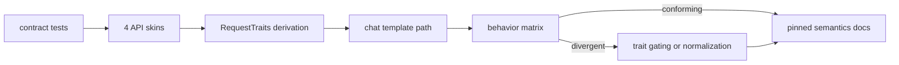
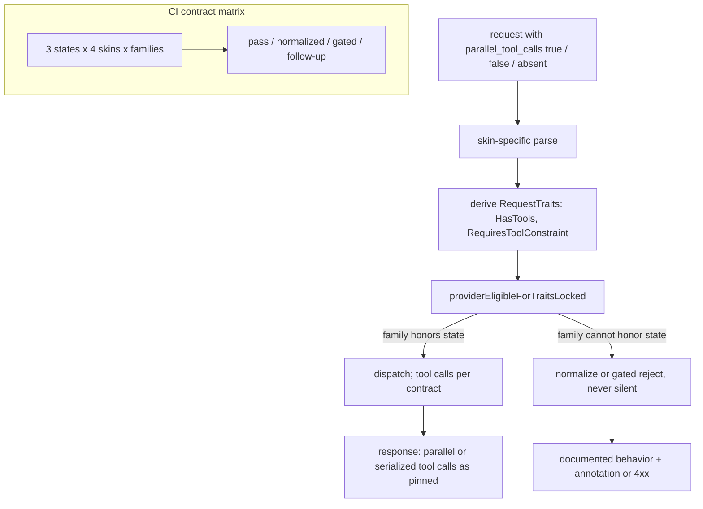

# ORP-088: `parallel_tool_calls` semantics tests and docs

> Last updated: 2026-09-25 · commit `b6f9574ed`

Darkbloom's behavior for the `parallel_tool_calls` parameter is unpinned across API skins and model families; OpenRouter documents normalized tool-calling semantics including `parallel_tool_calls`. Part of the OpenRouter-perspective review; see the [review index](../README.md).

## What

OpenRouter's tool-calling feature normalizes tool use across providers and documents `parallel_tool_calls` semantics (https://openrouter.ai/docs/features/tool-calling). Darkbloom has tool calling with capability version floors (tools floor v0.6.3, `tool_choice: "none"` floor v0.7.10, both in `coordinator/registry/request_traits.go`), and request traits (`RequestTraits`: `HasTools`, `RequiresToolConstraint`) gate eligibility in `providerEligibleForTraitsLocked`. But the meaning of `parallel_tool_calls` — true, false, or absent — is not pinned by contract tests across the four entrypoints in `coordinator/api/consumer.go` (`handleChatCompletions`, `handleCompletions`/`handleGenericInference`, `handleAnthropicMessages`) or across model families. The 2026-07-30 `tool_choice: "auto"` incident (incident report `docs/reports/2026-07-30-auto-tool-schema-rejection-root-cause.md`) showed tool-parameter semantics diverge silently per model: `tool_choice: "auto"` historically rejected standard JSON-Schema tools.

## Why

`parallel_tool_calls` is the same shape of risk as the 2026-07-30 incident: a parameter whose semantics can silently diverge per model family until a caller's agent loop either serializes calls it expected in parallel or receives parallel calls it cannot handle. Unpinned behavior means the divergence is discovered in production, per family, one caller at a time.

## Prompt

Pin `parallel_tool_calls` semantics with contract tests and documentation. Goal: define the intended behavior of `parallel_tool_calls` for each of its three states (true, false, absent) on each of the four API skins and each tool-capable model family; encode that behavior as contract tests that run against the real request-trait and template paths; and publish the resulting matrix in the docs. Constraints: (1) tests exercise the real pipeline — trait derivation in `coordinator/registry/request_traits.go` and the chat-template path that `TemplateRenderCheck` guards — not mocked handlers, since template behavior is where the 2026-07-30 divergence lived; (2) where a model family cannot honor a state (e.g. cannot force serialization), the contract is either a documented normalization (coordinator-side constraint or sequential tool-call repair) or trait-gated rejection — never silent divergence; (3) absent-state behavior must be pinned too, explicitly, since OpenAI's default is `true` and callers rely on it; (4) this issue is tests-and-docs-first: where the tests expose actual divergence, file the behavior fix as a follow-up rather than expanding scope here; (5) keep the existing version floors untouched unless a floor is found to be wrong. Files to touch: new contract-test files under `coordinator/api/` and `coordinator/registry/`, the consumer API reference docs for the pinned semantics, and `coordinator/api/consumer.go` only where a skin drops or mistranslates the parameter. Acceptance criteria: a test matrix covers (3 states × 4 skins × tool-capable families); every cell either passes against intended behavior or is documented as divergent with a follow-up issue; the docs page states the pinned semantics per skin; the 2026-07-30 incident pattern is cited as the rationale.

## Workflow

1. Read the tool-trait derivation and floors in `coordinator/registry/request_traits.go` and the 2026-07-30 incident report.
2. Define intended `parallel_tool_calls` semantics per state and per skin, in writing, before coding tests.
3. Build the contract-test harness that drives requests through trait derivation and template rendering per state.
4. Enumerate tool-capable model families and run the matrix.
5. Where a cell diverges, decide normalization vs. trait-gated rejection vs. documented limitation; implement only the cheap decisions, file issues for the rest.
6. Write the docs page pinning the semantics per skin, citing the incident report.
7. Run `make coordinator-test`.

## Loop

Run `make coordinator-test` (or `go test ./coordinator/api/... ./coordinator/registry/...` while iterating). Check: the matrix has no unclassified cells — each is passing, normalized, gated, or documented-with-follow-up; regression tests for the existing floors stay green. Definition of done: full matrix in CI, semantics documented per skin, every divergence either fixed or tracked.

## Graph

## Layout

- Add contract-test files under `coordinator/api/` and `coordinator/registry/`.
- Modify `coordinator/api/consumer.go` — only where a skin drops or mistranslates the parameter.
- Add a consumer-facing docs page pinning `parallel_tool_calls` semantics.
- No UI surface.

## Flow

Severity: low · Effort: S
