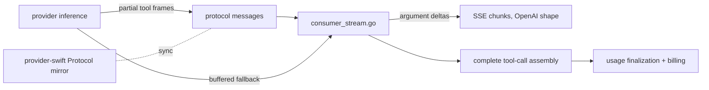

# ORP-089: Fine-grained tool-call streaming

> Last updated: 2026-09-25 · commit `b6f9574ed`

Darkbloom buffers complete tool-call JSON before emitting a stream chunk; OpenRouter supports fine-grained tool streaming where argument deltas arrive incrementally. Part of the OpenRouter-perspective review; see the [review index](../README.md).

## What

OpenRouter's tool-calling feature includes fine-grained tool streaming, where `tool_calls.function.arguments` arrive as incremental string deltas in SSE chunks exactly like content deltas (https://openrouter.ai/docs/features/tool-calling). Darkbloom's streaming is SSE with deferred commit and usage finalized at stream end (`coordinator/api/consumer_stream.go`), but tool-call arguments are delivered buffered: the full tool-call JSON is assembled before the chunk carrying it is emitted. Tool calling itself is established (capability floors in `coordinator/registry/request_traits.go`), so the gap is delivery granularity, not capability.

## Why

UI integrations render tool calls as they generate; buffered delivery adds seconds of perceived latency on large arguments (a long code-edit payload or structured function call arrives in one lump at the end instead of streaming visibly). Callers building agent UIs read this as a hang between the content and the tool call.

## Prompt

Implement fine-grained tool-call streaming on the coordinator's SSE path. Goal: when a provider streams partial tool-call data, the coordinator forwards argument deltas incrementally in OpenAI-compatible chunks (`tool_calls[].function.arguments` as growing string deltas with stable `index` and `id` on the first delta), instead of buffering the complete tool call before emitting. Constraints: (1) preserve the deferred-commit and usage-finalization discipline in `coordinator/api/consumer_stream.go` — incremental delivery must not change when usage is finalized or when billing commits; (2) chunk shape must match OpenAI's fine-grained format exactly so existing OpenAI SDK clients parse it without changes; (3) providers that only deliver complete tool calls keep today's behavior — the coordinator must pass through buffered delivery when no finer granularity exists upstream, so this may require protocol support for partial tool-call frames (`coordinator/protocol/messages.go` and the Swift mirror under `provider-swift/Sources/ProviderCore/Protocol/` must stay in sync per the repo's sync rules); (4) the assembled complete tool call must remain available internally for any post-processing (e.g. ORP-083 response healing); (5) `parallel_tool_calls` interactions are covered by ORP-088 — here just ensure multiple in-flight tool calls keep correct `index` attribution. Files to touch: `coordinator/api/consumer_stream.go` (delta emission), `coordinator/protocol/messages.go` and the Swift protocol mirror (partial tool-call frames, if upstream granularity is added), `provider-swift` inference streaming (emit partials), plus tests in both languages. Acceptance criteria: an OpenAI SDK client receives argument deltas during generation; buffered providers still deliver correct complete tool calls; usage finalization and billing are unchanged; multi-tool-call streams attribute deltas to the right index.

## Workflow

1. Read the stream assembly in `coordinator/api/consumer_stream.go` and the protocol frame types in `coordinator/protocol/messages.go`.
2. Decide whether upstream partial frames are needed or the provider already yields partials; if needed, add the protocol frame in Go and Swift together.
3. Emit OpenAI-shaped argument deltas from the coordinator as partials arrive.
4. Keep complete-tool-call assembly for internal consumers.
5. Handle multiple concurrent tool calls with correct `index` attribution.
6. Pass through buffered delivery unchanged when the provider sends only complete calls.
7. Add Go tests for chunk shape and index attribution; add Swift tests for partial emission if the protocol changed.
8. Run `make coordinator-test` and `make provider-test`; run `make e2e-integration` for a streaming tool call.

## Loop

Run `make coordinator-test` and `make provider-test` (or `go test ./coordinator/api/... ./coordinator/protocol/...` while iterating). Check: a golden-chunk test pins the exact OpenAI delta shape; index attribution tests cover interleaved multi-tool streams; protocol symmetry tests between Go and Swift stay green. Run `make e2e-integration` with a tool-calling model and verify deltas arrive before stream end and usage finalizes once. Definition of done: both test suites green, E2E shows incremental delivery, OpenAI SDK clients parse the stream unmodified, billing semantics unchanged.

## Graph



## Layout

- Modify `coordinator/api/consumer_stream.go` — incremental tool-call delta emission.
- Modify `coordinator/protocol/messages.go` and `provider-swift/Sources/ProviderCore/Protocol/` — partial tool-call frames, if upstream granularity is added (must change together).
- Modify `provider-swift` inference streaming — emit partials where the engine exposes them.
- Add tests in `coordinator/` (chunk shape, index attribution) and `provider-swift/Tests/` (partial emission).
- No UI surface; console-ui streaming rendering benefits automatically via `console-ui/src/hooks/useChatStream.ts` reading standard deltas.

## Flow

```mermaid
sequenceDiagram
  participant U as Consumer (OpenAI SDK)
  participant C as Coordinator consumer_stream.go
  participant P as Provider
  U->>C: POST /v1/chat/completions (tools, stream)
  C->>P: dispatch
  loop generation
    P-->>C: partial tool-call frame
    alt fine-grained supported
      C-->>U: chunk: tool_calls[i].function.arguments += delta
    else buffered provider
      C-->>U: (no chunk until complete)
    end
  end
  P-->>C: terminal frame
  C->>C: assemble complete tool call; finalize usage
  C-->>U: final chunk + [DONE]
  Note over C: billing commits once, at stream end, unchanged
```

Severity: low · Effort: M
