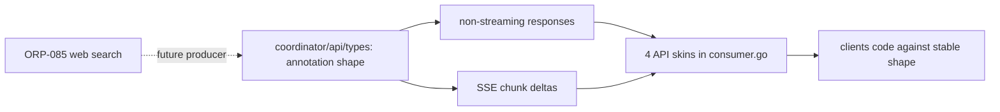
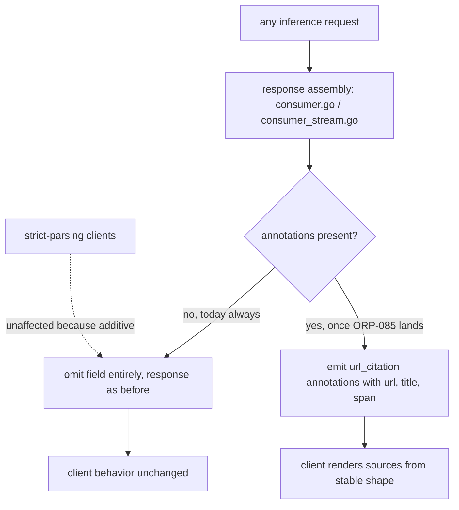

# ORP-090: Citation annotation convention

> Last updated: 2026-09-25 · commit `b6f9574ed`

Darkbloom has no reserved shape for citations in its streaming or response types; OpenRouter standardizes citations as `url_citation` annotations. Part of the OpenRouter-perspective review; see the [review index](../README.md).

## What

OpenRouter standardizes citations as `url_citation` annotations on response content, letting clients render sources uniformly regardless of which provider or plugin produced them. Darkbloom's response and SSE chunk types have no annotation slot at all: streaming is SSE with deferred commit in `coordinator/api/consumer_stream.go`, and the canonical consumer-facing JSON shapes live in `coordinator/api/types/` with no reserved field for content annotations. Citations become load-bearing the moment the web-search plugin (ORP-085) lands, since search-grounded answers must name their sources.

## Why

Retrofitting annotations into SSE chunk types later is a breaking change: clients that strict-parse chunks fail on the new field, and clients that cannot see citations misattribute sourced claims to the model. Reserving the shape now — present but empty until a producer exists — is cheap and lets clients code against the final contract today.

## Prompt

Reserve a `url_citation`-compatible annotation shape in Darkbloom's streaming and response types now, with no producer yet. Goal: define an `annotations` array on assistant message content in both non-streaming responses and SSE chunk deltas (matching OpenRouter's `url_citation` shape closely enough that OpenRouter-compatible clients parse it), emitted as empty or omitted until the web-search plugin (ORP-085) starts producing entries; document the shape as the stable convention for sourced content. Constraints: (1) wire-compatible with OpenRouter's annotation shape where practical — same field names for `type`, `url_citation.url`, `url_citation.title`, and span indices — so shared clients work unchanged; (2) purely additive: no existing field changes meaning, and clients that ignore unknown fields see zero behavioral difference; (3) the shape lands in the canonical types in `coordinator/api/types/` and is threaded through all four entrypoints' response paths in `coordinator/api/consumer.go` and the streaming path in `coordinator/api/consumer_stream.go`; (4) serialization must omit the field when empty rather than emitting `"annotations": null`, matching optional-field omission conventions; (5) document the shape in the API reference with a note that it is reserved and empty until ORP-085 lands. Files to touch: `coordinator/api/types/` (annotation types), `coordinator/api/consumer.go` and `coordinator/api/consumer_stream.go` (thread the field through response assembly), the API reference docs, plus serialization tests. Acceptance criteria: all four entrypoints can carry annotations in streaming and non-streaming responses; empty annotations omit cleanly; a serialization test pins the OpenRouter-compatible shape; docs describe the convention and its reserved status.

## Workflow

1. Read the canonical response types in `coordinator/api/types/` and the chunk assembly in `coordinator/api/consumer_stream.go`.
2. Define the annotation types (`type`, `url_citation` with url/title/span) mirroring OpenRouter's shape.
3. Add the `annotations` field to message content and delta types with omit-when-empty serialization.
4. Thread the field through all four entrypoints' response assembly.
5. Add golden serialization tests pinning the exact JSON shape, populated and empty.
6. Document the convention in the API reference, marked reserved until ORP-085.
7. Run `make coordinator-test`.

## Loop

Run `make coordinator-test` (or `go test ./coordinator/api/...` while iterating). Check: golden tests pin the populated and empty serialization for both streaming chunks and non-streaming responses; all four skins serialize identically; existing response-shape tests pass unchanged (proving pure additivity). Definition of done: coordinator tests green, shape documented and pinned by tests, zero behavioral change for existing clients.

## Graph

## Layout

- Modify `coordinator/api/types/` — annotation types.
- Modify `coordinator/api/consumer.go` — thread annotations through the four entrypoints.
- Modify `coordinator/api/consumer_stream.go` — annotations on SSE chunk deltas.
- Modify the consumer API reference docs — reserved-shape convention.
- Add golden serialization tests under `coordinator/api/`.
- No UI surface; console-ui can render citations once ORP-085 produces them.

## Flow

Severity: low · Effort: S
