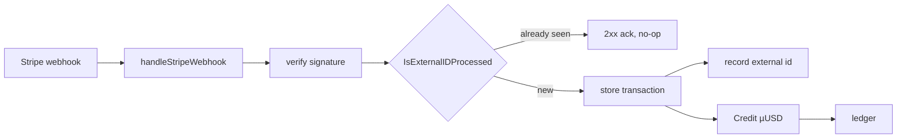
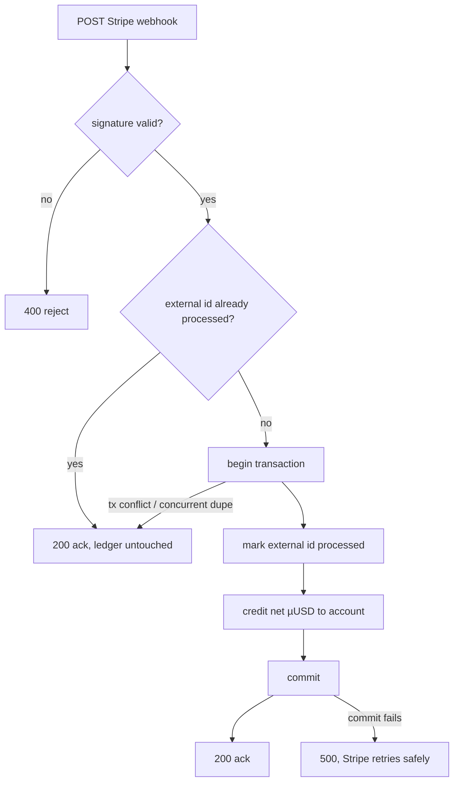

# ORP-091: Stripe deposit webhook dedup gap

> Last updated: 2026-09-25 · commit `b6f9574ed`

The Stripe deposit webhook can double-credit a deposit because the duplicate check and the credit are not one atomic step. Part of the OpenRouter-perspective review; see the [review index](../README.md).

## What

`coordinator/api/billing_handlers.go` (`handleStripeWebhook`) handles `checkout.session.completed` with a check-then-credit sequence: it looks up whether the Stripe session was already processed and then calls `Credit`, and the two are not performed atomically. The store primitive that would close the gap, `IsExternalIDProcessed`, exists in `coordinator/store/interface.go` but is unused on this path, and `Credit` itself is not reference-idempotent. This failure mode is already documented in `docs/architecture/billing.md`. Stripe retries webhook deliveries by design, so the duplicate-delivery precondition is routine, not exotic. OpenRouter treats deposit crediting as idempotent against the payment provider's event id (OpenRouter FAQ, https://openrouter.ai/docs/faq).

## Why

A duplicated or raced webhook delivery double-credits user balance: direct, silent money loss that only surfaces when someone audits the ledger against Stripe, and it breaks the ledger's accounting-integrity invariant.

## Prompt

Make Stripe deposit crediting idempotent and atomic in the coordinator. Goal: processing the same Stripe event (`checkout.session.completed` and any other crediting event types) more than once — sequentially or concurrently — credits the account exactly once. Constraints: (1) the processed-marker write and the credit must commit in the same store transaction, so no interleaving can pass the check twice; (2) use the Stripe event/session id as the external reference id via the existing `IsExternalIDProcessed` primitive in `coordinator/store/interface.go`; (3) all amounts stay integer micro-USD (`int64`, 1 USD = 1,000,000 µUSD); (4) a duplicate delivery must return a 2xx acknowledgment to Stripe (so Stripe stops retrying) without mutating the ledger; (5) the 15 billing invariants in `docs/architecture/billing.md` must be preserved — the dedup marker is bookkeeping, not a ledger entry. Files to touch: `coordinator/api/billing_handlers.go` (`handleStripeWebhook`), `coordinator/store/interface.go` and its Postgres/in-memory implementations (atomic mark-and-credit method if the current primitives cannot compose transactionally), `coordinator/payments` (`Credit` reference-idempotency), plus tests. Acceptance criteria: delivering the same signed webhook payload twice credits once; two concurrent deliveries of the same event credit once; the failure mode paragraph in `docs/architecture/billing.md` is updated to describe the closed behavior.

## Workflow

1. Read `handleStripeWebhook` in `coordinator/api/billing_handlers.go` and the `Credit` path in `coordinator/payments` to map the current check-then-credit sequence.
2. Read `IsExternalIDProcessed` in `coordinator/store/interface.go` and its Postgres and in-memory implementations.
3. Add (or compose) a store method that records the external id and applies the credit in one transaction, returning whether the credit was applied.
4. Rework `handleStripeWebhook` to call that method for every crediting event type and to ack duplicates without side effects.
5. Make `Credit` reference-idempotent (same external reference → no second ledger entry).
6. Add unit tests: duplicate delivery, concurrent duplicate deliveries, and the happy path.
7. Update the failure-modes section of `docs/architecture/billing.md`.
8. Run `make coordinator-test`.

## Loop

Run `make coordinator-test` (or `go test ./coordinator/api/... ./coordinator/store/... ./coordinator/payments/...` while iterating). Check: duplicate-delivery and concurrent-delivery tests pass; existing billing and ledger tests pass unchanged; the ledger gains exactly one credit entry per unique Stripe event id. Definition of done: all coordinator tests green, webhook crediting provably idempotent, `docs/architecture/billing.md` no longer lists this as an open failure mode.

## Graph

## Layout

- Modify `coordinator/api/billing_handlers.go` — atomic dedup-then-credit in `handleStripeWebhook`.
- Modify `coordinator/store/interface.go` plus Postgres and in-memory implementations — atomic mark-processed-and-credit.
- Modify `coordinator/payments/` — reference-idempotent `Credit`.
- Modify `docs/architecture/billing.md` — update the documented failure mode.
- Add/extend tests in `coordinator/api` and `coordinator/store`.
- No UI surface.

## Flow

Severity: high · Effort: S
