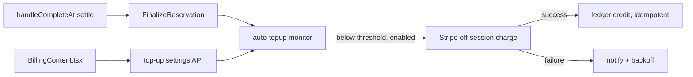
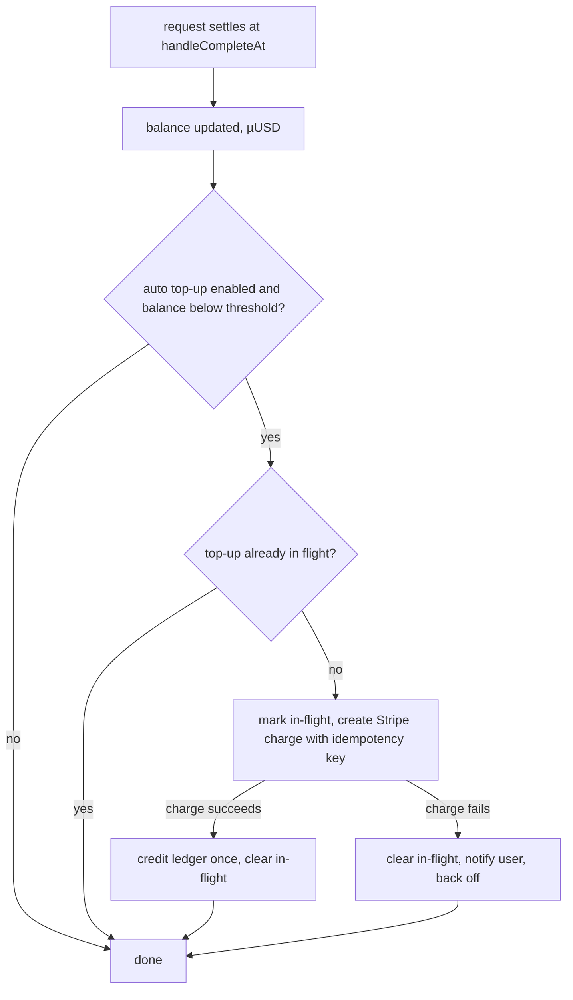

# ORP-092: Auto top-up

> Last updated: 2026-09-25 · commit `b6f9574ed`

Darkbloom has no automatic balance replenishment; when prepaid credit runs out, requests fail until a human makes another deposit. Part of the OpenRouter-perspective review; see the [review index](../README.md).

## What

Deposits are manual only: the consumer creates a Stripe Checkout session via `handleStripeCreateSession` in `coordinator/api/billing_handlers.go`, and nothing re-triggers that flow when the balance falls. There is no stored funding consent, no threshold setting, and no balance monitor. OpenRouter offers threshold-triggered auto top-up that charges the saved card when the balance drops below a user-set floor (OpenRouter FAQ, https://openrouter.ai/docs/faq). Today the first signal of an empty balance is inference admission rejecting the request: `coordinator/api/inference_admission.go` (`reserveInferenceBalance`) returns 402 `insufficient_funds`, and OpenRouter behaves the same on negative balance, including for free models (limits, https://openrouter.ai/docs/api-reference/limits).

## Why

Production workloads die at 402 `insufficient_funds` at 3am with no path back until an operator notices; auto top-up is the difference between a hobby API and infrastructure a team can run unattended.

## Prompt

Add opt-in auto top-up to the coordinator and console. Goal: a consumer can enable auto top-up with a balance threshold and a recharge amount; when the settled balance drops below the threshold, the coordinator charges the stored payment method once per threshold crossing and credits the account through the same ledger path as a manual deposit. Constraints: (1) explicit stored consent — the consumer sets up auto top-up through a Stripe flow that saves the payment method for off-session charges, and can disable it at any time; (2) charge creation must be idempotent (reference-idempotent ledger entry plus Stripe idempotency key, same pattern as the `wd-tr-<id>` / `wd-po-<id>` withdrawal keys); (3) all amounts integer micro-USD (`int64`, 1 USD = 1,000,000 µUSD); (4) the 15 billing invariants in `docs/architecture/billing.md` must be preserved; (5) one in-flight top-up per account — a second trigger while a charge is pending is a no-op; (6) off-session charge failures must not retry in a tight loop and must surface to the user. Files to touch: `coordinator/api/billing_handlers.go` (settings endpoints, setup-session handler), a new `coordinator/billing/auto_topup.go` (threshold monitor + charge creation), `coordinator/store/interface.go` (persist settings + in-flight marker), settlement path in `coordinator/api/provider.go` (`handleCompleteAt`) or reservation finalization in `coordinator/registry/pending_request.go` (`FinalizeReservation`) as the balance-drop observation point, `console-ui/src/app/billing/BillingContent.tsx` (enable/disable UI), plus tests. Acceptance criteria: with auto top-up enabled, a balance crossing below the threshold triggers exactly one Stripe charge and one ledger credit; disabling stops triggers; a failed charge notifies and does not spin.

## Workflow

1. Read `handleStripeCreateSession` and the deposit credit path to identify the shared credit entry point.
2. Read the settlement path (`handleCompleteAt`, `FinalizeReservation`) to pick where balance-drop is observed.
3. Design the settings schema: threshold µUSD, recharge amount µUSD, enabled flag, Stripe customer/payment-method references.
4. Add the Stripe setup flow that stores off-session consent for the payment method.
5. Implement the monitor: on settled-balance update, compare against threshold and enqueue one charge if enabled and none in flight.
6. Create the charge with a Stripe idempotency key and credit via the existing reference-idempotent deposit path.
7. Handle charge failure: mark attempt, notify the user, back off.
8. Add console UI on the billing page to enable, configure, and disable.
9. Add unit tests for trigger once-only, idempotent credit, disable, and failure backoff; run `make coordinator-test`.

## Loop

Run `make coordinator-test` (or `go test ./coordinator/billing/... ./coordinator/api/...` while iterating) and `make ui-lint` for the console change. Check: threshold-crossing triggers exactly one charge per crossing; a concurrent second trigger is a no-op; the ledger shows one reference-idempotent credit per successful charge; disabling mid-flight leaves at most one charge. Definition of done: coordinator tests green, UI lint green, billing invariants in `docs/architecture/billing.md` still hold.

## Graph

## Layout

- Add `coordinator/billing/auto_topup.go` — threshold monitor and charge creation.
- Modify `coordinator/api/billing_handlers.go` — settings and Stripe setup endpoints.
- Modify `coordinator/store/interface.go` and implementations — settings + in-flight marker persistence.
- Hook the observation point in `coordinator/api/provider.go` / `coordinator/registry/pending_request.go`.
- Modify `console-ui/src/app/billing/BillingContent.tsx` — auto top-up controls.
- Add tests in `coordinator/billing` and `coordinator/api`.

## Flow

Severity: medium · Effort: M
