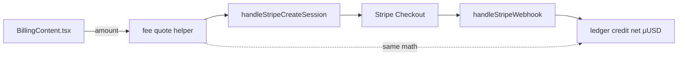
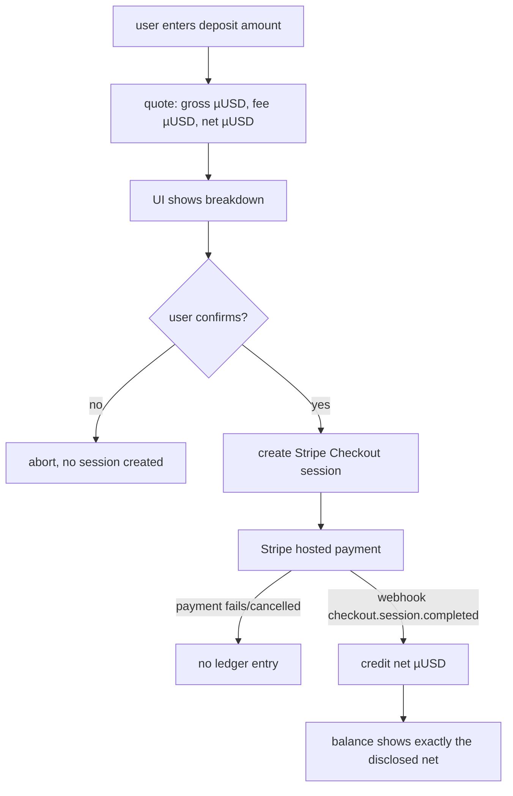

# ORP-093: Deposit fee transparency

> Last updated: 2026-09-25 · commit `b6f9574ed`

The deposit flow never tells the user what fees apply or how much credit will actually land in their account before they confirm payment. Part of the OpenRouter-perspective review; see the [review index](../README.md).

## What

The console deposit flow in `console-ui/src/app/billing/BillingContent.tsx` collects an amount and creates a Stripe Checkout session via `handleStripeCreateSession` in `coordinator/api/billing_handlers.go`; the session response and the checkout UI show no processing-fee breakdown or net-credit figure — the only fee disclosure is whatever Stripe's own hosted page renders, and only net µUSD lands in the ledger. OpenRouter discloses purchase fees up front, with card and crypto fee percentages shown before purchase (OpenRouter FAQ, https://openrouter.ai/docs/faq; exact fee figures render dynamically and are [UNVERIFIED] here).

## Why

A user who deposits $X and sees less than $X of credit appear treats the shortfall as a bug or a scam and files a dispute; undisclosed fees convert directly into support load and chargebacks.

## Prompt

Disclose deposit fees and net-credit math before checkout confirmation. Goal: before the user is sent to Stripe Checkout, the UI shows the deposit amount, the applicable processing fee, and the exact net credit in USD (and µUSD precision internally) that will land in the account; the session-creation API response carries the same breakdown so API consumers see it too. Constraints: (1) the displayed net credit must equal what the ledger actually credits on webhook completion — compute both from one shared function, not two copies; (2) all money math stays integer micro-USD (`int64`, 1 USD = 1,000,000 µUSD) with the USD rendering derived from it; (3) respect the existing deposit minimum of $0.50; (4) no fee figure may be hardcoded in two places — source it from config so a Stripe fee change is one edit; (5) this is disclosure only: it changes no ledger behavior and touches none of the 15 invariants in `docs/architecture/billing.md`. Files to touch: `coordinator/api/billing_handlers.go` (`handleStripeCreateSession` response), a fee-quote helper near the deposit logic, `console-ui/src/app/billing/BillingContent.tsx` (pre-confirmation breakdown), plus tests. Acceptance criteria: the UI and the API response show identical fee and net figures; the net figure matches the webhook credit to the µUSD; changing the fee config changes both surfaces.

## Workflow

1. Read `handleStripeCreateSession` and the webhook credit path to find where net µUSD is computed today.
2. Extract a single fee-quote function: input gross µUSD, output fee µUSD and net µUSD.
3. Add the breakdown to the session-creation response (gross, fee, net).
4. Source the fee parameters from config, not constants scattered across files.
5. Render the breakdown in `BillingContent.tsx` before the user confirms checkout.
6. Add unit tests asserting quote-vs-credit equality and config propagation.
7. Run `make coordinator-test` and `make ui-lint`.

## Loop

Run `make coordinator-test` (or `go test ./coordinator/api/...` while iterating) and `make ui-lint`. Check: the quote function and the webhook credit path produce identical net µUSD for the same gross amount; the session response includes the breakdown; the console renders it before confirmation; the $0.50 minimum still applies. Definition of done: coordinator tests and UI lint green, one shared fee computation, displayed net equals credited net.

## Graph

## Layout

- Modify `coordinator/api/billing_handlers.go` — breakdown in the session-creation response.
- Add a fee-quote helper alongside the deposit logic (coordinator billing/payments package).
- Modify `console-ui/src/app/billing/BillingContent.tsx` — pre-confirmation fee and net-credit display.
- Add config for fee parameters.
- Add tests in `coordinator/api` (or the package owning the quote helper).

## Flow

Severity: low · Effort: S
