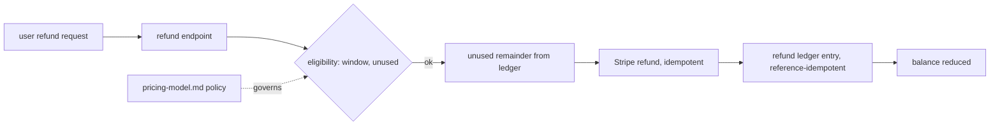
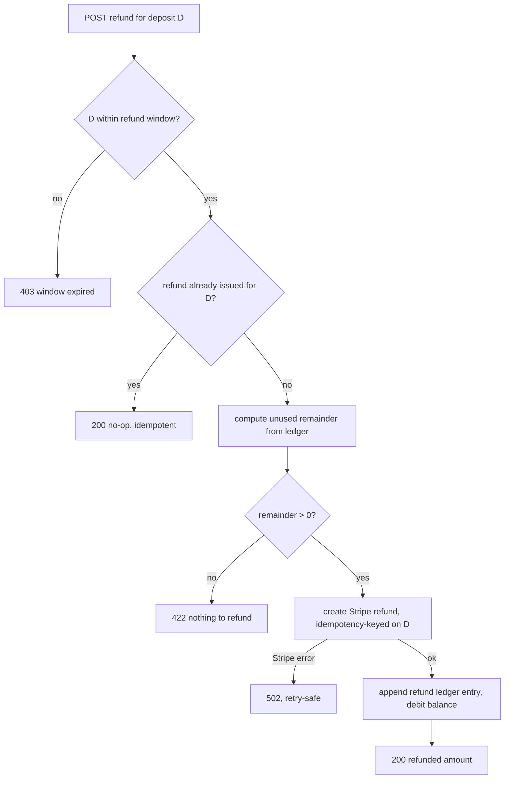

# ORP-094: Unused-credit refund policy and flow

> Last updated: 2026-09-25 · commit `b6f9574ed`

Darkbloom takes prepaid deposits but has no refund path: there is no policy, no endpoint, and no ledger entry type for returning unused credit. Part of the OpenRouter-perspective review; see the [review index](../README.md).

## What

The money path is one-way: deposits arrive via Stripe Checkout (`handleStripeCreateSession` in `coordinator/api/billing_handlers.go`) and credits are consumed by inference, but no endpoint moves unused balance back to the user. OpenRouter makes unused credits refundable within 24 hours of purchase via a button on the Credits page, with processing fees excluded from the refund (OpenRouter FAQ, https://openrouter.ai/docs/faq); OpenRouter also notes credits may expire one year after purchase (ToS), a policy question Darkbloom must answer for itself. Darkbloom already has the reference-idempotent ledger pattern this needs: withdrawals use idempotency keys `wd-tr-<id>` / `wd-po-<id>` and reference-keyed ledger entries.

## Why

Prepaid-only with no exit is a procurement blocker: businesses cannot commit budget to a balance they can never recover, so the absence of any refund story caps deal size before the pricing conversation starts.

## Prompt

Decide and implement Darkbloom's unused-credit refund policy. This issue has two halves. Policy (decide first, record in the review follow-up): within what window are unused prepaid credits refundable (OpenRouter: 24 hours), are processing fees excluded (OpenRouter: yes), and do credits ever expire (OpenRouter: 1 year after purchase). Implementation: add a refund flow that returns unused credit for an eligible deposit to the original Stripe payment method. Constraints: (1) refunds are reference-idempotent — a refund ledger entry keys off the original deposit reference, following the same idempotency pattern already used for withdrawals (`wd-tr-<id>` / `wd-po-<id>`), so a retried refund cannot double-pay; (2) only the unused remainder of a deposit is refundable — compute it from the ledger, never trust a client-supplied amount; (3) all amounts integer micro-USD (`int64`, 1 USD = 1,000,000 µUSD); (4) the 15 billing invariants in `docs/architecture/billing.md` must be preserved — if a new `refund` ledger entry type is added, amend the invariant list in the same change and document it; (5) refunds must not apply to promotional grants (model token promotions in `coordinator/store/model_token_promotions.go` are not cash and stay non-refundable); (6) Stripe refund creation must be idempotent against Stripe's own API. Files to touch: `coordinator/api/billing_handlers.go` (refund endpoint), `coordinator/billing/` (Stripe refund call), `coordinator/store/interface.go` (refund entry type + unused-remainder computation), `docs/architecture/billing.md` and `docs/reference/pricing-model.md` (policy + invariant update), plus tests. Acceptance criteria: an eligible deposit can be refunded exactly once for exactly its unused remainder; a retry is a no-op; an ineligible deposit (window passed, partially consumed past policy) is rejected with a clear error; the amended invariants pass review.

## Workflow

1. Record the policy decision (window, fee exclusion, expiry) in `docs/reference/pricing-model.md` and link it from `docs/architecture/billing.md`.
2. Read the withdrawal idempotency pattern (`wd-tr-<id>` / `wd-po-<id>`) and mirror it for refunds keyed on the deposit reference.
3. Add a `refund` ledger entry type in `coordinator/store/interface.go` and amend the invariant list in `docs/architecture/billing.md`.
4. Implement the unused-remainder computation from ledger history.
5. Add the Stripe refund call in `coordinator/billing/` with idempotency.
6. Add the consumer-facing refund endpoint in `coordinator/api/billing_handlers.go` with eligibility checks.
7. Add tests: single refund, retry no-op, ineligible cases, remainder math.
8. Run `make coordinator-test`.

## Loop

Run `make coordinator-test` (or `go test ./coordinator/billing/... ./coordinator/api/... ./coordinator/store/...` while iterating). Check: refund of an untouched deposit returns the full net amount once; refund of a partially consumed deposit returns exactly the remainder; duplicate refund requests produce one Stripe refund and one ledger entry; promotional balances are never refundable; the invariant list in `docs/architecture/billing.md` is updated and consistent with the new entry type. Definition of done: tests green, policy documented, refund provably idempotent end to end.

## Graph

## Layout

- Modify `coordinator/api/billing_handlers.go` — refund endpoint.
- Add refund support in `coordinator/billing/` — Stripe refund with idempotency.
- Modify `coordinator/store/interface.go` and implementations — `refund` entry type, remainder computation.
- Modify `docs/architecture/billing.md` — amend invariant list; `docs/reference/pricing-model.md` — policy.
- Optional: refund button on the console billing page (OpenRouter uses a Credits page button).
- Add tests in `coordinator/billing`, `coordinator/api`, and `coordinator/store`.

## Flow

Severity: medium · Effort: M
