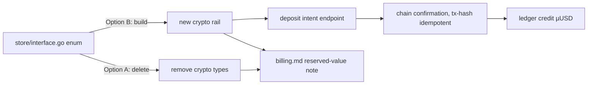
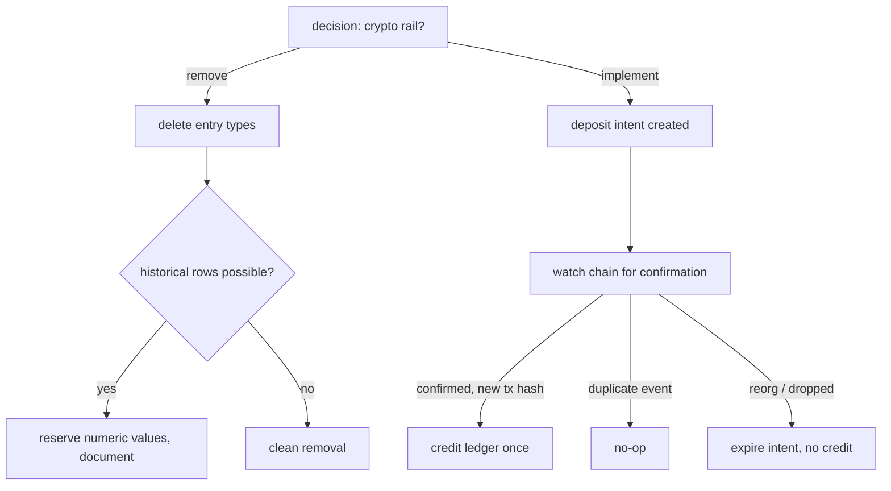

# ORP-095: Crypto deposit rail: implement or remove

> Last updated: 2026-09-25 · commit `b6f9574ed`

Legacy crypto deposit and withdrawal ledger entry types exist in the store interface but have no writers — dead surface that still appears in the enum. Part of the OpenRouter-perspective review; see the [review index](../README.md).

## What

`coordinator/store/interface.go` defines ledger entry types for crypto deposits and crypto withdrawals, yet no code path ever writes them: the only live deposit rail is Stripe Checkout (`handleStripeCreateSession` in `coordinator/api/billing_handlers.go`) and the only live payout rails are Stripe Connect Express (`coordinator/billing/stripe_connect.go`) and Global Payouts (`coordinator/billing/globalpayouts/`). OpenRouter supports crypto purchases alongside card, with its own disclosed fee (OpenRouter FAQ, https://openrouter.ai/docs/faq; exact figures render dynamically and are [UNVERIFIED] here), which is presumably why the types were reserved — but a reserved type with no writer is dead surface under the repo's own no-dead-surface hygiene rule.

## Why

Dead ledger types invite false assumptions: an integrator reading the enum concludes a crypto rail is supported, a future migration author assumes historical crypto rows may exist, and neither is true — the enum lies about what the system does.

## Prompt

Decide the fate of the crypto ledger entry types, then implement the decision fully. This is a decision issue with two valid resolutions. Option A — remove: delete the crypto deposit/withdrawal entry types from `coordinator/store/interface.go` and every reference (enum exhaustiveness switches, any admin/reporting rendering, docs). Verify no migration or historical-data path depends on the values; if old databases could theoretically contain such rows, keep the numeric constants reserved-but-unnamed so decoding never panics, and document that in `docs/architecture/billing.md`. Option B — implement: build a real crypto deposit rail (USDC-style), which means a deposit-intent endpoint, chain-event confirmation with reference-idempotent crediting keyed on the transaction hash (the same dedup discipline as the Stripe webhook fix, ORP-091), integer micro-USD accounting, and payout policy for crypto balances; this is a full feature, not a cleanup, and must satisfy all 15 billing invariants in `docs/architecture/billing.md`. Constraints for either option: no enum value may remain that has no writer and no documented reserved status; all money math integer micro-USD (`int64`). Files to touch (Option A): `coordinator/store/interface.go`, any switch/rendering sites, `docs/architecture/billing.md`. Files to touch (Option B): those plus new deposit endpoint(s) in `coordinator/api/billing_handlers.go`, a new `coordinator/billing/` rail package, store schema, and docs. Acceptance criteria: after the change, every ledger entry type in the enum either has a live writer or is explicitly documented as reserved; `make coordinator-test` is green.

## Workflow

1. Enumerate every reference to the crypto entry types: `grep` the enum values across `coordinator/`, `console-ui/`, and `admin-ui/`.
2. Check migrations and any historical-data handling for dependencies on the values.
3. Record the decision (remove vs implement) in the review follow-up; default to remove unless a product decision funds the rail.
4. If removing: delete the types, fix exhaustiveness sites, reserve the numeric values if historical rows are possible, update `docs/architecture/billing.md`.
5. If implementing: design deposit intent + confirmation with tx-hash idempotency, wire the ledger, document fees and policy.
6. Add or adjust tests for enum exhaustiveness and (if implemented) crediting idempotency.
7. Run `make coordinator-test`.

## Loop

Run `make coordinator-test` (or `go test ./coordinator/store/... ./coordinator/payments/...` while iterating). Check: `grep` finds no orphan references to removed types; enum-exhaustive switches compile; if implemented, duplicate chain-event delivery credits exactly once (tx-hash keyed). Definition of done: the enum contains no undocumented dead values, tests green, `docs/architecture/billing.md` states the outcome.

## Graph

## Layout

- Modify `coordinator/store/interface.go` — delete or document-reserve the crypto entry types.
- If implementing: add a rail package under `coordinator/billing/` and deposit endpoint(s) in `coordinator/api/billing_handlers.go`.
- Modify `docs/architecture/billing.md` — record the outcome.
- Sweep any enum rendering in `console-ui/` / `admin-ui/`.
- Adjust tests in `coordinator/store` / `coordinator/payments`.

## Flow

Severity: low · Effort: S
