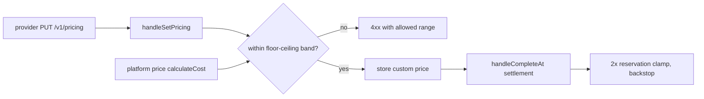
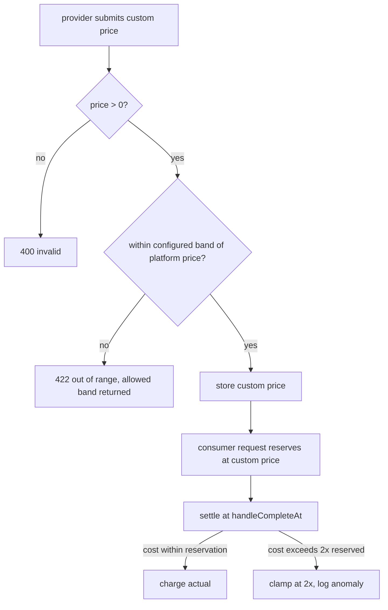

# ORP-096: Provider custom-price floor/ceiling validation

> Last updated: 2026-09-25 · commit `b6f9574ed`

Providers can set custom per-token prices with no bounds beyond `> 0`, so a provider can price absurdly low or absurdly high relative to the platform price. Part of the OpenRouter-perspective review; see the [review index](../README.md).

## What

`PUT /v1/pricing` (`handleSetPricing` in `coordinator/api/billing_handlers.go`, with `DELETE` to clear) validates a provider's custom input/output prices only as greater than zero. Nothing relates the custom price to the platform price from `coordinator/payments/pricing.go` (`calculateCost`). A 1 µUSD/M custom price distorts payout math optics; an absurdly high price overcharges consumers until the reservation clamp (settlement capped at ≤ 2× the reserved estimate via `reserveInferenceBalance` in `coordinator/api/inference_admission.go` and `handleCompleteAt` in `coordinator/api/provider.go`) limits the damage. OpenRouter exposes per-provider pricing but each provider's price is a fixed, visible rate consumers filter on with `max_price` — the marketplace protects the consumer by transparency (OpenRouter provider routing, https://openrouter.ai/docs/features/provider-routing).

## Why

Unbounded custom prices are a consumer-trust hole in a marketplace: one misconfigured or malicious provider can 100× a model's price, and consumers discover it only in their ledger after the reservation clamp has already let through twice the expected charge.

## Prompt

Add floor and ceiling validation for provider custom prices relative to the platform price. Goal: `handleSetPricing` rejects custom prices outside a sane band around the platform price for that model. Constraints: (1) the band must be policy, not hardcoded per model — e.g. custom price must be within [0.5×, 4×] the platform per-token price, with the exact multipliers in config so they can be tuned without a deploy; (2) validation must reject with a clear 4xx naming the allowed range, not silently clamp; (3) existing custom prices already stored outside the new band need a policy: grandfather with a warning, or invalidate on next heartbeat — decide and document in `docs/reference/pricing-model.md`; (4) the reservation clamp (≤ 2× reserved) stays as the second line of defense regardless; this issue adds prevention, not a replacement; (5) all prices integer micro-USD (`int64`); the 15 billing invariants in `docs/architecture/billing.md` are unaffected because this changes validation only. Files to touch: `coordinator/api/billing_handlers.go` (`handleSetPricing`), `coordinator/payments/pricing.go` (band-check helper beside `calculateCost`), config for the multipliers, `docs/reference/pricing-model.md`, plus tests. Acceptance criteria: a custom price within the band is accepted; below-floor and above-ceiling prices are rejected with the allowed range in the error; unset (`DELETE`) behavior is unchanged; the band multipliers come from config.

## Workflow

1. Read `handleSetPricing` to see current validation and where the platform price for a model is available.
2. Add config for the floor/ceiling multipliers relative to platform price.
3. Implement a band-check helper in `coordinator/payments/pricing.go` next to `calculateCost`.
4. Wire the check into `handleSetPricing` with a descriptive 4xx error.
5. Decide and implement the policy for already-stored out-of-band prices.
6. Document the band in `docs/reference/pricing-model.md`.
7. Add tests: in-band accept, floor/ceiling reject, boundary values, config change.
8. Run `make coordinator-test`.

## Loop

Run `make coordinator-test` (or `go test ./coordinator/api/... ./coordinator/payments/...` while iterating). Check: boundary prices (exactly floor, exactly ceiling) behave per policy; rejection errors name the allowed range; the `DELETE /v1/pricing` reset path is untouched; existing pricing tests pass. Definition of done: tests green, band enforced at write time, policy documented.

## Graph

## Layout

- Modify `coordinator/api/billing_handlers.go` — band validation in `handleSetPricing`.
- Modify `coordinator/payments/pricing.go` — band-check helper.
- Add config keys for the floor/ceiling multipliers.
- Modify `docs/reference/pricing-model.md` — document the band.
- Add tests in `coordinator/api` and `coordinator/payments`.
- No UI surface (unless the provider-facing pricing editor exists in console-ui — verify before claiming).

## Flow

Severity: medium · Effort: S
