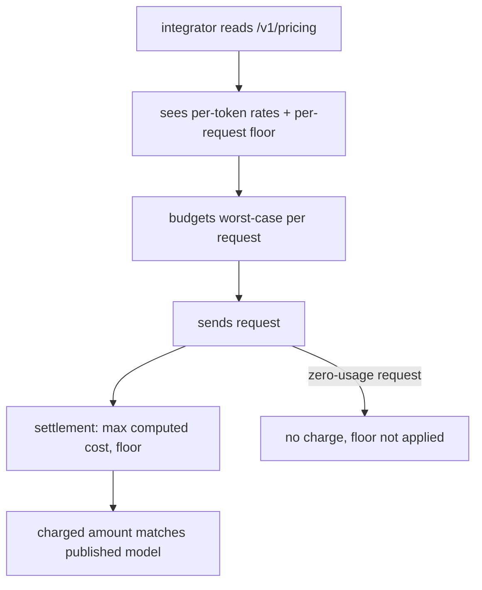

# ORP-097: Minimum-charge floors surfaced in pricing docs and API output

> Last updated: 2026-09-25 · commit `b6f9574ed`

Every request has a minimum charge floor — 100 µUSD for consumers, 1 µUSD for service accounts — but neither floor appears in the pricing API output or the pricing reference doc. Part of the OpenRouter-perspective review; see the [review index](../README.md).

## What

`coordinator/payments/pricing.go` floors per-request cost: `CalculateCostWithOverrides` clamps the total at `minimumChargeMicroUSD = 100` ($0.0001/request), and `CalculateCostWithOverridesNoMinimum` for service accounts still floors non-zero usage at 1 µUSD via `calculateCost`. Neither floor is visible to integrators: `/v1/pricing` output reports per-token rates without the per-request floor, and `docs/reference/pricing-model.md` does not list the floors as first-class rows. OpenRouter publishes its pricing model including per-request behavior on its docs and exposes limits explicitly (OpenRouter FAQ, https://openrouter.ai/docs/faq; limits, https://openrouter.ai/docs/api-reference/limits).

## Why

A high-frequency small-request integrator (embeddings-style batching, autocomplete pings) budgets from the per-token rate and discovers the floor only by auditing their ledger after the bill is 2–10× the estimate; hidden floors read as overcharging even when the math is correct.

## Prompt

Surface the minimum-charge floors as first-class pricing facts. Goal: the floors are stated in `docs/reference/pricing-model.md` as table rows next to the per-token rates, and the pricing API output (`/v1/pricing`) includes the applicable floor per request class so clients can compute worst-case costs without reading Go. Constraints: (1) the doc and the API must source the numbers from the code constants (`minimumChargeMicroUSD`, the 1 µUSD service-account floor) — do not hardcode copies that drift; for the doc, cite `coordinator/payments/pricing.go` (`calculateCost`) per the docs citation rules; (2) state exactly when each floor applies: consumer requests floor at 100 µUSD, service-account requests floor at 1 µUSD for non-zero usage, zero-usage requests are not charged; (3) note the interaction with `platformFeePercent = 0` during alpha so the doc matches reality; (4) this is a disclosure change — no pricing behavior changes, no ledger impact, no invariant impact. Files to touch: `docs/reference/pricing-model.md`, the `/v1/pricing` handler (find it from `coordinator/api/server.go` route wiring; likely in `coordinator/api/billing_handlers.go` or a pricing handler file), plus tests for the new response field. Acceptance criteria: `docs/reference/pricing-model.md` has explicit floor rows citing the constants; `/v1/pricing` output includes the floor; a reader can predict a single 1-token request's charge from public information alone.

## Workflow

1. Read `calculateCost`, `CalculateCostWithOverrides`, and `CalculateCostWithOverridesNoMinimum` in `coordinator/payments/pricing.go` to pin the exact floor semantics.
2. Locate the `/v1/pricing` handler via `coordinator/api/server.go`.
3. Add the applicable floor(s) to the pricing response, sourced from the constants.
4. Add first-class floor rows to `docs/reference/pricing-model.md` citing `coordinator/payments/pricing.go` (`calculateCost`).
5. Note the zero-usage exemption and the service-account distinction.
6. Add/update tests for the response shape.
7. Run `make coordinator-test` and `make docs-check`.

## Loop

Run `make coordinator-test` (or `go test ./coordinator/api/...` while iterating) and `make docs-check`. Check: the pricing response includes the floor and matches the constant; the doc's stated floors equal the code's floors; existing pricing tests pass with the additive field. Definition of done: tests and docs lint green; the floors are discoverable from both the API and the reference doc without reading Go.

## Graph

```mermaid
flowchart LR
  C[pricing.go constants] --> CALC[calculateCost floors]
  C --> API[/v1/pricing response]
  C --> DOC[pricing-model.md rows]
  API --> INT[integrator cost model]
  DOC --> INT
  CALC --> SETTLE[handleCompleteAt settlement]
```

## Layout

- Modify `docs/reference/pricing-model.md` — first-class floor rows with code citations.
- Modify the `/v1/pricing` handler (locate via `coordinator/api/server.go`) — include floors in output.
- Add/update tests for the pricing response shape.
- No UI surface.

## Flow



Severity: low · Effort: S
