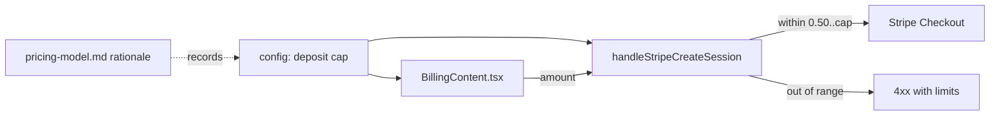
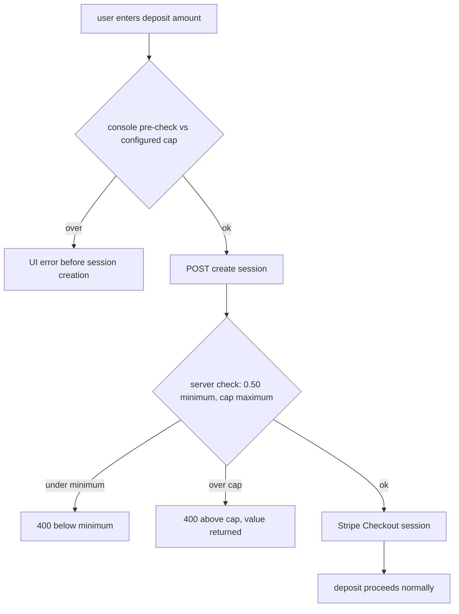

# ORP-098: $20 deposit cap review

> Last updated: 2026-09-25 · commit `b6f9574ed`

The console caps a single deposit at $20, hardcoded in the billing page with no config path and no documented rationale. Part of the OpenRouter-perspective review; see the [review index](../README.md).

## What

`console-ui/src/app/billing/BillingContent.tsx` enforces a $20 maximum on the deposit amount before it ever reaches `handleStripeCreateSession` in `coordinator/api/billing_handlers.go`; the coordinator itself enforces only the $0.50 minimum. The cap is a reasonable alpha-stage risk limit, but it lives as a literal in UI code: there is no server-side enforcement, no config knob, and no doc recording why $20 was chosen. OpenRouter imposes purchase limits that are account-state dependent and documented rather than hardcoded client-side (OpenRouter FAQ, https://openrouter.ai/docs/faq; limits, https://openrouter.ai/docs/api-reference/limits).

## Why

The first serious customer who wants to prepay $500 hits a client-side wall and must file a support request for what should be a settings change; a hardcoded UI cap also gives a false sense of protection, since anyone can bypass the console and call the API directly.

## Prompt

Make the deposit cap a deliberate, configured, server-enforced policy — or remove it. Goal: decide whether a deposit cap should exist post-alpha; if yes, enforce it server-side from config with a clear error, keep the console in sync, and document the rationale; if no, delete the client-side literal. Constraints: (1) the decision and its rationale must be recorded in `docs/reference/pricing-model.md` or `docs/architecture/billing.md` so the next reviewer does not re-litigate it; (2) if kept, the cap must be enforced in `handleStripeCreateSession` (server-side, from config) with the console reading the same value rather than duplicating a literal — client-only enforcement of a money limit is security theater; (3) keep the $0.50 minimum as is; (4) no ledger behavior changes; the 15 billing invariants in `docs/architecture/billing.md` are unaffected; (5) all amounts integer micro-USD (`int64`) internally. Files to touch: `coordinator/api/billing_handlers.go` (`handleStripeCreateSession`), coordinator config, `console-ui/src/app/billing/BillingContent.tsx`, the chosen doc, plus tests. Acceptance criteria: the cap (or its absence) is one config value enforced at the API; the console reflects it; the rationale is documented; an over-cap API request gets a clear 4xx.

## Workflow

1. Read the deposit flow in `BillingContent.tsx` and `handleStripeCreateSession` to map current min/max enforcement.
2. Record the decision: keep-and-configure vs remove, with rationale, in the chosen doc.
3. If keeping: add a config value for the max deposit; enforce it in `handleStripeCreateSession`.
4. Expose the current cap to the console (config endpoint or the session endpoint's error) so the UI stops hardcoding it.
5. If removing: delete the literal and any UI clamping beyond the server minimum.
6. Add tests: at-cap accept, over-cap reject with clear error, config change takes effect.
7. Run `make coordinator-test` and `make ui-lint`.

## Loop

Run `make coordinator-test` (or `go test ./coordinator/api/...` while iterating) and `make ui-lint`. Check: the API enforces the configured cap regardless of client; the console and API agree on the limit; the doc states the value and the rationale; below-minimum deposits still reject. Definition of done: tests and lint green, no money limit enforced only in client code, decision documented.

## Graph

## Layout

- Modify `coordinator/api/billing_handlers.go` — server-side cap enforcement in `handleStripeCreateSession` (if kept).
- Add coordinator config value for the max deposit.
- Modify `console-ui/src/app/billing/BillingContent.tsx` — read the cap instead of hardcoding $20 (or remove the clamp).
- Modify `docs/reference/pricing-model.md` or `docs/architecture/billing.md` — decision and rationale.
- Add tests in `coordinator/api`.

## Flow

Severity: low · Effort: S
