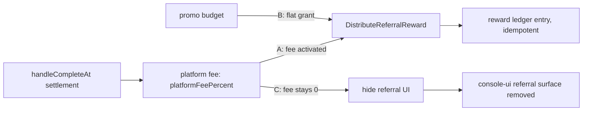
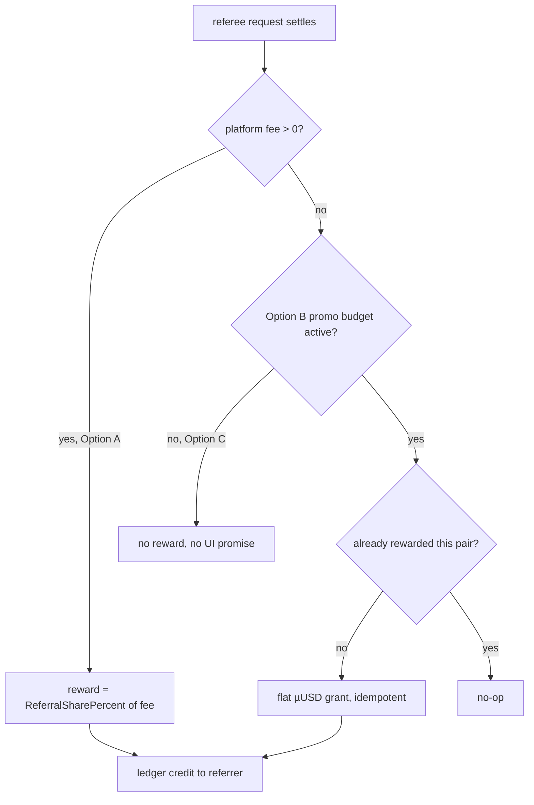

# ORP-099: Referral activation decision while platform fee is 0

> Last updated: 2026-09-25 · commit `b6f9574ed`

The referral program is live in the UI but pays nothing: rewards are a share of the platform fee, and the platform fee is globally 0 during alpha. Part of the OpenRouter-perspective review; see the [review index](../README.md).

## What

`coordinator/billing/referral.go` (`DistributeReferralReward`) computes the referral reward as `ReferralSharePercent` of the platform fee, and `coordinator/payments/pricing.go` sets `platformFeePercent = 0` globally during alpha (with per-user overrides clamped to [0,100] by `resolveFeePercent`), so every referral reward is exactly zero. The referral surface — codes, tracking, the program UI — is nonetheless live, promising a reward the system structurally cannot pay. OpenRouter's incentive design (credit expiry, purchase fees) is at least internally consistent: what it advertises is what it pays (OpenRouter FAQ, https://openrouter.ai/docs/faq).

## Why

A referral program that pays nothing is a broken promise rendered in the UI: users invest social capital referring others, receive zero, and learn the platform's other promises deserve the same skepticism.

## Prompt

Decide the referral program's fate during the zero-fee alpha, then align code and UI with the decision. This is a decision issue with three valid resolutions. Option A — activate a fee: set a non-zero `platformFeePercent` (globally or per-user via the existing `resolveFeePercent` override path) so rewards flow; this changes consumer pricing and must be treated as a pricing decision, documented in `docs/reference/pricing-model.md`, with the 15 invariants in `docs/architecture/billing.md` re-checked (fee splits interact with settlement at `handleCompleteAt`). Option B — switch to a fixed promo budget: pay referral rewards as flat µUSD grants from a budgeted promotion pool (the model token promotions machinery in `coordinator/store/model_token_promotions.go` is the nearest existing pattern for non-ledger-fee grants), reference-idempotent per (referrer, referee) pair. Option C — retire the surface until post-alpha: hide the referral UI and stop issuing codes while `platformFeePercent = 0`, keeping the plumbing dormant but tested. Constraints for any option: no live UI may promise a reward that computes to zero; all amounts integer micro-USD (`int64`); any reward ledger mutation must be idempotent; docs (`docs/architecture/billing.md`, `docs/reference/pricing-model.md`) must state the outcome. Files to touch depend on the option: `coordinator/payments/pricing.go` (A), `coordinator/billing/referral.go` (A/B), the referral UI in `console-ui` (C, or messaging fixes for A/B), plus tests. Acceptance criteria: the UI's promise and the ledger's behavior agree; rewards, when any, are idempotent and non-zero by construction; the decision is documented.

## Workflow

1. Read `DistributeReferralReward` in `coordinator/billing/referral.go` and `resolveFeePercent` in `coordinator/payments/pricing.go` to confirm the zero-reward path.
2. Inventory the referral UI surface in `console-ui` and the referral endpoints in `coordinator/api/billing_handlers.go`.
3. Record the decision (A/B/C) with rationale in `docs/architecture/billing.md`.
4. Implement the chosen option behind the smallest possible diff.
5. For A: set the fee, verify fee-split invariants at settlement, update pricing docs.
6. For B: implement flat grants keyed idempotently per (referrer, referee); budget cap in config.
7. For C: hide the UI and code-issuance while the fee is 0; keep tests covering the dormant path.
8. Add tests for whichever path ships; run `make coordinator-test` (and `make ui-lint` if UI changed).

## Loop

Run `make coordinator-test` (or `go test ./coordinator/billing/... ./coordinator/payments/...` while iterating); run `make ui-lint` if the console changes. Check: for A, a referral-eligible settlement produces a non-zero, correctly split reward and the billing invariants still hold; for B, duplicate reward distribution for the same (referrer, referee) pays once; for C, no UI surface advertises rewards while the fee is 0. Definition of done: tests green, UI promise and ledger behavior identical, decision recorded in docs.

## Graph

## Layout

- Modify `coordinator/billing/referral.go` — reward computation per the chosen option.
- Modify `coordinator/payments/pricing.go` — only if activating a fee (Option A).
- Modify the referral UI in `console-ui` — messaging or removal per the decision.
- Modify `docs/architecture/billing.md` and `docs/reference/pricing-model.md` — record the decision.
- Add tests in `coordinator/billing`.

## Flow

Severity: low · Effort: S
