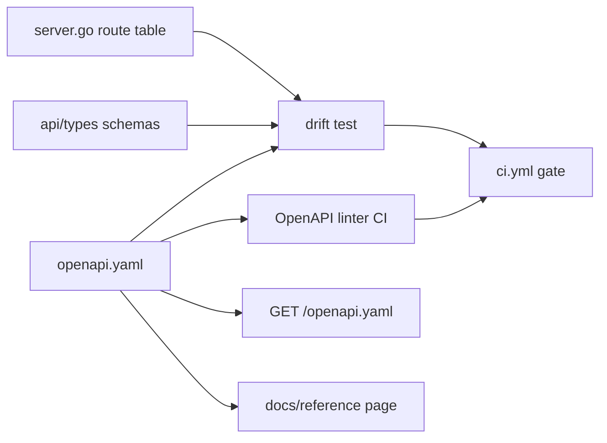
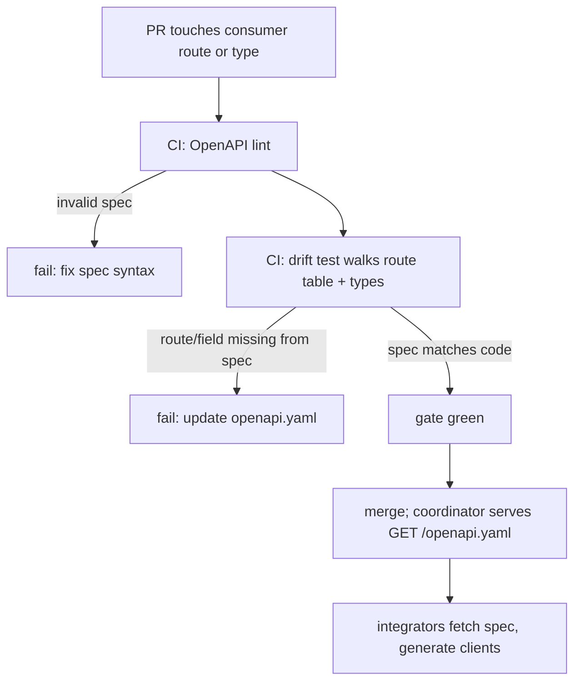

# ORP-100: Published OpenAPI spec with CI drift test

> Last updated: 2026-09-25 · commit `b6f9574ed`

Darkbloom's consumer API is OpenAI-compatible by convention but has no machine-readable contract: API docs are hand-maintained reference pages under `docs/reference/` and the route table lives only in code. Part of the OpenRouter-perspective review; see the [review index](../README.md).

## What

There is no published OpenAPI spec for the consumer API. The canonical route wiring lives in `coordinator/api/server.go` and the canonical consumer JSON shapes live in `coordinator/api/types/`; human-readable API contracts are maintained by hand in `docs/reference/` and kept honest only by the docs-impact rules (`scripts/docs-impact-rules.json`), which force a doc update but not a contract update. OpenRouter publishes its spec at https://openrouter.ai/openapi.yaml and treats it as the machine-readable source of truth for the API.

## Why

Integrators cannot generate clients, validate payloads, or diff Darkbloom against OpenAI/OpenRouter contracts; "OpenAI-compatible" is asserted in prose rather than tested. Hand-maintained reference pages drift silently: an additive response field or a new route ships with code and docs, and nothing fails, so compatibility breaks surface only as user bug reports.

## Prompt

Introduce a machine-readable OpenAPI 3.1 spec for Darkbloom's consumer-facing HTTP API and make it drift-proof. Goal: a checked-in `docs/api/openapi.yaml` (or generated equivalent) that covers the consumer routes wired in `coordinator/api/server.go` (chat/completions, responses, completions, messages, models, models/capacity, billing/pricing, stats) with request/response schemas derived from the canonical types in `coordinator/api/types/`; the spec is served publicly (a `GET /openapi.yaml` route on the coordinator and/or a static copy published with the docs). Constraints: (1) prefer generating the spec from the Go types and route table, or add a Go drift test that walks the route table and asserts every consumer route and schema field appears in the spec — hand-maintained specs without a drift gate are banned; (2) provider-internal and admin routes stay out of the published spec; (3) the spec must validate with an OpenAPI linter in CI; (4) follow the docs rules in `docs/AGENTS.md` for any new doc page. Files to touch: `coordinator/api/server.go`, `coordinator/api/types/`, a new `coordinator/api/openapi/` package or `scripts/` generator, `.github/workflows/ci.yml`, `docs/reference/` pointer page. Acceptance criteria: the spec lints clean; a CI job fails when a consumer route or schema field in code is missing from (or contradicts) the spec; the spec is fetchable over HTTP.

## Workflow

1. Inventory consumer routes in `coordinator/api/server.go` and response shapes in `coordinator/api/types/`.
2. Choose generation vs hand-authored-plus-drift-test; document the decision in a `docs/design/` record with a status line.
3. Produce the initial `openapi.yaml` covering all consumer routes and schemas.
4. Wire an OpenAPI linter (e.g. vacuum or spectral) into CI.
5. Write the drift test: enumerate routes from the server and schema fields from the Go types; fail on any mismatch with the spec.
6. Serve the spec at a public route (e.g. `GET /openapi.yaml`) from the coordinator.
7. Add a short `docs/reference/` page linking the spec, and register the new code-to-doc mapping in `scripts/docs-impact-rules.json`.
8. Run `make coordinator-test` and `make docs-check`.

## Loop

Iterate with `make coordinator-test` for the drift test and the OpenAPI linter for spec validity. In CI, confirm the new job fails when a route is added to `coordinator/api/server.go` without a spec update, and passes on the merged state. Run `make docs-check` so the new reference page passes stamp/link/orphan checks. Definition of done: spec lint clean, drift test green and demonstrably red on an artificial mismatch, spec served publicly, Docs Lint green.

## Graph

## Layout

- Modify `coordinator/api/server.go` — expose the spec route and route-table enumeration for the drift test.
- Modify `coordinator/api/types/` — annotate or register schemas for spec generation.
- Add `coordinator/api/openapi/` (generator and drift test) or `scripts/openapi-gen.sh`.
- Add `docs/api/openapi.yaml` — the published spec.
- Modify `.github/workflows/ci.yml` — spec lint + drift test job.
- Modify `docs/reference/` — pointer page; update `scripts/docs-impact-rules.json`.
- No UI surface.

## Flow

Severity: medium · Effort: L
