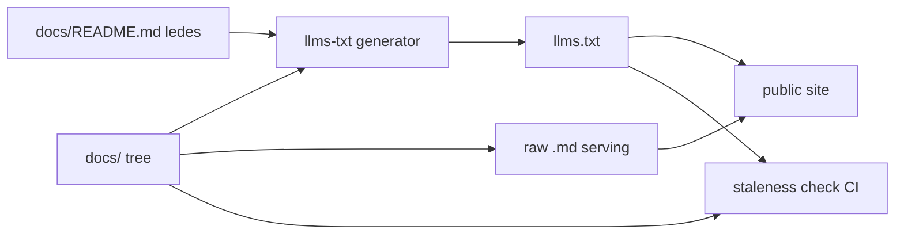
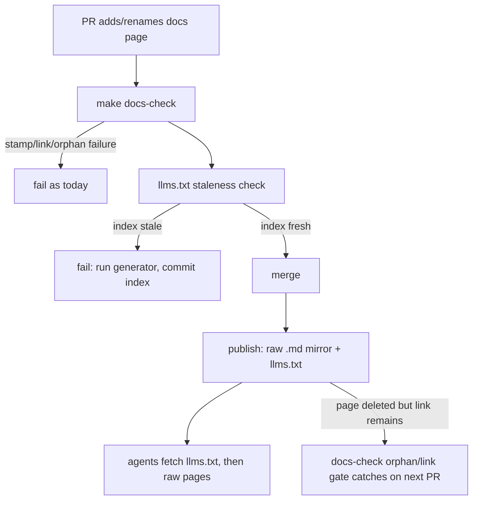

# ORP-101: `llms.txt` and raw-markdown docs serving

> Last updated: 2026-09-25 · commit `b6f9574ed`

Darkbloom's docs are written for agents but are reachable only as GitHub-rendered HTML; there is no `llms.txt` index and no raw-markdown serving. Part of the OpenRouter-perspective review; see the [review index](../README.md).

## What

The repo's own docs rules (`docs/AGENTS.md`, §9 "write for agents as well as people", which already cites llms.txt) stop at the repo boundary: docs are Diátaxis-organized markdown linted by `scripts/docs-check.sh` (`make docs-check`), but a deployed agent or user agent can only read them through GitHub's HTML rendering. OpenRouter serves a machine-readable index at https://openrouter.ai/docs/llms.txt and exposes every docs page as raw markdown via a `.md` suffix.

## Why

Agents are now a primary docs audience, and HTML-wrapped pages waste their context and break retrieval tooling that expects plain markdown. Integrators building against Darkbloom with coding agents get worse grounding than they get from OpenRouter, for reasons unrelated to the content's quality.

## Prompt

Serve Darkbloom's docs as raw markdown and publish an `llms.txt` index. Goal: every page under `docs/` is fetchable as raw markdown from the public site (a `.md` suffix passthrough or a static mirror of the docs tree), and a top-level `llms.txt` lists the docs map with one-line descriptions. Constraints: (1) generate the `llms.txt` index from the docs tree and its README indexes rather than hand-maintaining it — add a script under `scripts/` and a CI check that the committed index matches the tree; (2) reuse the existing docs metadata (lede lines, freshness stamps) for descriptions; (3) keep `make docs-check` semantics unchanged — raw serving must not weaken link or stamp checks; (4) frozen records (`docs/reports/`) are served as-is. Files to touch: a new generator in `scripts/`, the docs-serving or static-mirror config for the public site, `docs/AGENTS.md` (document the new surface), `docs/README.md` (link the index). Acceptance criteria: `llms.txt` is fetchable and lists every current docs page; any docs page is retrievable as raw markdown; CI fails when a docs page is added or renamed without regenerating the index.

## Workflow

1. Read `docs/README.md` and `docs/AGENTS.md` to see how the docs tree is indexed and linted today.
2. Write `scripts/llms-txt-gen.sh` (or Python) that walks `docs/` and emits `llms.txt` with page titles and lede lines.
3. Decide the serving mechanism (static mirror published with the site, or a coordinator route with `.md` passthrough) and document it.
4. Wire generation into the docs publish path.
5. Add a CI check (extend `scripts/docs-check.sh` or a new script) that fails when the committed `llms.txt` is stale relative to the docs tree.
6. Update `docs/AGENTS.md` §9 to describe the machine-readable surface and `docs/README.md` to link it.
7. Run `make docs-check` and the new staleness check.

## Loop

Run `make docs-check` and the new `llms.txt` staleness check while iterating. Verify by fetching `llms.txt` and one raw `.md` page from the deployed site and confirming the content matches the repo. Confirm CI goes red when a page is added to `docs/` without regenerating the index. Definition of done: index fresh, raw serving live, staleness gate green in CI and demonstrably red on a stale index.

## Graph

## Layout

- Add `scripts/llms-txt-gen.sh` (or `.py`) — generate the index from the docs tree.
- Add `llms.txt` at the served root (generated, committed).
- Modify `scripts/docs-check.sh` or add `scripts/llms-txt-check.sh` — staleness gate; wire into `make docs-check` and CI.
- Modify docs-serving/static-mirror config — raw `.md` passthrough.
- Modify `docs/AGENTS.md` and `docs/README.md` — document and link the new surface.
- No UI surface.

## Flow

Severity: low · Effort: M
