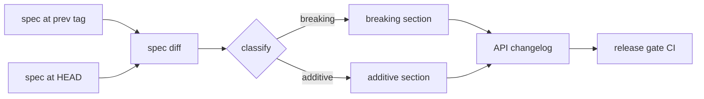
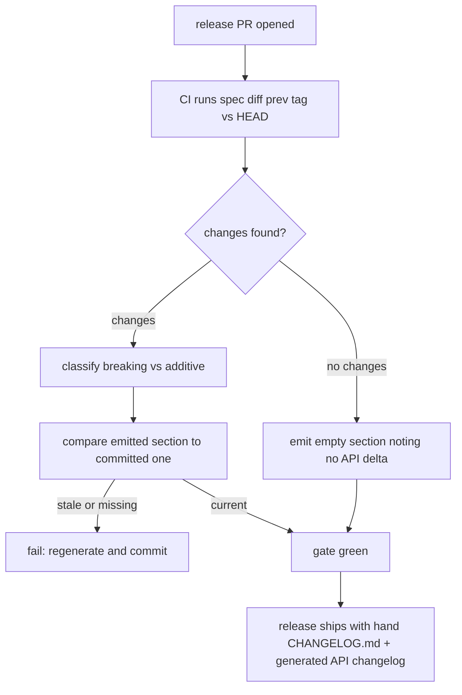

# ORP-102: Automated API changelog from spec diffs

> Last updated: 2026-09-25 · commit `b6f9574ed`

API changes are recorded only in a hand-written `CHANGELOG.md`; nothing enumerates contract-level changes between releases. Part of the OpenRouter-perspective review; see the [review index](../README.md).

## What

Once an OpenAPI spec exists (ORP-100), the contract delta between releases is computable, but today `CHANGELOG.md` is hand-written per release and no tool diffs the API surface. OpenRouter generates its API changelog from spec diffs and classifies changes as breaking or additive (https://openrouter.ai/docs/api_reference/versioning). Darkbloom's docs rules already force `CHANGELOG.md` updates for anything user-visible (`docs/AGENTS.md` §7), but enforcement is social, not mechanical.

## Why

Hand-written changelogs miss additive field changes that break strict-decoding clients: a new response field in `coordinator/api/types/` is a no-op for the writer and a decode failure for any integrator with `DisallowUnknownFields` semantics. Integrators have no reliable way to answer "what changed in the API between vX and vY" short of reading the source.

## Prompt

Generate an API changelog by diffing the OpenAPI spec between releases. Goal: a script under `scripts/` that diffs the checked-in spec (from ORP-100) between two git refs, classifies every change as breaking (removed route/field, tightened constraint, changed type) or additive (new route, optional field, new enum value), and emits a dated markdown section committed alongside the hand-written `CHANGELOG.md` (e.g. `docs/releases/` API-change blocks or an `API-CHANGELOG.md`). Constraints: (1) the tool complements, never edits, the hand-written `CHANGELOG.md`; (2) classification rules are explicit and conservative — unknown change kinds classify as breaking; (3) the release workflow runs the diff and fails if the generated section is missing or stale; (4) depend on ORP-100's spec and drift gate, do not build a parallel route inventory. Files to touch: new `scripts/api-changelog` generator, the release workflow in `.github/workflows/`, `docs/AGENTS.md` §7 row, `docs/releases/` or new `API-CHANGELOG.md`. Acceptance criteria: running the generator between the last two releases reproduces a known additive change; a release PR without the generated section fails CI.

## Workflow

1. Land ORP-100 so a checked-in, drift-tested spec exists.
2. Pick a spec-diff library (e.g. oasdiff) and pin it in the toolchain.
3. Write the generator: diff spec at two refs, classify changes, emit markdown.
4. Generate the first historical section to validate classification against a known release.
5. Wire the generator into the release workflow: fail when the emitted section is absent or stale for the release tag.
6. Document the classification rules and the release step in `docs/AGENTS.md` §7 and the release runbook.
7. Run the generator in CI on a test diff to confirm red/green behavior.

## Loop

Verify by diffing two historical tags and checking that a known additive field and a known breaking change classify correctly. In CI, confirm the release gate fails when the generated section is stale and passes after regeneration. Run `make docs-check` for the new docs edits. Definition of done: generator reproduces a real historical delta, release gate is green on a compliant release and red on a stale one, docs updated.

## Graph

## Layout

- Add `scripts/api-changelog/` or `scripts/api-changelog.py` — diff and classify.
- Add `API-CHANGELOG.md` or per-release blocks under `docs/releases/`.
- Modify the release workflow in `.github/workflows/` — generation + staleness gate.
- Modify `docs/AGENTS.md` §7 — new row for API changelog generation.
- No UI surface.

## Flow

Severity: low · Effort: M
