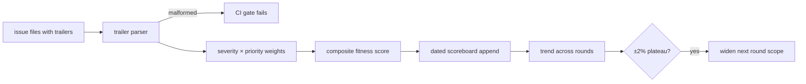
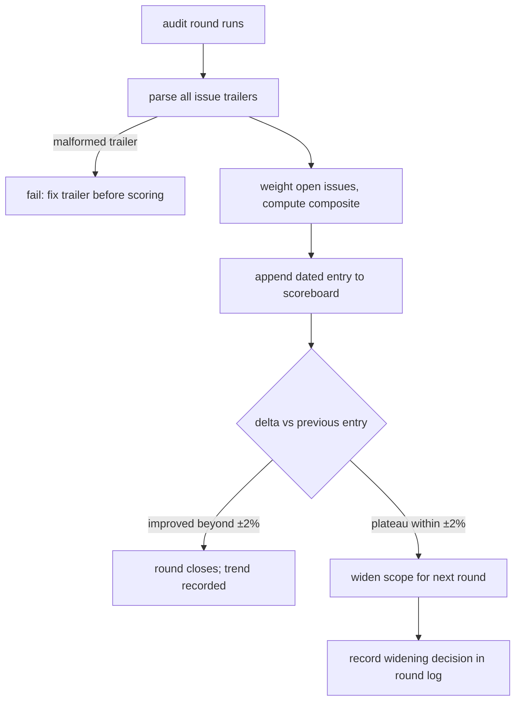

# ORP-103: Issue fitness scoreboard and gap ledger

> Last updated: 2026-09-25 · commit `b6f9574ed`

Darkbloom files thorough review findings but has no metric over its open-issue backlog, so "is the project getting healthier" has no quantitative answer. Part of the OpenRouter-perspective review; see the [review index](../README.md).

## What

The repo produces dated review records under `docs/reports/` — including this review's `issues/` directory, where each file ends with a machine-set `Severity: <level> · Effort: <S|M|L>` trailer — but nothing aggregates those trailers into a score, and no dated scoreboard tracks the backlog across rounds. The DiCompute process computes a composite issue-fitness score (severity × derived priority over open issues) before and after every audit round, appends it to a dated scoreboard, and applies a plateau rule: a delta within ±2% widens the next round's scope.

## Why

Without a metric, backlog health is vibes: a review round that closes nine trivial issues looks identical to one that closes one critical gap, and a stagnant backlog is invisible until someone re-reads every issue. Maintainers cannot tell whether audit effort is converging or circling, and the plateau signal that should widen scope never fires.

## Prompt

Build an issue-fitness scoreboard for the Darkbloom backlog. Goal: a script under `scripts/` that scans every issue file under `docs/reports/*/issues/` (and any other machine-readable issue source), parses the `Severity: … · Effort: …` trailer, maps severity and derived priority (see ORP-105) to weights, computes a composite fitness score over open issues, and appends the result — date, counts per severity, composite score, delta vs previous entry — to a dated scoreboard file. Constraints: (1) a missing or malformed trailer is scored as worse than a wrong one, not skipped, and reported by name; (2) the scoreboard is append-only and dated, so rounds show a trend; (3) the script runs locally and in CI (a `make` target), and fails on unparsable trailers; (4) closed/resolved issues are excluded via an explicit resolution marker, not file deletion. Files to touch: new `scripts/issue-scoreboard` script, `Makefile` target, a scoreboard record under `docs/reports/`, `docs/AGENTS.md` or contributing docs documenting the trailer contract. Acceptance criteria: the script reproduces a hand-computed score on a fixture set; `make docs-check` stays green; removing one high-severity open issue moves the composite score by the expected amount.

## Workflow

1. Survey existing issue trailers under `docs/reports/*/issues/` to fix the parser contract.
2. Define the weight table (severity × priority) and the resolution marker in a short design note or contributing doc.
3. Write the parser/scorer script with a fixture-based test.
4. Add the `make issue-scoreboard` target that appends to the dated scoreboard.
5. Backfill: score the current open set as the first scoreboard entry.
6. Add a CI check that fails on unparsable or missing trailers in issue files.
7. Document the trailer contract and scoreboard cadence in the contributing docs.
8. Run `make docs-check` and the new target.

## Loop

Iterate with the fixture test: scores must match hand computation. Verify the CI gate goes red on a fixture issue with a malformed trailer. Run `make docs-check` for doc edits. Definition of done: scoreboard has a dated baseline entry, `make issue-scoreboard` is reproducible, trailer gate is green and demonstrably red on a malformed trailer.

## Graph

## Layout

- Add `scripts/issue-scoreboard/` (parser, scorer, fixture tests).
- Modify `Makefile` — `issue-scoreboard` target.
- Add a dated scoreboard record under `docs/reports/`.
- Modify `.github/workflows/ci.yml` — trailer-parse gate.
- Modify contributing docs / `docs/AGENTS.md` — trailer contract documentation.
- No UI surface.

## Flow

Severity: low · Effort: M
