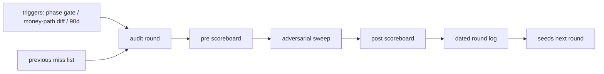
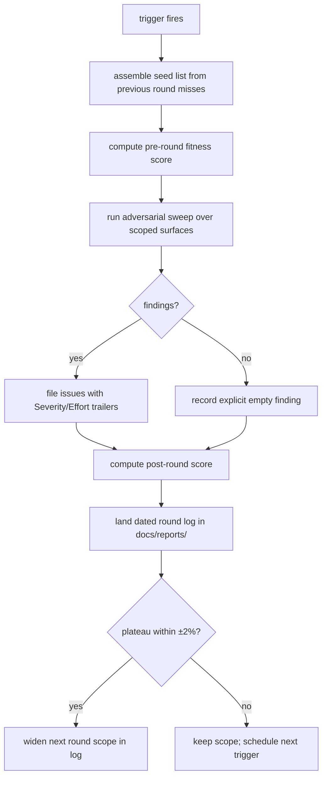

# ORP-104: Scheduled audit-loop procedure

> Last updated: 2026-09-25 · commit `b6f9574ed`

Darkbloom runs excellent one-off deep reviews but has no recurring adversarial sweep, so drift accumulates between reviews. Part of the OpenRouter-perspective review; see the [review index](../README.md).

## What

The repo's dated reports under `docs/reports/` (incidents, measurements, reviews like this one) are thorough but episodic: nothing schedules the next adversarial round, seeds it from the previous round's miss list, or requires a dated round log when nothing is found. The DiCompute process runs scheduled re-audit rounds triggered by phase gates, money-path diffs, and a 90-day backstop; each round is seeded from the previous round's misses, computes the fitness scoreboard (ORP-103) before and after, applies a plateau rule, and always lands a dated round log — including the empty case.

## Why

Adversarial review quality decays without recurrence: routing, billing, and security surfaces drift from the assumptions their last review verified, and because no round is owed, the drift is discovered by incidents instead. When a review does happen, its findings are not fed back as seeds, so the same blind spots repeat.

## Prompt

Write the audit-loop procedure doc for Darkbloom. Goal: a new doc (proposed home: `docs/operations/audit-loop.md` or `docs/developer/audit-loop.md`, following the `docs/AGENTS.md` skeleton for its type) that defines when audit rounds run (release phase gates, diffs touching money paths such as `coordinator/payments/` and `coordinator/billing/`, and a 90-day backstop), how each round is seeded from the previous round's miss list and unresolved findings, the pre/post fitness-scoreboard step (ORP-103), the plateau rule (delta within ±2% ⇒ widen scope next round), and the requirement to land a dated round log under `docs/reports/` even when nothing is found. Constraints: (1) the doc is a procedure, not a tool — keep it short, declarative, and consistent with `docs/AGENTS.md` voice; (2) name the trigger surfaces concretely (billing, routing, attestation) so "money-path diff" is checkable in review; (3) do not invent tooling that does not exist — reference ORP-103/ORP-105 as the scoreboard and trailer mechanisms; (4) register the new page in the relevant `docs/README.md` index. Files to touch: the new doc, `docs/README.md` or section index, optionally `scripts/docs-impact-rules.json` if money-path diffs should prompt an audit check. Acceptance criteria: `make docs-check` passes; a reader can run a full audit round from the doc alone; the doc names concrete triggers, seeding, scoreboard steps, and the empty-round log rule.

## Workflow

1. Read `docs/AGENTS.md` page skeletons and pick the doc type and home directory.
2. Read two or three existing `docs/reports/` records to ground the seeding procedure in real artifacts.
3. Define the trigger set: phase gates, money-path diffs (`coordinator/payments/`, `coordinator/billing/`), 90-day backstop.
4. Write the seeding procedure: previous miss list, open high-severity issues, plateau-driven scope widening.
5. Write the round-log template (dated record, findings or explicit empty statement, pre/post scoreboard).
6. Add the page to the directory's `README.md` index with a one-line description.
7. Consider a `scripts/docs-impact-rules.json` entry prompting an audit check on money-path diffs.
8. Run `make docs-check`.

## Loop

Run `make docs-check` (stamp, links, orphan, cited-path existence) until green. Review the doc against the §3 skeleton for its type and the §10 voice rules. Definition of done: docs lint green, page indexed, procedure executable end-to-end by a reader with no other context.

## Graph

## Layout

- Add `docs/operations/audit-loop.md` (or `docs/developer/audit-loop.md`) — the procedure.
- Modify the directory `README.md` index — register the page.
- Optionally modify `scripts/docs-impact-rules.json` — audit prompt on money-path diffs.
- No UI surface.

## Flow

Severity: low · Effort: S
