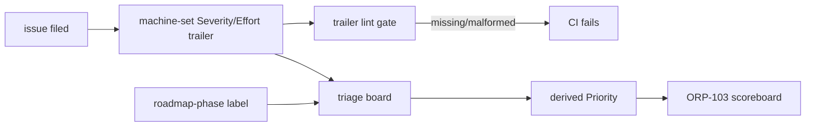
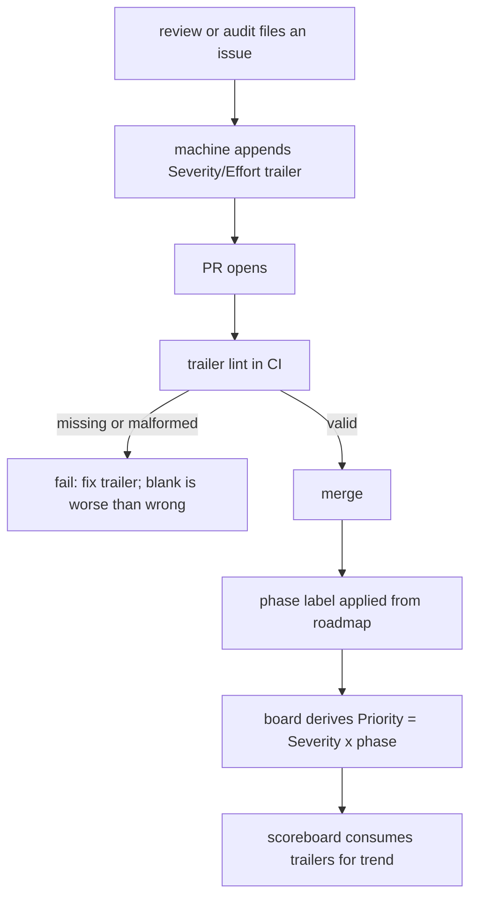

# ORP-105: Issue trailer and triage-board fields

> Last updated: 2026-09-25 · commit `b6f9574ed`

Darkbloom's filed issues lack a machine-readable severity/effort contract and a derived priority, so the backlog cannot answer "what do I do next". Part of the OpenRouter-perspective review; see the [review index](../README.md).

## What

Issue files in this review's `docs/reports/2026-09-26-openrouter-perspective-review/issues/` directory end with a `Severity: <level> · Effort: <S|M|L>` trailer, but that convention is local to this review: there is no repo-wide rule that every filed issue carries machine-set trailer fields, and no triage board that derives Priority from Severity × roadmap-phase labels. The DiCompute process sets the trailer mechanically on every audit-filed issue, treats blank fields as worse than wrong ones, and derives Priority rather than hand-picking it.

## Why

At high issue volume an untriaged list cannot answer "what do I do next": hand-picked priorities churn as maintainers relabel, and blank fields hide the worst issues from any aggregation (ORP-103's scoreboard depends on parseable trailers). Derived priority removes relabeling churn because changing a phase label re-prioritizes the whole board consistently.

## Prompt

Adopt a repo-wide issue-trailer contract and derived-priority triage. Goal: every machine-filed issue (in `docs/reports/*/issues/` and any future tracker) ends with a machine-set `Severity: <level> · Effort: <S|M|L>` trailer; a triage board (or generated index) derives Priority from Severity × roadmap-phase labels using a documented derivation rule; the rule lives in the contributing docs. Constraints: (1) blank or malformed trailers are treated as worse than wrong ones — a lint check (extend `scripts/docs-check.sh` or add a script wired into `make docs-check` / CI) fails on a missing trailer in an issue file; (2) Priority is never set by hand; the derivation table (severity rows × phase columns) is documented once and linked, not restated; (3) the trailer format stays exactly `Severity: <level> · Effort: <S|M|L>` so existing files parse; (4) keep the change compatible with ORP-103's scoreboard parser. Files to touch: contributing docs / `docs/AGENTS.md` (trailer contract + derivation rule), the lint check, issue-file templates if any. Acceptance criteria: the lint gate fails on an issue file with a missing trailer; the derivation rule is documented; a board or index view ordered by derived priority can be generated from the current backlog.

## Workflow

1. Fix the trailer grammar (levels, effort values, exact separator) from the existing `issues/` files.
2. Write the derivation table: Severity × roadmap-phase label → Priority.
3. Document the contract and the derivation rule in the contributing docs, following `docs/AGENTS.md` voice.
4. Add a lint check that parses trailers in `docs/reports/*/issues/` files and fails on missing/malformed ones; wire it into `make docs-check` and CI.
5. Generate a first derived-priority index over the current backlog to validate the rule.
6. Backfill any existing issue files that lack trailers.
7. Run `make docs-check`.

## Loop

Iterate with the lint check: red on a fixture issue with no trailer, green on the current backlog after backfill. Verify the derived index orders a small known set correctly (highest severity × current phase first). Run `make docs-check`. Definition of done: trailer gate green in CI, derivation rule documented, derived-priority index reproducible.

## Graph

## Layout

- Modify contributing docs / `docs/AGENTS.md` — trailer contract and derivation rule.
- Modify `scripts/docs-check.sh` or add a trailer-lint script — wire into `make docs-check` and CI.
- Backfill trailers in existing `docs/reports/*/issues/` files as needed.
- No UI surface.

## Flow

Severity: low · Effort: S
