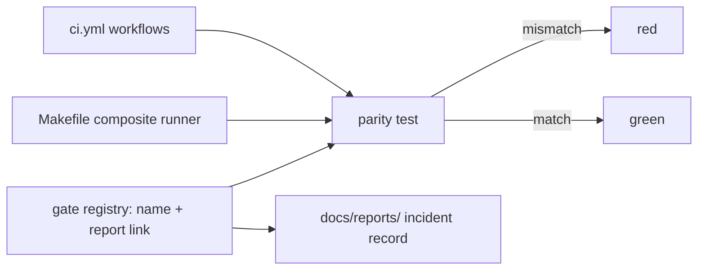
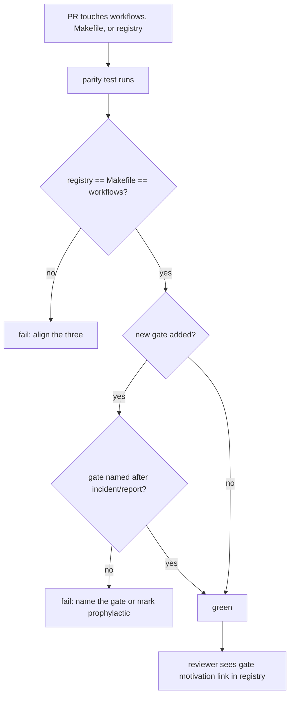

# ORP-106: Incident-named CI gate registry with parity test

> Last updated: 2026-09-25 · commit `b6f9574ed`

Darkbloom's CI gates are anonymous and its local and CI gate sets can drift apart, so gates get deleted by people who forgot why they exist and red code can merge green. Part of the OpenRouter-perspective review; see the [review index](../README.md).

## What

CI gates live in `.github/workflows/ci.yml` (plus `integration.yml` and `benchmarks.yml`) with generic job names; the motivating incident or report — which the repo already has under `docs/reports/` (e.g. the 2026-08-31 OpenRouter 504 cascade review, the 2026-07-30 tool-schema rejection review) — is not recorded next to the gate, and no parity check compares the gate set in CI against any local composite runner. The DiCompute process names every CI gate after the incident that motivated it and runs a parity test that fails when the local composite script and CI disagree about the gate set.

## Why

Unnamed gates are deleted by people who forgot why they exist, re-opening the exact failure the gate was added to catch; the deletion passes review because nothing links the gate to the incident report. Divergent local/CI gate sets are worse: a contributor's local run goes green, CI goes red (or vice versa), and the mismatch is debugged from scratch each time — or red code merges green when CI silently runs fewer gates.

## Prompt

Create an incident-named CI gate registry with a parity test. Goal: a checked-in registry (e.g. `ci/gates.json` or a section in an existing config) listing every static gate with a stable name of the form `<incident-or-report-slug>` (e.g. `openrouter-504-cascade`, `tool-schema-rejection`), a link to the motivating `docs/reports/` record, and the command it runs; a parity test that enumerates the registry, the local composite runner (`Makefile` targets), and the jobs in `.github/workflows/ci.yml`, and fails when any of the three disagree. Constraints: (1) every gate added from now on is named after its motivating incident/report; existing gates are renamed or mapped in the registry with their historical motivation where known; (2) the parity test compares sets, not ordering; (3) the registry is the single source of truth — both the local runner and CI consume or are checked against it; (4) gate names follow the repo rule against work-wave labels: use meaningful incident identifiers. Files to touch: new registry file, `Makefile`, `.github/workflows/ci.yml`, a parity script under `scripts/`, `docs/developer/` doc. Acceptance criteria: removing a job from `ci.yml` without updating the registry fails the parity test; every registry entry links to an existing report or states "prophylactic" explicitly; `make` local run and CI run the same gate set.

## Workflow

1. Inventory current CI jobs across `.github/workflows/ci.yml`, `integration.yml`, and `benchmarks.yml`, and local `Makefile` test/lint targets.
2. Match each gate to its motivating incident/report under `docs/reports/` where one exists; mark the rest "prophylactic".
3. Define the registry schema (name, motivation link, command, surfaces).
4. Write the registry covering all current gates, renaming toward incident-derived names.
5. Write the parity script: parse registry, Makefile targets, and workflow YAML; fail on set mismatch.
6. Wire the parity check into `make docs-check`-adjacent local checks and CI itself.
7. Document the naming rule and registry in `docs/developer/` and register it in `scripts/docs-impact-rules.json` for workflow edits.
8. Run the parity script, `make coordinator-test`, and `make docs-check`.

## Loop

Iterate on the parity script until registry, Makefile, and workflows agree. Test failure modes deliberately: drop a job from a workflow copy, drop a registry entry, add a Makefile target — each must turn the parity test red. Run `make docs-check` for the doc. Definition of done: parity green on the real tree and demonstrably red on all three artificial mismatches; every gate has a named motivation or an explicit "prophylactic" marker.

## Graph

## Layout

- Add `ci/gates.json` (or equivalent) — the registry.
- Add `scripts/ci-gate-parity.py` — the parity test.
- Modify `Makefile` — consume or be checked against the registry.
- Modify `.github/workflows/ci.yml` — gate names aligned with the registry.
- Add `docs/developer/ci-gates.md` — naming rule and registry doc.
- No UI surface.

## Flow

Severity: low · Effort: M
