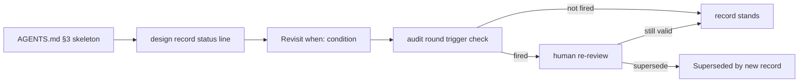
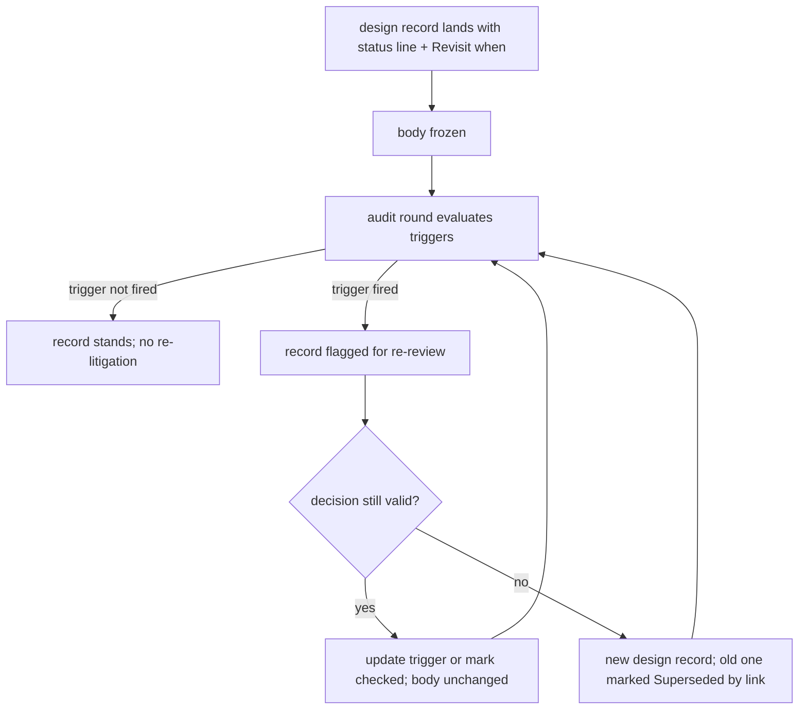

# ORP-107: Design records gain revisit triggers

> Last updated: 2026-09-25 · commit `b6f9574ed`

Darkbloom's design records say what was decided and whether it is built, but not when the decision stops being valid. Part of the OpenRouter-perspective review; see the [review index](../README.md).

## What

Design records in `docs/design/` carry a status line (`Status: Proposed | In progress | Implemented | Superseded | Abandoned`, per `docs/AGENTS.md` §3) with the body frozen, but there is no revisit-trigger convention: nothing names the condition under which the decision should be re-examined. The pattern already exists informally — the repo's AGENTS.md carries an inline retirement condition for `hypervisor_active` ("Remove only once the fleet version floor passes v0.6.31") — but it lives in prose, not in the design record, and no audit checks whether a trigger has fired. The DiCompute process gives every decision record named revisit triggers, and audits check trigger state instead of re-litigating or ignoring the decision.

## Why

Decisions without triggers decay in one of two wasteful ways: they get re-litigated in review threads that re-argue settled context, or they outlive their validity because nobody owns the moment the assumption changed (a version floor passing, a dependency landing). The `hypervisor_active` retirement condition shows the repo already feels this pain — the condition exists but is invisible to any systematic sweep.

## Prompt

Extend the design-record convention with explicit revisit triggers. Goal: the `docs/AGENTS.md` §3 design-record skeleton gains a required "Revisit when" field on the status line (one or more named, checkable conditions, e.g. "fleet version floor passes v0.6.31", "ORP-100 spec lands"), existing records in `docs/design/` are backfilled with triggers or an explicit "no trigger — final" marker, and the audit-loop procedure (ORP-104) includes a step that evaluates trigger state across records. Constraints: (1) triggers must be checkable conditions, not dates alone; (2) a trigger that has fired does not auto-change the record — it surfaces the record for human re-review; (3) keep the body-frozen rule: only the status line (and trigger state) is edited after landing; (4) update `docs/AGENTS.md` §3 and the design-template guidance in the same PR as the first backfilled records. Files to touch: `docs/AGENTS.md`, `docs/design/` records, `docs/design/README.md` index if present. Acceptance criteria: `make docs-check` passes; every `docs/design/` record carries a "Revisit when" line or the explicit no-trigger marker; the audit-loop doc references trigger evaluation.

## Workflow

1. Read `docs/AGENTS.md` §3 and several `docs/design/` records to see the status-line convention as practiced.
2. Define the "Revisit when" grammar (checkable condition; multiple allowed; explicit no-trigger marker).
3. Update `docs/AGENTS.md` §3 skeleton and voice rules to require the field.
4. Backfill each existing `docs/design/` record with a trigger or the no-trigger marker, editing only the status line.
5. Move the informal `hypervisor_active` retirement condition into the relevant design record's trigger field.
6. Add a trigger-evaluation step to the audit-loop procedure (ORP-104).
7. Optionally extend `scripts/docs-check.sh` to fail on a design record missing the "Revisit when" line.
8. Run `make docs-check`.

## Loop

Run `make docs-check` until green (stamp, links, index registration). If the lint extension is added, verify it goes red on a fixture design record without the field. Definition of done: skeleton updated, all records backfilled, audit loop references trigger evaluation, docs lint green.

## Graph

## Layout

- Modify `docs/AGENTS.md` §3 — require the "Revisit when" field.
- Modify `docs/design/*.md` — backfill status lines (status line only; bodies stay frozen).
- Modify `docs/design/README.md` — note the convention in the index if present.
- Optionally modify `scripts/docs-check.sh` — lint for the field on design records.
- No UI surface.

## Flow

Severity: low · Effort: S
