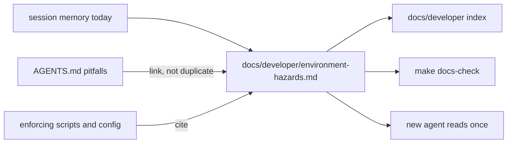
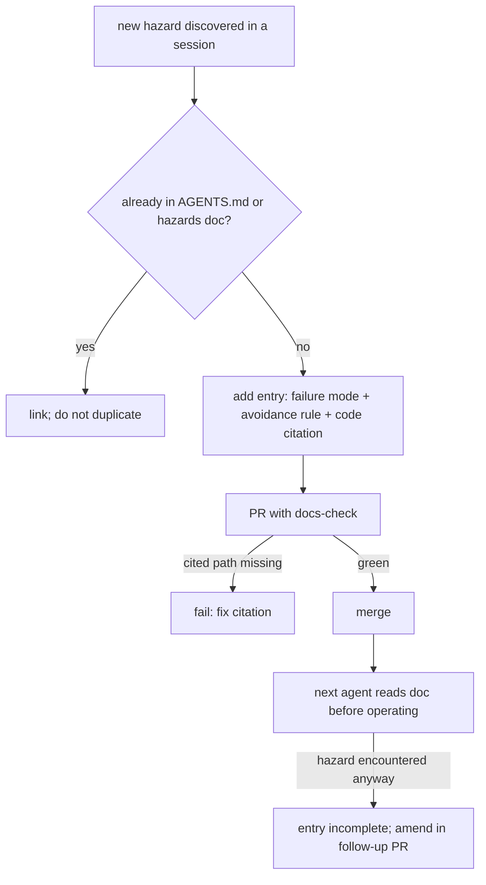

# ORP-108: Environment/ops hazards committed to git

> Last updated: 2026-09-25 · commit `b6f9574ed`

Some of Darkbloom's environment hazards are documented in AGENTS.md, but the full list lives in operator and agent session memory, where every new agent re-discovers it. Part of the OpenRouter-perspective review; see the [review index](../README.md).

## What

The repo's AGENTS.md "Common Pitfalls" section records real hazards — the gitignored `coordinator/coordinator` build-artifact trap, hash-after-signing in the release workflow, scan-time template checks — but the list is partial: macOS-only Swift builds, the metallib source-matching requirement (`scripts/fetch-metallib.sh` builds from `libs/mlx-swift` source), benchmark runner cost gating (`e2e/benchmark_test.go` posting to PR comments via `.github/workflows/benchmarks.yml`), shared-worktree and shared-stash rules for parallel agents, and memory caps are not committed anywhere. The DiCompute process commits environment hazards for agents (memory caps, shared-stash hazards, worktree rules) to git rather than keeping them in one session's memory.

## Why

Hazards kept in session memory are re-discovered by every agent and every new operator, and the re-discovery cost is paid in broken worktrees, wasted benchmark spend, or a polluted stash — the expensive way. The AGENTS.md pitfalls section proves the value of committing these: the hazards it does record stop recurring; the ones it does not record keep recurring.

## Prompt

Commit a developer doc listing the known agent/operator environment hazards for this repo. Goal: a new doc (proposed home: `docs/developer/environment-hazards.md`, following the `docs/AGENTS.md` skeleton) that enumerates each hazard with its concrete failure mode and the rule that avoids it: macOS-only Swift builds, the metallib source-matching requirement (`scripts/fetch-metallib.sh`), benchmark runner cost gating, shared-worktree rules and shared-stash hazards for parallel agents, agent memory caps, and the `coordinator/coordinator` build-artifact trap already noted in AGENTS.md (link, do not duplicate). Constraints: (1) one canonical home per fact per `docs/AGENTS.md` §7 — hazards already in AGENTS.md are linked, not restated; (2) every hazard entry names the failure mode and the avoidance rule in checkable terms; (3) register the page in the `docs/developer/` index and consider a `docs/AGENTS.md` §7 row so new hazards are added with the code that creates them; (4) plain declarative voice, no narrative. Files to touch: the new doc, `docs/developer/README.md` index, `docs/AGENTS.md` if a mapping row is added. Acceptance criteria: `make docs-check` passes; a new agent reading only the doc avoids every listed hazard; no fact is duplicated between the doc and AGENTS.md.

## Workflow

1. Read the AGENTS.md "Common Pitfalls" section and note which hazards already have a canonical home.
2. Gather the uncommitted hazards: build-platform constraints, metallib source matching, benchmark cost gating, worktree/stash rules, memory caps.
3. Draft the doc with one entry per hazard: failure mode, avoidance rule, citation to the code or script that enforces it.
4. Link the AGENTS.md-resident hazards instead of restating them.
5. Register the page in the `docs/developer/` index with a one-line description.
6. Add a `docs/AGENTS.md` §7 row if a code-to-doc mapping is warranted.
7. Run `make docs-check`.

## Loop

Run `make docs-check` (stamp, links, orphan, cited-path existence) until green. Verify each hazard entry cites an existing path — the checker enforces cited-path existence outside frozen records. Definition of done: docs lint green, page indexed, no duplicated facts, every entry actionable by a reader with no session history.

## Graph

## Layout

- Add `docs/developer/environment-hazards.md` — the hazard list.
- Modify `docs/developer/README.md` — index entry.
- Optionally modify `docs/AGENTS.md` §7 — mapping row for new hazards.
- No UI surface.

## Flow

Severity: low · Effort: S
