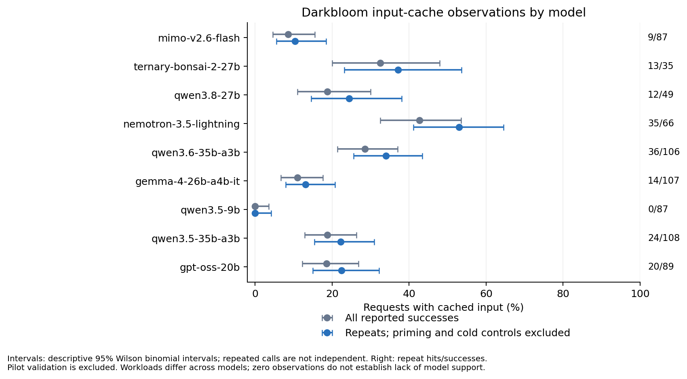
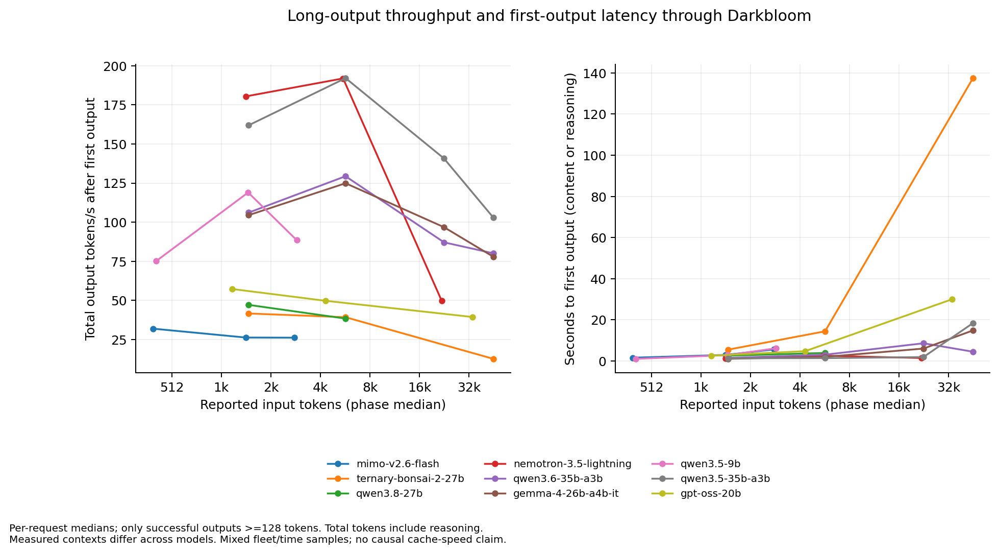

# OpenRouter cache and throughput investigation

> Last updated: 2026-10-03

## Scope and result

All nine public Darkbloom models were requested through OpenRouter with the
provider pinned to `darkbloom` and fallback disabled. The completed comparison
has **1,012 attempts, 885 successes, 163 input-cache hits
(18.42% of successful requests)** and
**21.42% of reported input tokens restored**.
127 service failures are retained; all are provider/routing 429s,
including errors carried inside an HTTP-200 stream. The primary cost is
$0.468844; every reported cost reconciles to the discovered endpoint
prices. Including separate configuration/availability probes, this study has
1,073 attempts and reports $0.478453 in charges.

This is an observational production baseline, authorized for synthetic paid
inference. It is not a deployed measurement of the proposed fixes. The deployed
coordinator was `c56b98e8638f1895b80e22c00122880bed9b11b9`, provider release
0.9.17. The reviewed cache paths also match parent
`48d2be458b3ce511a2a9006238b923295c9c6718`. Production inspection was read-only.
No production configuration, traffic routing, fleet binary or release was changed.

## Per-model cache coverage

| Model | Successes / attempts | Hits / reported successes | Hit rate | Cached input-token share | Repeat-only hit rate |
|---|---:|---:|---:|---:|---:|
| MiMo V2.6 Flash* | 105/107 | 9/105 | 8.57% | 10.66% | 10.34% |
| Bonsai 2 27B | 40/83 | 13/40 | 32.50% | 27.37% | 37.14% |
| Qwen 3.8 27B | 64/94 | 12/64 | 18.75% | 15.40% | 24.49% |
| Nemotron 3.5 Lightning | 82/113 | 35/82 | 42.68% | 46.66% | 53.03% |
| Qwen 3.6 35B | 126/128 | 36/126 | 28.57% | 35.30% | 33.96% |
| Gemma 4 26B | 127/128 | 14/127 | 11.02% | 10.31% | 13.08% |
| Qwen 3.5 9B* | 105/107 | 0/105 | 0.00% | 0.00% | 0.00% |
| Qwen 3.5 35B | 128/129 | 24/128 | 18.75% | 16.44% | 22.22% |
| GPT-OSS 20B | 108/123 | 20/108 | 18.52% | 11.56% | 22.47% |

The first successful priming request for each synthetic prefix/control cohort
and fresh controls are excluded only from the repeat-only column. The overall
column includes them. Every successful request in this primary matrix reported
cache usage, so there is no unknown-usage denominator here. That differs from
the private coordinator metrics below.

*MiMo and Qwen 9B used a reduced 256/1k/2k nominal matrix after their original
roughly 5.7k-token pilot was rejected. Other models used 1k/4k/16k/32k nominal
sizes. Failed larger cohorts stop after three consecutive failures; completed
means the declared stop policy completed, not that every size served. Actual
input-token counts, failure counts and per-size samples are in
[throughput.csv](evidence/openrouter-cache-2026-10-03/throughput.csv).
The public coordinator also lists a Gemma 8-bit build without a distinct
OpenRouter endpoint; it was not tested as a tenth model.

## Throughput and latency

The following rows use the nominal 1k-input cohort, actual prompt counts below,
`max_tokens=512`, and only successful generations with at least 128 reported
completion tokens. Tiny OK replies are excluded from throughput calculations.

| Model | Actual median input tokens | Long-output samples | Generation TPS estimate | End-to-end TPS | First output, seconds | First visible content, seconds |
|---|---:|---:|---:|---:|---:|---:|
| MiMo V2.6 Flash* | 1,443 | 8 | 26.20 | 21.57 | 2.892 | 2.892 |
| Bonsai 2 27B | 1,498 | 8 | 41.59 | 28.79 | 5.457 | 5.457 |
| Qwen 3.8 27B | 1,494 | 8 | 47.12 | 34.27 | 2.521 | 2.521 |
| Nemotron 3.5 Lightning | 1,446 | 8 | 180.45 | 123.48 | 1.292 | 1.292 |
| Qwen 3.6 35B | 1,498 | 8 | 106.07 | 83.25 | 1.417 | 1.417 |
| Gemma 4 26B | 1,497 | 8 | 104.44 | 84.99 | 1.000 | 1.000 |
| Qwen 3.5 9B* | 1,490 | 8 | 118.98 | 67.30 | 2.801 | 2.801 |
| Qwen 3.5 35B | 1,499 | 8 | 161.93 | 115.88 | 1.261 | 1.261 |
| GPT-OSS 20B | 1,187 | 8 | 57.25 | 44.38 | 2.517 | 3.076 |

Generation TPS = reported completion tokens / (last output timestamp minus
first output timestamp). It is a client estimate affected by SSE framing and
the first chunk, not an engine token/kernel measurement. End-to-end TPS divides
by full request duration through DONE, including prefill, queues, transport and
the donation tail. GPT-OSS uses low reasoning, which contributes to total
completion tokens and can precede visible content; all other models disable
reasoning. The CSV retains sample counts for each timing separately.

At roughly 46k prompt tokens, Gemma's three observed long-output cache hits had
median visible TTFT 4.630 s, versus 15.564 s for five zero-cache responses.
Qwen 3.5 35B had 4.422 s for three hits versus 18.634 s for five zero-cache
responses; Qwen 3.6 had 4.258 s for six hits versus 20.602 s for two zero-cache
responses. These are associations across a heterogeneous fleet, not paired
speedups on the same Mac. See the retained
[cache-state measurements](evidence/openrouter-cache-2026-10-03/cache-latency.csv).

A separate Qwen 9B probe repeated a 4,356-token prompt ten times and restored
4,096 tokens on seven calls; median visible TTFT was 0.921 s for hits and
7.522 s for the three zero-cache calls. This is excluded from its primary
0/105
result. It supports investigating actual checkpoint boundaries, rather than
concluding that the model never caches.

## Coordinator evidence and attribution

A separate network-wide interval, 08:32:01–08:44:09 UTC, recorded 31,777 admitted
planning evaluations and 4,184 failures (13.17%), with 2,593 client overloads,
1,586 client timeouts, no QPS throttling and no sidecar restart. The current
Rust child recorded only three plan timeouts. Its 117.64 ms mean includes fast
overload/error paths, and RSS rose from 980,221,952 to 1,065,123,840 bytes.
The Linux 2 GiB limit is virtual address space, not an RSS limit. These counters
do not isolate queue, serialization, tokenization or disconnected-worker costs.

During the distinct 08:25:26–08:44:02 UTC model-metric interval, selected holders
with valid reported usage hit on 1,466 of 1,467 calls (99.93%). Another 89
selected requests had unreported usage. Network-wide missing/invalid usage is
an observation gap, not a cache miss. The interval recorded 302 prompt-anchor
mismatches and two proof-mismatch holder removals, distinct events/populations.
These observations favor improving cache creation and planning coverage; they
do not justify relaxing proof checks or making cache affinity unconditional.

The planning interval also observed 13,317 novel-donation skips, 9,886 donations,
6,035 priority-limit refusals and 478 unsafe-root outcomes. The code-established
write-priority error below can waste reserved repeat capacity, but the counters
do not identify how many refusals were caused by it. Ready-state/init failures
and missing-root diagnosis remain separate work.

## Confirmed mechanisms and proposed fixes

1. **Demanded fork discarded.** The baseline `CBv2CheckpointRetention.publication` drops a
   target within 1,024 tokens below the latest. An actual source/chain replay
   with retained 1,024 / 5,120 / 6,144 publishes 1,024 / 6,144. A suffix that
   diverges after the shared 5,120 prefix cannot authenticate the deeper hash,
   so it restores only 1,024 and loses 4,096 reusable tokens. Retain the distinct
   demanded boundary within the existing three-checkpoint and byte bounds.
   A complete recurrent state cannot be reconstructed at an earlier position
   merely because a deeper checkpoint exists.
2. **Fleet-repeat priority differs from admission.**
   `SSDHybridCheckpointStore.prepareWriteJob` admits a fleet-repeated prefix but
   classifies its first local tag as novel for `SSDWriteRateLimiter`. A source
   reproduction exhausting the 90% novel share rejects a 50-byte novel write
   but accepts the same repeated write under the remaining total budget.
   Classify only checkpoints covered by the authenticated repeated-token hint
   as repeated; a novel extension behind a common preamble remains novel.
3. **Repeated template compilation and diagnostic copies.** `render` builds a
   Minijinja environment and compiles the same verified template per request.
   `Planner.plan_sync` additionally clones bodies/token IDs required only by
   fixture responses. Attach immutable compiled variants to the bounded loaded
   contract and keep request-owned dates in request context; separate fixture
   diagnostics from production planning. Measure actual templates/tokenizers,
   bounded retention, concurrent dates and exact token-chain parity.
4. **Deadline and work use different counts.** The API creates its SLA duration
   from heuristic tokens before installing qualified exact work. The forecast
   can then price 5,779 tokens against a duration based on 3,606: the ordinary
   9s + 1ms/token policy gives 12.606s instead of 14.779s. Reconcile the token
   term from trusted matching work while retaining the original ingress anchor,
   explicit caller cutoff, alias/account policy and physical admission. This is
   candidate-local: only a provider advertising the matching artifact/renderer
   uses the exact cutoff; a different renderer retains the original fallback.
   Reservation binds the selected cutoff and final writer authorization rejects
   unsent exact-bound renderer drift. This is deadline correctness; an increased
   budget alone is not lower measured TTFT.
5. **Short solo capture gaps.** Dense Qwen defaults to a 4,096-token solo stripe;
   durable capture requires an actual aligned range end before prompt end.
   Many shorter requests therefore have no reusable checkpoint despite
   exceeding the 1,024-token storage floor. MiMo has a related natural-chunk
   constraint. A demand-target boundary needs native/MTP parity and cold/long
   throughput evidence; indiscriminately shrinking all prefill chunks can cost
   throughput and change numerical paths.

Source paths and current behavior are in
[the prefix architecture](../architecture/prefix-cache.md),
[SSD contract](../reference/ssd-kv-cache.md),
[sidecar architecture](../architecture/prompt-contract-sidecar.md), and
[first-content routing](../architecture/first-content-routing.md).
Candidate qualification is recorded in the
[local before/after report](2026-10-03-prefix-cache-qualification.md).

## Decisions and remaining work

- Keep exact proof, provider eligibility and physical memory admission. Selected
  precision is already high; forcing an unavailable or slower holder can raise
  latency. The existing first-content band and whole-Mac work cost must continue
  to arbitrate real cache savings against load and restore cost.
- Do not increase holder count blindly: production already uses 16 per bucket,
  with bounded 250k total holders. Measure bucket/global eviction separately.
- Do not flip resident caching on for the current fleet. Paged COMPLETE serving
  needs a bounded compatible hot-state bank; the existing opt-in contiguous
  recurrent bank does not supply that implementation. Any future bank must
  claim its existing KV grant and yield under pressure.
- Existing open PRs #1213/#1214 cover planner admission/readiness/preload,
  #1215 covers owned SSD restoration/shorter retry, and #1243/#1270/#1276 cover
  stale/failed idle exploration. Integrate/review those contributions rather
  than duplicate their policy here.
- Measure request-correlated planning phases and donation priority after an
  approved deployment, and repeat this study with the same cohorts. The current
  observational baseline does not attribute a fleet-wide improvement to new code.

## Reproduction and evidence limits

The request matrix uses synthetic inventory, exact repeats, changing suffixes,
growing histories, fresh-prefix controls, concurrency four, delayed revisits
and nonstream responses. Nominal sizes are character-scaled labels; all tables
use actual provider token usage. Priming/control exclusion is declared above.
Cohort observations are correlated; binomial intervals in the plot are
sampling summaries, not independent fleet-wide confidence guarantees.

`X-OpenRouter-Cache:false` disables whole-response caching. Pinning Darkbloom
fixes the inference service, not a particular Mac. The hit definition is
`usage.prompt_tokens_details.cached_tokens > 0`, supported by exact cost
reconciliation using input-cache read prices. `cache_write_tokens=0` does not
prove that providers wrote no files. These controls follow OpenRouter's
[provider routing](https://openrouter.ai/docs/guides/routing/provider-selection),
[prompt caching](https://openrouter.ai/docs/guides/best-practices/prompt-caching),
and [response caching](https://openrouter.ai/docs/guides/features/response-caching)
contracts captured at the study date.

Retained [request measurements](evidence/openrouter-cache-2026-10-03/requests.csv),
[model summary](evidence/openrouter-cache-2026-10-03/models.csv),
[full throughput cohorts](evidence/openrouter-cache-2026-10-03/throughput.csv),
[methods](evidence/openrouter-cache-2026-10-03/methods.txt), and
[snapshot with SHA-256 digests](evidence/openrouter-cache-2026-10-03/snapshot.json)
contain only explicit numeric/public fields. The runtime API key, account IDs,
request/generation IDs, prompt hashes, prompt text and completion text are
excluded from committed evidence. Private operational raw snapshots are not
committed. The earlier standalone Gemma experiment (133 attempts) is a separate
run and is not mixed into these counts. 43 validation attempts and
18 ad-hoc availability attempts are retained as separate datasets.
