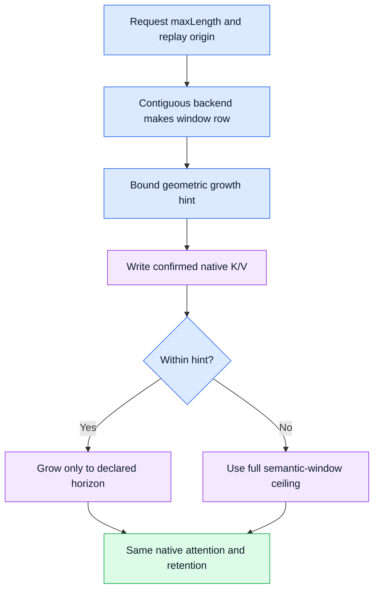

# Native window backing bounded by a request horizon

> Last updated: 2026-10-09

A request-horizon hint removes geometric allocation slack from fresh Gemma 4
and GPT-OSS contiguous sliding rows while preserving native K/V bits and the
model's semantic window. Four actual-artifact continuation controls pass every
compared logit and final K/V bit. This record separates dense allocator tests,
actual model tensor extents, and unchanged admission/checkpoint bounds.

## Mechanism and first-principles limit

The parent elastic implementation doubles storage as confirmed retained tokens
arrive. At token 513, a 1,024-token Gemma window therefore owns 1,024 slots even
when a request can finish by absolute position 544 or 576. The request already
carries an absolute `maxLength`; fresh and replayed sliding rows use
`min(window, maxLength - initialOffset)` as the grow-only ceiling. Geometric
steps still happen normally until that ceiling, and all retained native bits
are remapped with the existing absolute-position ring rules.

The ceiling is a hint rather than an append/retention limit. If confirmed
writes need more slots, it permanently falls back to the semantic window.
Staged speculative writes are accepted without changing the live ring; growth
is applied only to the accepted tail after rollback. A cancellation can never
turn optimistic writes into permanent backing. Complete imported checkpoints
continue owning their full-window rings.
Current capability-derived prefix replay plans already span at least the full
sliding dependency window. Their remaining horizon is therefore at least the
window size, so this change does not reduce their replay ring allocation.

Blue is allocation control, purple is backing storage, and green is the
preserved native result. No new request rejection condition is introduced.

## Consumer and ownership trace

| Consumer | Meaning and preserved bound |
|---|---|
| `EngineLoopV2.ensureKVState` | Existing `promptTokens.count + max(maxTokens, 1)` remains the request's absolute maximum. |
| `EngineLoopV2` prefix adoption | Passes the same maximum to `makeSequenceState(adopting:)`; fresh replay rows subtract `plan.replayStart`. |
| `CBv2FullSequenceKV` | Existing hard full-row append bound is unchanged. The sliding hint does not weaken this consumer. |
| `CBv2ContiguousKVBackend.makeRow` | Forwards the horizon; the row applies it only when `elasticWindowStorage` is enabled. |
| `CBv2WindowedSequenceKV.ensureCapacity` | The private hint never rejects valid pending or confirmed writes; a miss restores the window ceiling. |
| Restored window constructor | Retains `elasticStorage = false`, full-ring backing and the unchanged complete-checkpoint format. |
| Admission and native residency | Retain existing worst-case semantic-window and transient reservations; no capacity credit is claimed from the hint. |
| Provider factory | Existing loaded Gemma text/VLM and GPT-OSS gate remains; MiMo and other factories keep their established allocation behavior. |

Sources are
`libs/mlx-swift-lm/Libraries/MLXLMCommon/ContinuousBatchingV2/EngineLoopV2.swift`,
`SequenceKV/ContiguousKVBackend.swift`, `SequenceKV/WindowedSequenceKV.swift`,
and the provider's `EngineV2Factory+BackendPreparation.swift`. Parent dependency
refresh adds only benchmark evidence; original native normalization remains.
Current contiguous callers set the replay origin in the window constructor.
Production `fastForward` call sites operate on paged rows, so they do not change
the origin after a horizon-enabled contiguous row is created.

## Dense buffer qualification

`CBv2WindowLifetimeBackingTests` compares dense BF16 rows against parent elastic
rows, evaluates their actual buffers, and checks `allocatedBytes == nbytes`.
Representative cases are 512+32, 512+64 and 32+512. Absolute replay origin 997,
a non-power-of-two capacity, accepted overruns, staged overspeculation above the
hint, cancellation and unchanged full-window reservations have explicit tests.
The combined suite retains the actual Gemma shared-layer borrowing and complete
codec export/import restoration controls from the parent.

| Gemma layout projection | Parent geometric extent | Hinted extent | Reduction |
|---|---:|---:|---:|
| 25 layers, Hkv=8, Dk=Dv=256, BF16; 544 slots | 200 MiB | 106.25 MiB | 46.875% |
| Same layout; 576 slots | 200 MiB | 112.5 MiB | 43.75% |

The dense allocator test evaluates one real-shape row for each case. The
25-layer values are the exact sum for that layout, also observed as actual
model tensor extents below. Completed exports/imports can own full-window
backing separately; these values are live row extents rather than admission
or checkpoint credit.

## Actual artifact controls

The benchmark-only `BenchWindowLifetime` uses the actual public model factory,
loaded hooks and native cache APIs. Each loaded model compares two independent
row banks: parent elastic growth without a hint, and the candidate hint. Full
rows, model operations and original normalization are identical. It compares
every native logit bit and argmax through greedy continuation, then all owning
native K/V snapshot bits and absolute offsets. Inputs are public synthetic
512-token sequences; these are exactness controls, not task-score evaluations.

| Artifact | Max completion | Actual generated / finish | Actual KV end | Parent / hint slots | Parent / hint sliding extents |
|---|---:|---|---:|---|---|
| Gemma 4 26B QAT 4-bit | 32 | 32 / length | 543 | 1,024 / 544 | 200 / 106.25 MiB |
| Gemma 4 26B QAT 4-bit | 64 | 64 / length | 575 | 1,024 / 576 | 200 / 112.5 MiB |
| GPT-OSS 20B | 32 | 32 / length | 543 | 128 / 128 | 5.75 / 5.75 MiB |
| GPT-OSS 20B | 64 | 64 / length | 575 | 128 / 128 | 5.75 / 5.75 MiB |

All four cells match every compared native logit, generated token and final
K/V bit. Their final sampled token has not yet been fed back, so actual KV ends
are 543/575 rather than 544/576. The hinted backing has already grown to its
544/576 allocation ceiling. GPT's window is saturated by the prompt and has no
capacity benefit in these cells. The native state retains its actual per-layer
dtypes; no GPT arithmetic promotion is changed.

The unchanged cached artifacts are bound by the existing production model
hasher receipts in the [native packet evidence](evidence/native-kv-packets-2026-10-09/artifact-manifest.json):
Gemma aggregate `2468a0cb3049a871f42052f4d9f9380bf12a0792f64c7a29f768559fc7d28785`,
GPT aggregate `61bfc04e4016a7fa487eb10e29f79360047e302487229f298da3681984aec512`.
The controls use a source-matched MLX metallib and original native model source.

## Evidence and validation

The [preregistration](evidence/window-lifetime-2026-10-09/preregistration.json),
[control summary](evidence/window-lifetime-2026-10-09/control-summary.json),
[build receipt](evidence/window-lifetime-2026-10-09/build-receipt.json) and frozen
control driver/raw JSON/logs preserve exact input and generated token IDs,
finish/counts, offsets, tensor extents and source/binary hashes. The artifact
manifest binds their immutable bytes. Model runs were serialized under the
shared workload lease and that owned lease was explicitly released.
The [pre-refactor source patch](evidence/window-lifetime-2026-10-09/first-pass-source.patch.gz)
and [source receipt](evidence/window-lifetime-2026-10-09/first-pass-source.json)
preserve the SDK working version at review base `c1a9af29`. The gzip member
retains the original patch name, bytes and SHA-256; archive-aware application
reproduces review tree `9e2607f7a007c27b9387e160a21231f55b61ad8e`. The original control
driver and all measured artifacts retain their original bytes and hashes.

The first working version passed 16 source-matched SDK tests in five suites;
the CI gate inventory passed all 23 tests. Changed Swift files are formatted.
The subsequent refactor passes 18 storage/model/checkpoint tests and three pure
benchmark-configuration tests. It adds real tail/frozen replay coverage and a
768-token checkpoint with 800-slot hinted backing that restores the full ring
and continues beyond the hint. The four actual-artifact controls were preserved,
not rerun. No numerical operation or threshold was changed by the refactor.
The [refactor validation receipt](evidence/window-lifetime-2026-10-09/refactor-validation.json)
binds the final checked source and test output separately from the model controls.

Use the canonical [SDK test procedure](../developer/test.md#elastic-contiguous-window-tests)
and [build source binding](../developer/build.md) for the combined selector.
The system Swift 6.4/Xcode 27 path and temporary local MLX binding are used
because pinned Swift 6.3 fails before tests against this SDK. The workspace
binding is reverted after validation, never committed.

## Canonical provider component result

The final source-matched provider test build passes with `swift build -j 4
--build-tests` in 280.17 seconds. The unchanged canonical `make provider` runs
under the existing owned-process watchdog with verified pinned public/synthetic
MiMo prerequisites, the general suite and every isolated/exclusive gate intact.
It finishes in 498.57 seconds with exit 2, no timeout and no interruption;
its owned workload lease is explicitly released after the processes are reaped.

The canonical build/test-build pass in 3.44/2.36 seconds. The general 3,625-test,
476-suite run fails with 139 issues in 255.072 seconds: known missing
`pagedattention.metal` resource gates and their dependent expectations, plus
one signed-child `SelfUpdaterTests` packaging fixture. The isolated native-pool
teardown and exclusive allocator gates each also fail on that exact missing
resource. The remaining isolated gates complete, and the contiguous
loaded-family gate passes. Supplying verified MiMo prerequisites removes their
prior absence errors; it does not make this full gate green or establish a
controlled before/after reduction in issue counts.

The [canonical receipt](evidence/window-lifetime-2026-10-09/canonical-provider.json)
records exact source, commands, fixture hashes, outcome and all test summaries.
Its [gzip transcript](evidence/window-lifetime-2026-10-09/canonical-provider.log.gz)
preserves the original complete log bytes and logical filename. No assertions,
resources, caps or admission guards were weakened, and the failed full suite
was not rerun simply to change its color. Focused exactness and hosted component
checks remain separate gates.

No TPS or latency gain, broader concurrent-model quality, admission capacity,
release, deployment, TTL/cap change, altered activation reserve, quantization
composition, or encrypted new storage format is claimed. The parent canonical
full provider run reproduced its known 148-issue local resource/prerequisite
failure; candidate-focused and hosted component gates remain distinct.
