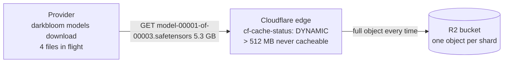
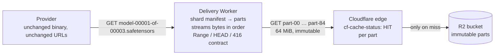

# Model download benchmark: small immutable R2 objects vs. large shards

> **Status: experiment.** Synthetic data, one client, one evening. The next revision of
> this PR runs the same harness against **production shards** (real model files split
> into parts under the benchmark hostname) before any production change is proposed.

**Question.** Does storing model files as smaller immutable objects in Cloudflare R2
improve download throughput and cacheability for providers, while the original shard
bytes are reconstructed exactly?

**Answer (2026-09-01, run `2026-09-01-r1`).** Yes on cacheability, and it removes a
throughput cliff that large objects hit. The measured numbers are in
[Results](#results). Reconstruction was byte-identical in every pass.

Everything here ran against an isolated environment. No production bucket, domain,
cache rule, client, or model was touched. See [Safety boundaries](#safety-boundaries).

## Why this matters for Darkbloom

- `darkbloom.ai` is on Cloudflare's **Free plan** (zone plan read via the API: "Free
  Website"). Per Cloudflare's documentation the cacheable file limit on Free, Pro and
  Business is **512 MB**. Production shards such as
  `model-00001-of-00003.safetensors` (5.3 GB) can never be edge-cached on this zone.
  Every provider download goes to R2 origin.
- Production objects on `models.darkbloom.ai` currently return
  `cf-cache-status: DYNAMIC`: no `Cache-Control` header and `.safetensors` is not a
  default-cached extension, so Cloudflare does not even attempt to cache them.
- The shipped provider (`darkbloom models download`) already downloads four files
  concurrently and resumes with HTTP `Range`. What it cannot do today is parallelise
  inside one 5 GB file, or benefit from an edge cache that refuses files that size.

## What was measured

Two arms, identical bytes (4 shards of 1 GiB each, deterministic content):

| Arm | Objects | Object size | What it models |
| --- | --- | --- | --- |
| `chunked` | 64 | 64 MiB | proposed layout: each shard split into 16 immutable parts |
| `large` | 4 | 1 GiB | today's layout, sized to exceed the 512 MB cache limit but stay ≤ 5 GB |

Part *N* of a large object is byte-for-byte chunk *N* of the chunked arm, so both arms
share the same expected SHA-256 per shard.

The client is the **shipped provider binary, unmodified** (v0.8.15; bundle and binary
SHA-256 match the coordinator's published release, see `results/provider-binary.txt`),
driven exactly as a provider would drive it:

```
darkbloom models download bench-chunked-2026-09-01-r1 \
  --coordinator http://127.0.0.1:8799 \
  --r2-cdn https://model-download-bench.darkbloom.ai
```

A stub coordinator (Docker) serves only `/v1/models/catalog` and
`/v1/models/catalog/manifest/<id>` for the two benchmark models. The downloader's own
manifest validation, per-file SHA-256 checks, aggregate hash and publish step all run
as in production. After each pass the harness reconstructs every shard from the
downloaded parts (concatenation in manifest order) and compares it to the precomputed
SHA-256.

Each arm ran **cold** (unique run prefix, never requested before) and **warm** (same
URLs again). Recorded per object: size, `CF-Cache-Status`, colo from `CF-Ray`,
`Cache-Control`; per pass: wall time, aggregate throughput, per-second interface
throughput, reconstruction result.

## Results

All passes: 4 GiB per pass, four files in flight (the provider's default), from a Mac
in Miami (colo MIA) whose uplink tops out around 80 MiB/s. Generated with
`node harness/summarize.mjs results`; the per-second column ignores zero samples (the
sampler ticks once a second and occasionally straddles a counter update).

| Pass | Objects | GiB | Wall s | Aggregate MiB/s | Per-second MiB/s median (min–max) | CF-Cache-Status after pass | Colo | Byte-identical |
|---|---|---|---|---|---|---|---|---|
| chunked-cold | 64 | 4 | 75.2 | 54.5 | 64 (17–81) | 64 HIT | MIA | yes |
| chunked-warm | 64 | 4 | 73.5 | 55.7 | 65 (29–82) | 64 HIT | MIA | yes |
| chunked-warm2 | 64 | 4 | 66.8 | 61.3 | 71 (30–86) | 64 HIT | MIA | yes |
| large-cold | 4 | 4 | 77.5 | 52.8 | 63 (8–76) | 4 MISS | MIA | yes |
| large-warm | 4 | 4 | 284.1 | 14.4 | 15 (4–56) | 4 MISS | MIA | yes |
| large-warm2 | 4 | 4 | 211.4 | 19.4 | 19 (1–80) | 4 MISS | MIA | yes |
| large-warm3 | 4 | 4 | 280.4 | 14.6 | 16 (6–39) | 4 MISS | MIA | yes |

What the numbers say:

1. **Cacheability.** Every 64 MiB part was in the edge cache after a single cold pass
   (64/64 `HIT`). No 1 GiB object was ever cached (`MISS` after four full downloads):
   they exceed the plan's 512 MB limit, exactly as production's 5 GB shards do.
2. **Consistency.** The chunked arm was link-bound and stable across all three passes
   (54–61 MiB/s aggregate, median per-second rate 64–71 MiB/s). The large arm's first
   pass matched it, then the three repeat passes ran at **14–19 MiB/s aggregate**,
   three to four times slower, with per-second rates sitting at 10–20 MiB/s for
   minutes at a time. That is the band the team has been seeing on production downloads
   (9–14 MB/s), and our own production probe the same night measured 11.9 MiB/s
   (`results/preflight-production-samples.txt`, `results/warm-probe/probe.log`). Large
   objects through the proxy are not only uncacheable, they are unpredictable.
3. **Warm speedup.** On this client the warm chunked pass was not faster than the cold
   one, because the Mac's uplink was the bottleneck in both. The benefit of `HIT`
   shows up as origin offload (R2 egress and Class B operations avoided) and as
   headroom for faster providers; it needs a faster client to be measured as a
   throughput gain.
4. **Correctness.** All seven passes reconstructed every shard byte-for-byte
   (`verify.json`), and the unmodified provider accepted the chunked manifest and
   published the model (`download.log` ends in `Done.` with the cache path). The
   provider's own per-file SHA-256 and aggregate-hash checks run by construction on
   that path (`ModelDownloader+Download.swift`: a mismatch throws and clears staging),
   so a published model implies they passed.

### Once the cache is warm

The warm passes above were limited by the client's uplink, so they do not show what the
edge cache itself delivers. These direct probes (`results/warm-probe/`, taken with
`curl` after the passes) isolate the cache-side behaviour:

| Object | CF-Cache-Status | Time to first byte | Single-stream speed |
|---|---|---|---|
| Cached 64 MiB part (8 samples) | HIT | 50–200 ms, median ~90 ms | 18–64 MiB/s, five of eight above 48 MiB/s |
| Uncached 1 GiB benchmark object | BYPASS | 204 ms | 56 MiB/s (15 s sample) |
| Production 5.3 GB shard, `models.darkbloom.ai` | DYNAMIC | 504 ms | **11.9 MiB/s** (15 s sample; the same object did 40 MiB/s ~6 h earlier, `results/preflight-production-samples.txt`) |
| `Range: bytes=1048576-2097151` on a cached part | HIT, `206` | 91 ms | served from cache, no origin fetch |

Four parallel streams over 16 cached parts (1 GiB) at that moment
(`results/warm-probe/par4-summary.txt`): 31.7 MiB/s aggregate,
per-stream 2–52 MiB/s, first byte 44–293 ms. That is lower than the earlier warm passes
(55–61 MiB/s) and the per-stream spread is wide, which tracks the client link's variance
at that time rather than the cache: the same production shard measured 40 MiB/s earlier in
the day and 12 MiB/s during this probe, on an unchanged path.

What the warm state buys, independent of client speed:

- **First byte in ~90 ms instead of ~500 ms**, and no R2 read at all: a warm model
  download is entirely edge-served. Every provider after the first one in a colo costs
  zero R2 egress and zero Class B operations for the weights.
- **Range requests hit the cache too**, so the provider's existing byte-resume path
  (`Range: bytes=N-` on a `.part` file) resumes from the edge, not from R2.
- **A ceiling far above today's**: even single cached streams reached 64 MiB/s here,
  against 12 MiB/s from the production path at the same hour. On a provider with a
  faster line than this Mac, four-way concurrency over cached parts should scale with
  the link; measuring that is part of the production-shard follow-up.

Caveats: single client, single colo, single evening; the large-arm slowdown has three
consistent samples but no root cause (candidates: Cloudflare buffering of oversize
uncacheable responses, R2 per-object throughput, MIA egress). Worth repeating from a
provider on a gigabit-plus line and from a second region before treating the exact
numbers as representative.

## Safety boundaries

- Dedicated bucket `darkbloom-model-download-benchmark` (ENAM), created empty for this
  test. Nothing else reads or writes it.
- Dedicated hostname `model-download-bench.darkbloom.ai`, attached as an R2 custom
  domain. It did not exist before.
- One cache rule, matching **only** `http.host eq "model-download-bench.darkbloom.ai"`
  (cache eligible, respect origin `Cache-Control`). The zone had **no cache rules**
  before, so this created the cache-phase ruleset with exactly this rule; nothing was
  modified or reordered.
- Synthetic data only, generated inside a throwaway Worker with an R2 binding to the
  benchmark bucket (no upload from a laptop). The Worker was deleted after seeding.
- Cold runs use a fresh unique prefix; no cache purge was issued.
- Cloudflare access for the setup used an **account-owned API token** scoped to R2
  edit, zone/DNS read and cache-rules edit, with a short TTL, revoked afterwards.
  User-derived credentials (OAuth via the Cloudflare MCP server, user API tokens)
  turned out to carry no effective permissions on the Eigen Labs account; see
  [Notes](#notes).

## Architecture: before and after

**Today.** One request per shard, straight to R2 through Cloudflare, uncacheable.



**Proposed (transparent).** Shard URLs stay the same. A delivery Worker maps each shard
request to its immutable parts, which the edge caches; the Worker streams the parts in
order so the client receives the original bytes, `Content-Length`, and `Range`
semantics. Clients, manifests and hashes do not change.



The reconstruction contract (full GET, HEAD, single/suffix/open ranges, 416, resume
after mid-stream failure, manifest gap detection) is implemented and unit-tested in
`../transparent-reconstruction-poc/`. This benchmark measured the storage/caching half
with the real provider; it did **not** measure the delivery Worker in the path. That
is the next step before any production proposal.

## Reproducing

Prerequisites: Docker, Node 22, the shipped provider bundle (`Darkbloom.app`), an
account-owned Cloudflare API token if you need to (re)create the bucket, hostname,
cache rule or seed data.

1. `cd docs/spikes/model-download-benchmark && docker build -t darkbloom-bench-harness harness`
2. Generate expected hashes, catalog and manifests (writes `out/`; add `-e RUN_ID=<id>`
   for a new run, default `2026-09-01-r1`):
   `docker run --rm -v "$PWD/out:/harness/out" darkbloom-bench-harness node gen-manifests.mjs`
3. Seed the bucket via the setup Worker (`harness/setup-worker`, `wrangler deploy`,
   then `wrangler secret put SETUP_TOKEN`), then
   `docker run --rm -e SETUP_URL=… -e SETUP_TOKEN=… darkbloom-bench-harness sh seed-bucket.sh`.
   The objects for run `2026-09-01-r1` already exist, so this step can be skipped.
4. Start the stub coordinator:
   `docker run -d --name bench-coordinator -p 127.0.0.1:8799:8799 -v "$PWD/out:/harness/out:ro" darkbloom-bench-harness`
5. Run passes natively (the provider binary is a macOS app and cannot run in Docker):
   `DARKBLOOM_BIN=/path/to/Darkbloom.app/Contents/MacOS/darkbloom harness/run-bench.sh chunked cold`
   then `chunked warm`, `large cold`, `large warm`. Each pass writes
   `out/<arm>-<pass>/{timing.log,cache-status.log,verify.json,throughput-MiBps.log,download.log,files.log}`.
6. Copy the `out/<arm>-<pass>/` directories (plus `out/*.json`) into `results/` to
   commit them, then `node harness/summarize.mjs results` for the table.

Change `RUN_ID` in `harness/setup-worker/wrangler.jsonc` and in the environment for a
new cold run; never reuse a prefix.

## Notes

- Cloudflare's own MCP server (`mcp.cloudflare.com`) authorised with the right scopes
  still failed every R2, DNS-records and rulesets call with error 10000. The same
  happened with a user API token. `/user` shows the Eigen Labs membership with
  `permissions: null` for user-derived credentials even though the member is Super
  Administrator, which matches open issues cloudflare/mcp#202 and #199. An
  account-owned token (`cfat_…`) works for everything. Use those for automation on
  this account.
- The per-second throughput sampler reads interface byte counters, so it includes all
  traffic on the Mac's uplink; treat it as an upper bound on benchmark traffic.
