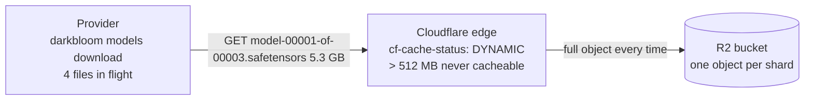
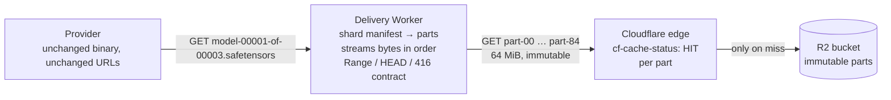

# Model download benchmark: small immutable R2 objects vs. large shards

> Last updated: 2026-09-27 · commit `93d556533`

**Status: experiment; measurements from 2026-09-01.** This synthetic, single-client
record compares 64 MiB objects with 1 GiB objects. All seven recorded passes passed
external shard reconstruction; repeated large-object passes were slower. It does
not establish a production speedup or validate native provider chunk reconstruction.
Raw [results](results/) are preserved; the harness corrections below were verified
locally on 2026-09-27 without rerunning the cloud benchmark.

## Why this matters for Darkbloom

The September 1 preflight recorded the zone's Free plan and production objects
returning `cf-cache-status: DYNAMIC` (see
[production samples](results/preflight-production-samples.txt)). These are historical
observations, not a check of the current deployment. Cloudflare documents a
[512 MB cacheable object limit for Free, Pro and Business](https://developers.cloudflare.com/cache/concepts/default-cache-behavior/)
and [R2 custom-domain caching requirements](https://developers.cloudflare.com/cache/interaction-cloudflare-products/r2/).
Large shards exceeded that limit under the recorded plan.

The tested binary was **v0.8.15**, whose source is pinned at
`0e63aed56a2e0956650dbc91ae9c3edfe6e04b89`. Its download behavior is established by:

| Behavior in the tested release | Canonical source |
| --- | --- |
| Four concurrent logical files by default | [`ModelDownloader.swift`, `init`](https://github.com/Layr-Labs/d-inference/blob/0e63aed56a2e0956650dbc91ae9c3edfe6e04b89/provider-swift/Sources/ProviderCore/Models/ModelDownloader.swift) sets `concurrency: Int = 4`; [`ModelDownloader+Download.swift`, `downloadManifestModel`](https://github.com/Layr-Labs/d-inference/blob/0e63aed56a2e0956650dbc91ae9c3edfe6e04b89/provider-swift/Sources/ProviderCore/Models/ModelDownloader+Download.swift) bounds the per-file task group. |
| Resume a retained `.part` file with `Range: bytes=N-` | [`ModelDownloader+HTTP.swift`, `downloadFile` and `streamDownload`](https://github.com/Layr-Labs/d-inference/blob/0e63aed56a2e0956650dbc91ae9c3edfe6e04b89/provider-swift/Sources/ProviderCore/Models/ModelDownloader+HTTP.swift) derives the starting offset from the local file size. |
| Per-file SHA-256 and size checks, then aggregate validation before publication | [`ModelDownloader+Download.swift`, `downloadManifestFileWithResume` and `finalizeStagedManifest`](https://github.com/Layr-Labs/d-inference/blob/0e63aed56a2e0956650dbc91ae9c3edfe6e04b89/provider-swift/Sources/ProviderCore/Models/ModelDownloader+Download.swift), with the digest check in [`ModelDownloader+HTTP.swift`, `downloadFile`](https://github.com/Layr-Labs/d-inference/blob/0e63aed56a2e0956650dbc91ae9c3edfe6e04b89/provider-swift/Sources/ProviderCore/Models/ModelDownloader+HTTP.swift). |

These citations describe the measured release, not the current provider. In the
chunked arm, each part is a **separate logical manifest file**; the harness's
[`verify.mjs`](harness/verify.mjs) concatenates them afterward. The published snapshot
contains parts, not reconstructed safetensors files, and no inference was attempted.

## What was measured

Two arms, identical bytes (4 shards of 1 GiB each, deterministic content):

| Arm | Objects | Object size | What it models |
| --- | --- | --- | --- |
| `chunked` | 64 | 64 MiB | proposed layout: each shard split into 16 immutable parts |
| `large` | 4 | 1 GiB | today's layout, sized to exceed the 512 MB cache limit but stay ≤ 5 GB |

Part *N* of a large object is byte-for-byte chunk *N* of the chunked arm, so both arms
share the same expected SHA-256 per shard.

The client is the **shipped provider binary, unmodified** (v0.8.15; bundle and binary
SHA-256 were recorded against the published release in
[provider-binary.txt](results/provider-binary.txt)), invoked through its normal CLI:

```
darkbloom models download bench-chunked-2026-09-01-r1 \
  --coordinator http://127.0.0.1:8799 \
  --r2-cdn https://model-download-bench.darkbloom.ai
```

A stub coordinator (Docker) serves only `/v1/models/catalog` and
`/v1/models/catalog/manifest/<id>` for the two benchmark models. The downloader's own
manifest validation, per-file SHA-256 checks, aggregate hash and publish step all run
as in production. After each pass the harness reconstructs every shard from the
downloaded parts (concatenation in manifest order) and compares it to the precomputed
SHA-256.

Each arm ran **cold** (unique run prefix, never requested before) and **warm** (same
URLs again). Recorded per object: size, `CF-Cache-Status`, colo from `CF-Ray`,
`Cache-Control`; per pass: wall time, aggregate throughput, per-second interface
throughput, reconstruction result.

## Results

All passes: 4 GiB per pass, four files in flight (the provider's default), from a Mac
in Miami (colo MIA) whose uplink tops out around 80 MiB/s. Generated with
`node harness/summarize.mjs results`; the per-second column ignores zero samples (the
sampler ticks once a second and occasionally straddles a counter update). The
updated summarizer also displays download and overall outcome columns; every
recorded pass below reports success.

| Pass | Objects | GiB | Wall s | Aggregate MiB/s | Per-second MiB/s median (min–max) | CF-Cache-Status after pass | Colo | Byte-identical |
|---|---|---|---|---|---|---|---|---|
| chunked-cold | 64 | 4 | 75.2 | 54.5 | 64 (17–81) | 64 HIT | MIA | yes |
| chunked-warm | 64 | 4 | 73.5 | 55.7 | 65 (29–82) | 64 HIT | MIA | yes |
| chunked-warm2 | 64 | 4 | 66.8 | 61.3 | 71 (30–86) | 64 HIT | MIA | yes |
| large-cold | 4 | 4 | 77.5 | 52.8 | 63 (8–76) | 4 MISS | MIA | yes |
| large-warm | 4 | 4 | 284.1 | 14.4 | 15 (4–56) | 4 MISS | MIA | yes |
| large-warm2 | 4 | 4 | 211.4 | 19.4 | 19 (1–80) | 4 MISS | MIA | yes |
| large-warm3 | 4 | 4 | 280.4 | 14.6 | 16 (6–39) | 4 MISS | MIA | yes |

What the numbers say:

1. **Cacheability.** Every 64 MiB part was in the edge cache after a single cold pass
   (64/64 `HIT`). No 1 GiB object was ever cached (`MISS` after four full downloads):
   they exceed the plan's 512 MB limit, exactly as production's 5 GB shards do.
2. **Consistency.** The chunked arm was stable across all three passes
   (54–61 MiB/s aggregate, median per-second rate 64–71 MiB/s). The large arm's first
   pass matched it, then the three repeat passes ran at **14–19 MiB/s aggregate**,
   three to four times slower, with per-second rates sitting at 10–20 MiB/s for
   minutes at a time. That is the band the team has been seeing on production downloads
   (9–14 MB/s), and our own production probe the same night measured 11.9 MiB/s
   (`results/preflight-production-samples.txt`, `results/warm-probe/probe.log`). Large
   objects were slower on repeat passes in this sample; the cause was not isolated.
3. **Warm speedup.** On this client the warm chunked pass was not faster than the cold
   one. Client-link limits are one possible explanation, not an isolated cause.
   The benefit of `HIT`
   shows up as origin offload (R2 egress and Class B operations avoided) and as
   headroom for faster providers; it needs a faster client to be measured as a
   throughput gain.
4. **Correctness.** All seven passes reconstructed every shard byte-for-byte
   (`verify.json`), and the unmodified provider accepted the chunked manifest and
   published the model (`download.log` ends in `Done.` with the cache path). The
   provider's own per-file SHA-256 and aggregate-hash checks run on that path
   (see the pinned `downloadManifestFileWithResume` and `finalizeStagedManifest`
   citations above). This checks part publication; the harness verifies the original
   shard hashes separately.

### Once the cache is warm

The warm passes above were limited by the client's uplink, so they do not show what the
edge cache itself delivers. These direct probes (`results/warm-probe/`, taken with
`curl` after the passes) isolate the cache-side behaviour:

| Object | CF-Cache-Status | Time to first byte | Single-stream speed |
|---|---|---|---|
| Cached 64 MiB part (8 samples) | HIT | 50–200 ms, median ~90 ms | 18–64 MiB/s, five of eight above 48 MiB/s |
| Uncached 1 GiB benchmark object | BYPASS | 204 ms | 56 MiB/s (15 s sample) |
| Production 5.3 GB shard, `models.darkbloom.ai` | DYNAMIC | 504 ms | **11.9 MiB/s** (15 s sample; the same object did 40 MiB/s ~6 h earlier, `results/preflight-production-samples.txt`) |
| `Range: bytes=1048576-2097151` on a cached part | HIT, `206` | 91 ms | served from cache, no origin fetch |

Four parallel streams over 16 cached parts (1 GiB) at that moment
(`results/warm-probe/par4-summary.txt`): 31.7 MiB/s aggregate,
per-stream 2–52 MiB/s, first byte 44–293 ms. That is lower than the earlier warm passes
(55–61 MiB/s), with wide per-stream variation. The same production shard measured
40 MiB/s earlier in the day and 12 MiB/s during this probe. These observations do
not distinguish client-link effects from origin or proxy effects.

The probes observed a lower median first-byte time for cached parts and a cached
`206` response for one Range request. A cache hit can avoid an R2 read, but future
hits depend on cache residency, location, and policy; a first download does not
make all later downloads origin-free. The pinned provider's `.part` resume path
can use such a cached response. This small sample does not establish a latency
or throughput guarantee for other clients.

Caveats: single client, single colo, single evening; the large-arm slowdown has three
consistent samples but no root cause (candidates: Cloudflare buffering of oversize
uncacheable responses, R2 per-object throughput, MIA egress). Worth repeating from a
provider on a gigabit-plus line and from a second region before treating the exact
numbers as representative.

## Safety boundaries

- Dedicated bucket `darkbloom-model-download-benchmark` (ENAM), created empty for this
  test. Nothing else reads or writes it.
- Dedicated hostname `model-download-bench.darkbloom.ai`, attached as an R2 custom
  domain. It did not exist before.
- One cache rule, matching **only** `http.host eq "model-download-bench.darkbloom.ai"`
  (cache eligible, respect origin `Cache-Control`). The zone had **no cache rules**
  before, so this created the cache-phase ruleset with exactly this rule; nothing was
  modified or reordered.
- Synthetic data only, generated inside a throwaway Worker with an R2 binding to the
  benchmark bucket (no upload from a laptop). The Worker was deleted after seeding.
- Cold runs use a fresh unique prefix; no cache purge was issued.
- Cloudflare access for the setup used an **account-owned API token** scoped to R2
  edit, zone/DNS read and cache-rules edit, with a short TTL, revoked afterwards.
  User-derived credentials (OAuth via the Cloudflare MCP server, user API tokens)
  turned out to carry no effective permissions on the Eigen Labs account; see
  [Notes](#notes).

## Architecture: before and after

**Recorded baseline (2026-09-01).** One request per shard through Cloudflare,
with production responses observed as `DYNAMIC`.


```mermaid
flowchart LR
  P[Provider<br/>darkbloom models download<br/>4 files in flight] -->|GET model-00001-of-00003.safetensors 5.3 GB| CF[Cloudflare edge<br/>cf-cache-status: DYNAMIC<br/>&gt; 512 MB never cacheable]
  CF -->|full object every time| R2[(R2 bucket<br/>one object per shard)]
```

**Proposed (transparent).** Shard URLs stay the same. A delivery Worker maps each shard
request to its immutable parts, which the edge caches; the Worker streams the parts in
order so the client receives the original bytes, `Content-Length`, and `Range`
semantics. Clients, manifests and hashes do not change.


```mermaid
flowchart LR
  P[Provider<br/>unchanged binary, unchanged URLs] -->|GET model-00001-of-00003.safetensors| W[Delivery Worker<br/>shard manifest → parts<br/>streams bytes in order<br/>Range / HEAD / 416 contract]
  W -->|GET part-00 … part-84<br/>64 MiB, immutable| CF[Cloudflare edge<br/>cf-cache-status: HIT<br/>per part]
  CF -->|only on miss| R2[(R2 bucket<br/>immutable parts)]
```

The reconstruction contract (full GET, HEAD, single/suffix/open ranges, 416, resume
after mid-stream failure, manifest gap detection) is implemented and unit-tested in
the [local reconstruction spike](../transparent-reconstruction-poc/README.md).
This benchmark measured the storage/caching half
with the real provider; it did **not** measure the delivery Worker in the path. That
is the next step before any production proposal.

## Reproducing

For cloud-free regression checks, see [developer testing](../../developer/test.md#model-download-experiments).
The steps below create cloud resources and download multiple GiB. They require
a separately authorized isolated environment. The pass runner removes the selected
benchmark model from the local provider cache before each download.

Prerequisites: Docker, Node 22, the shipped provider bundle (`Darkbloom.app`), an
account-owned Cloudflare API token if you need to (re)create the bucket, hostname,
cache rule or seed data.

1. `cd docs/spikes/model-download-benchmark && docker build -t darkbloom-bench-harness harness`
2. Generate expected hashes, catalog and manifests (writes `out/`; add `-e RUN_ID=<id>`
   for a new run, default `2026-09-01-r1`):
   `docker run --rm -v "$PWD/out:/harness/out" darkbloom-bench-harness node gen-manifests.mjs`
3. Seed the bucket via the setup Worker (`harness/setup-worker`, `wrangler deploy`,
   then `wrangler secret put SETUP_TOKEN`), then
   `docker run --rm -e SETUP_URL=… -e SETUP_TOKEN=… darkbloom-bench-harness sh seed-bucket.sh`.
   Historical object availability has not been rechecked. Verify the intended
   isolated environment before reusing data; fresh cold runs require a new prefix.
4. Start the stub coordinator:
   `docker run -d --name bench-coordinator -p 127.0.0.1:8799:8799 -v "$PWD/out:/harness/out:ro" darkbloom-bench-harness`
5. Run passes natively (the provider binary is a macOS app and cannot run in Docker):
   `DARKBLOOM_BIN=/path/to/Darkbloom.app/Contents/MacOS/darkbloom harness/run-bench.sh chunked cold`
   then `chunked warm`, `large cold`, `large warm`. Each pass writes
   `out/<arm>-<pass>/` diagnostics, including `status.log`, timing, provider logs,
   cache probes and verification JSON. A failed download or verification exits
   nonzero and stops the sampler. The summary marks failed/incomplete passes and
   suppresses their throughput; historical successful result files remain readable.
6. Copy the `out/<arm>-<pass>/` directories (plus `out/*.json`) into `results/` to
   commit them, then `node harness/summarize.mjs results` for the table.

Pass labels are `cold`, `warm`, or `warmN`; `RUN_ID` starts with a letter or
digit and contains only letters, digits, underscores and hyphens. `verify.log`
retains verifier errors.

Change `RUN_ID` in `harness/setup-worker/wrangler.jsonc` and in the environment for a
new cold run; never reuse a prefix.

## Notes

- Cloudflare's own MCP server (`mcp.cloudflare.com`) authorised with the right scopes
  still failed every R2, DNS-records and rulesets call with error 10000. The same
  happened with a user API token. `/user` shows the Eigen Labs membership with
  `permissions: null` for user-derived credentials even though the member is Super
  Administrator, which matches open issues cloudflare/mcp#202 and #199. An
  account-owned token (`cfat_…`) works for everything. Use those for automation on
  this account.
- The per-second throughput sampler reads interface byte counters, so it includes all
  traffic on the Mac's uplink; treat it as an upper bound on benchmark traffic.
