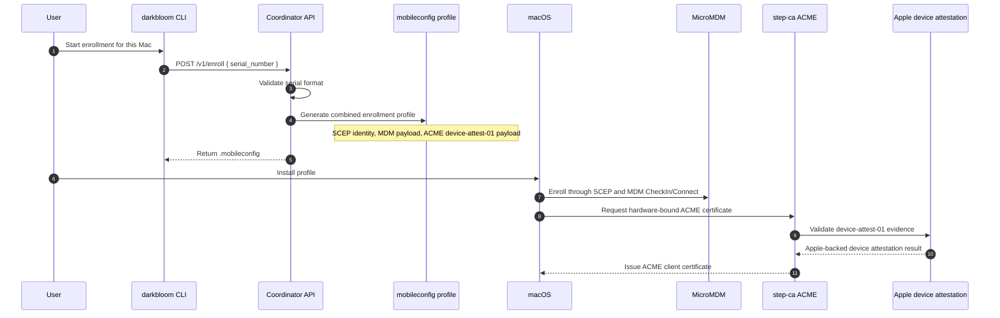
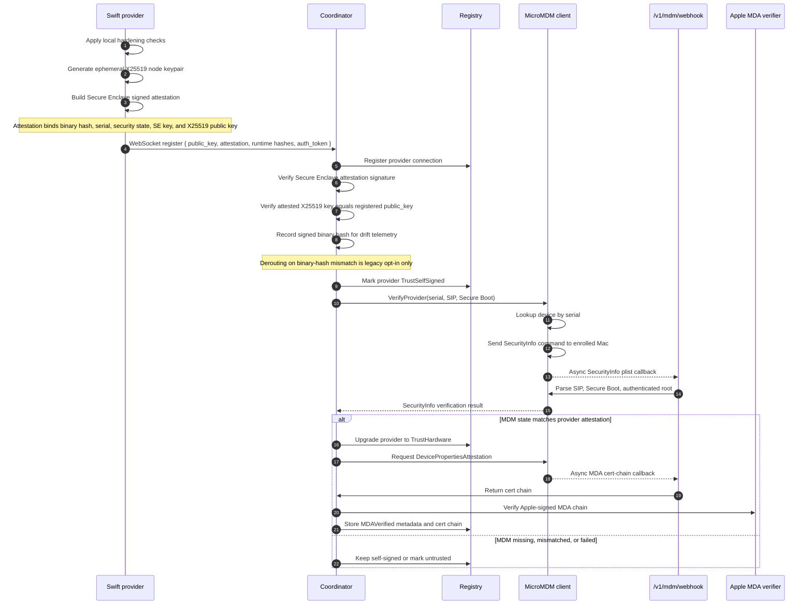
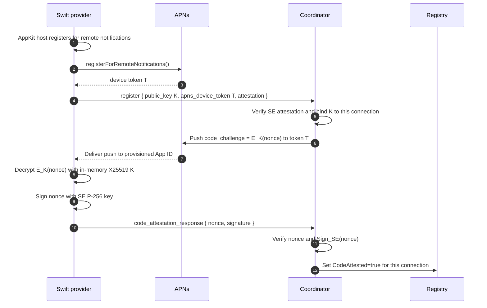
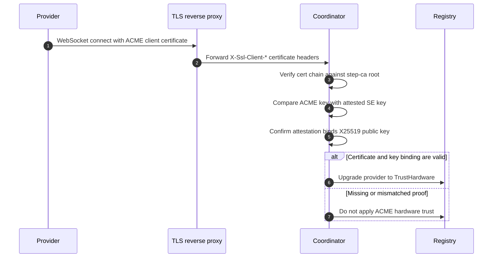
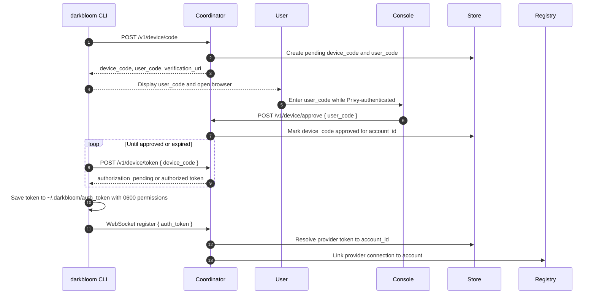
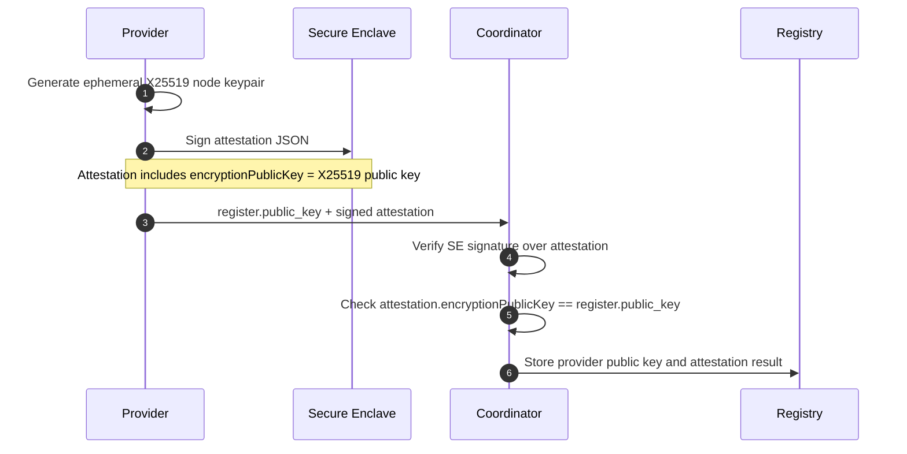
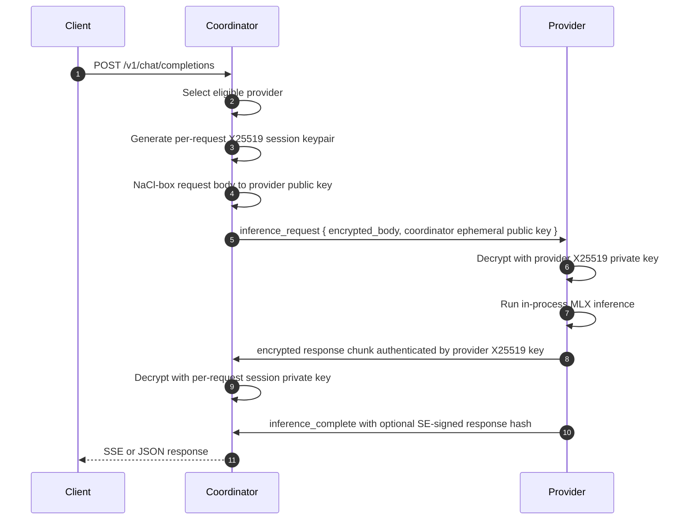
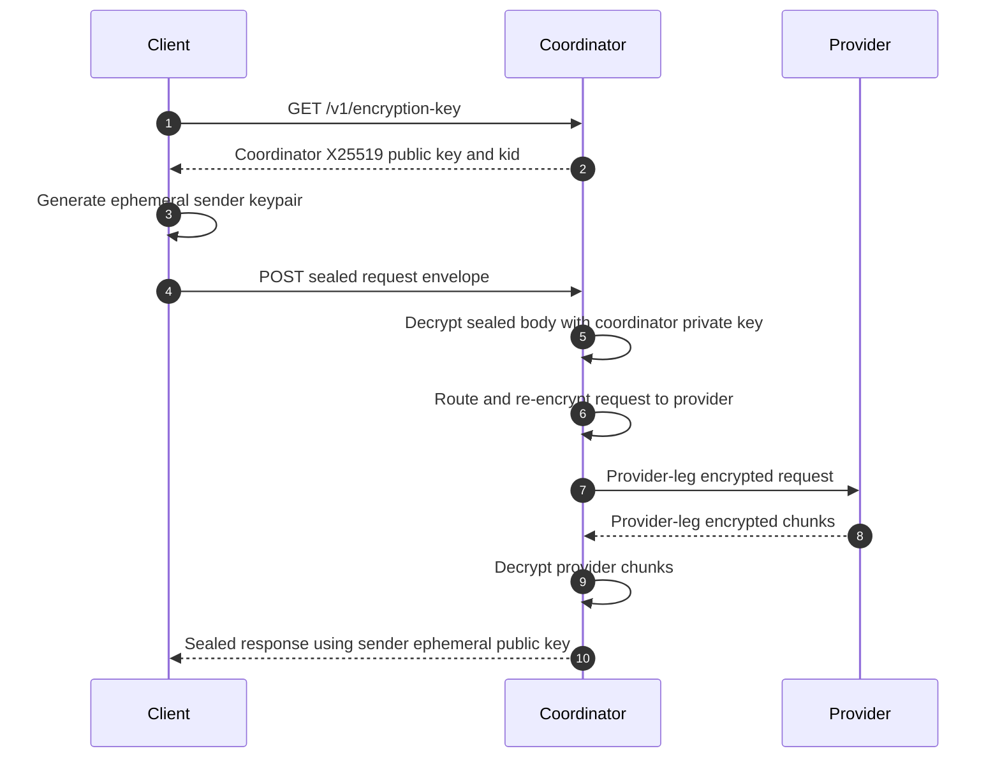

# System Workflows

This document captures operational workflows for Darkbloom/EigenInference. The
first two workflows cover MDM-backed provider trust registration and key
material handling.

## 1. MDM Enrollment And Provider Trust Registration

The MDM path has two phases:

- Enrollment: the operator installs a generated `.mobileconfig` profile on the
  Mac.
- Trust upgrade: the provider connects, self-attests with a Secure Enclave key,
  then the coordinator cross-checks the device through MicroMDM and Apple MDA.

### Enrollment Profile Generation



Code path:

- Profile generation: `coordinator/api/enroll.go`
- MDM client: `coordinator/mdm/mdm.go`
- ACME verification: `coordinator/api/acme_verify.go`

The generated profile requests minimal read-only MDM powers. Its
`AccessRights=1041` includes profile inspection, device information queries,
and security-related queries. It does not request wipe, lock, app management,
or settings mutation rights.

### Runtime Provider Trust Upgrade



Trust gates:

| Gate | Purpose | Failure Behavior |
| --- | --- | --- |
| Secure Enclave attestation | Verifies the provider's signed posture blob and possession of the claimed P-256 signing key. By itself this is `self_signed`, not Apple-rooted hardware trust. | No hardware trust; may be marked untrusted when binary-hash policy is configured. |
| X25519 key binding | Binds provider transport encryption key to the attested identity. | Provider cannot receive private text requests. |
| Binary hash telemetry | Records the provider-reported hash inside signed attestation/status payloads. It is drift telemetry by default because the measurer is provider code. | No routing effect by default. Legacy derouting requires `EIGENINFERENCE_BINARYHASH_ENFORCE=true`. |
| Runtime manifest | Pins runtime assets such as `mlx.metallib`. | Provider is excluded from routing. |
| MDM SecurityInfo | Independently checks SIP, Secure Boot, and authenticated root through Apple MDM APIs. | Provider stays self-signed or is marked untrusted on mismatch. |
| Apple MDA cert chain | Lets the coordinator and users verify Apple-backed hardware identity. | Provider may still have MDM hardware trust, but MDA is not marked verified. |

### APNs Code-Identity Lane

APNs code-identity attestation is separate from `TrustLevel`. It marks a single
WebSocket connection as `CodeAttested` after the app receives an Apple-gated
push for the Darkbloom App ID and answers over that same WebSocket.



Rollout behavior in code:

- If APNs is unconfigured, no code-identity challenge runs.
- If APNs is configured but `APNS_ENFORCE_AFTER` is unset or in the future, the
  coordinator challenges and measures but still routes un-attested providers.
- Once APNs is configured and `APNS_ENFORCE_AFTER` has passed, the private-text
  routing chokepoint requires `CodeAttested=true`.
- `CodeAttested` is in-memory and per-connection. It is reset on reconnect.

### ACME Trust Lane

The profile also installs an ACME device-attest-01 payload. If the provider
TLS connection presents the profile-issued client certificate during WebSocket
registration, the reverse proxy may forward client certificate metadata to the
coordinator. The coordinator verifies the certificate chain against the step-ca
root and only upgrades trust if the ACME public key matches the attested Secure
Enclave key and the attestation also binds the X25519 encryption key.



Operational assumption: the coordinator must not be directly reachable in a way
that lets clients spoof `X-Ssl-Client-*` headers.

Implementation caveat: this lane is conditional. The current verifier expects
the client certificate key to be compatible with the provider's attested P-256
Secure Enclave key. If the OS-managed ACME identity cannot be presented by the
provider TLS stack, or if the ACME profile issues a different key type, this
lane will not upgrade trust and the MDM/MDA path remains the hardware-trust
path.

## 2. Key Workflows

Darkbloom uses several unrelated key classes. Treat them separately.

| Key / Token | Owner | Persistence | Purpose |
| --- | --- | --- | --- |
| Privy identity token | Browser/user | Privy session | User authentication for account operations. |
| Consumer API key | Browser/API client | Stored by the consumer; console currently uses `localStorage` | Authenticates OpenAI-compatible consumer requests. |
| Provider auth token | Provider CLI | `~/.darkbloom/auth_token`, mode `0600` | Links a provider machine to a user account. |
| Provider X25519 node key | Provider process | Ephemeral in process memory | Decrypts coordinator-to-provider inference requests and encrypts response chunks. |
| Provider Secure Enclave P-256 key | Provider/macOS Secure Enclave | Persistent keychain-backed key when available, otherwise ephemeral SE key | Signs registration attestations, challenge responses, and response hashes. |
| Coordinator per-request X25519 session key | Coordinator | Ephemeral per request | Encrypts one request to a provider and decrypts that provider's response chunks. |
| Coordinator sender-encryption X25519 key | Coordinator | Long-lived coordinator key when configured | Optional client-to-coordinator sealing. Coordinator decrypts this before routing. |
| ACME hardware key/cert | macOS keychain/Secure Enclave profile payload | Installed by ACME profile | Proves Apple-attested device identity to the coordinator via proxy mTLS headers. |

### Provider Account Token Flow



Relevant code:

- Coordinator endpoints: `coordinator/api/device_auth.go`
- Swift token storage and polling: `provider-swift/Sources/ProviderCore/Auth/DeviceAuth.swift`
- Registration message construction: `provider-swift/Sources/ProviderCore/Coordinator/CoordinatorClientCodec.swift`

### Provider Encryption Key Binding



This is the core binding that prevents an unauthenticated process from swapping
in a different X25519 key while reusing a legitimate attestation.

### Inference Request And Response Encryption



Properties:

- The provider WebSocket wire message never carries plaintext request JSON.
- The provider response chunk must be encrypted. The coordinator rejects
  plaintext or mixed plaintext/encrypted chunks.
- The completion message may carry an SE signature over the response hash; the
  streaming chunks themselves are authenticated by NaCl box using the provider
  X25519 key.
- The coordinator sees plaintext before encrypting to the provider and after
  decrypting provider chunks.

### Image And Video Request Routing

The coordinator detects media parts in plaintext after TLS or sealed-envelope
decryption. It then requires a provider advertising a vision-capable build for
the resolved model. This prevents media requests from silently falling through
to a text-only provider.

```mermaid
sequenceDiagram
    autonumber
    participant Client
    participant Coord as Coordinator
    participant Registry
    participant Provider
    participant VLM as VLMRequestInference
    participant Batch as BatchScheduler

    Client->>Coord: Chat/Responses request with image_url or video_url
    Coord->>Coord: detectMediaRequirement()
    Coord->>Registry: Select provider with ModelInfo.is_vision for model
    alt no vision-capable provider
        Coord-->>Client: 4xx no vision-capable provider
    else vision provider found
        Coord->>Provider: encrypted_body
        Provider->>Provider: Decrypt request
        alt VLM model + media present
            Provider->>VLM: build UserInput(text, images, videos)
            VLM->>VLM: Accept inline data: URIs; reject remote/file URLs
            VLM->>Provider: Non-batched prepare/generate stream
        else text-only request
            Provider->>Batch: Continuous batching text path
        end
        Provider-->>Coord: encrypted response chunks
        Coord-->>Client: SSE or JSON response
    end
```

The current provider path preserves media only in the VLM branch. The batched
text path still collapses message content to text, but `MultiModelBatchScheduler`
checks for media before entering that path and fails closed for non-VLM models.

### Optional Sender-To-Coordinator Sealing



Privacy boundary: sender-to-coordinator sealing protects the request on the
browser-to-coordinator leg beyond TLS, but it is not coordinator-blind
encryption. The coordinator decrypts the request before routing.
