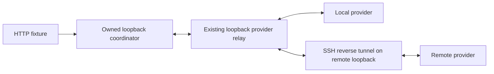

# Owned provider hosts for the connected cache fixture

`SuiteConfig.ProviderTargets` optionally assigns each provider to an explicit
host. Leaving it nil retains the existing local launcher. The connected HTTP
fixture accepts the same option as `providers` in its input JSON, requires two
entries, and reports schema 2 with scope `two_host_base_routing`.

The coordinator and provider relay keep their existing loopback listeners. A
local target uses an owned Python helper. An SSH target uses the same helper
through a single SSH control connection and a reverse tunnel:



Provider dispatch and reply frames retain their existing encryption. Registration
is bound to the fixture account assigned to each target, rather than registration
order. The helper hashes the host hardware UUID with a fresh suite nonce; the
report retains that suite-scoped identity, never the raw UUID. Two target names
or SSH aliases of one physical host cannot satisfy the two-host check.

## Explicit inputs

Every target supplies the following fields. Paths refer to that target's host;
the SSH identity path refers to the controller host.

| Field | Required meaning |
| --- | --- |
| `name`, `root` | Unique target name and a new absolute owned root with an existing parent. |
| `runtime_directory`, `runtime_files` | Existing provider runtime and complete selected file manifest, including `darkbloom`, `mlx.metallib`, and required bundle resources. |
| `models` | Exact model IDs, selected absolute snapshots, and complete file manifests matching the connected fixture's immutable catalog. |
| `assistant_path` | When selected, a path matching an explicitly manifested assistant in `models`. |
| `canonical_config_sha256` | Hash of the already-existing host `~/.config/darkbloom/provider.toml`. |
| `hardware_model`, `memory_bytes` | Exact expected host hardware and physical memory. |
| `macmon_path`, `macmon` | Existing telemetry executable and its file identity. |
| `ssh` | Optional `destination` (`user@host`), `identity_file`, absolute `python`, and unused `forward_port` (1024–65535). |

Each file manifest maps a relative path to `{ "sha256": "<64 lowercase hex>",
"bytes": <exact size>, "mode": <permission bits as a JSON integer> }`.
For example, decimal 493 is mode 0755; decimal 420 is mode 0644.
Runtime files must be regular, with no leaf symlinks. Model snapshot links may
resolve into that selected snapshot or its own Hugging Face model's `blobs`
directory. Escapes, dangling links, different hashes, sizes, or modes refuse.

The selected target snapshot must be the one the provider's current exact-ID
resolver would load. An absent alias, a newer competing snapshot, or an
unsupported layout refuses before provider launch. The helper does not create
aliases, download models, or alter snapshot files. Full model and assistant
manifests are verified on each host before launch; host paths cannot substitute
different bytes for the selected catalog input. Existing global connected inputs
still pin the local prompt artifacts, sidecar, backend, cache mode, normal MTP
policy, and any assistant input.

Owned targets require the isolated in-memory testbed store, provider relay,
explicit cache mode (`off` or `ssd`), and the existing ephemeral-cache opt-in.
The helper supplies a clean provider environment and isolates config, state,
updater scratch, temporary files, and SSD cache under the new root. Only the
pinned runtime is copied there. It verifies an unentitled fixture executable and
refuses missing/changed canonical config or retired startup artifacts; it never
repairs, migrates, signs, deletes default files, or exports key material.

## Lifecycle and evidence

The helper starts one provider process group. A bounded private JSON stdin frame
carries the fixture token; SSH argv and logs contain no token. State/observation
requests use monotonic IDs. A missing initial state file is retryable, and late
responses to cancelled requests cannot satisfy a newer request.

Explicit stop, control EOF, controller HUP/TERM/INT, a 30-second lease expiry, or
a 30-minute process deadline retires the owned group. Descendants are retired
even if the original group leader exits first. The helper reaps its direct child
and writes `terminal.json` with the group identity, signals, exit code, cleanup
status, and failure. A cleanup error retains an incomplete receipt. The Go
adapter requires terminal and host-cleanup evidence; it reports an unconfirmed
shutdown as an error. Failed startup and fixture assertions still run cleanup and
retain cleanup errors. Runtime, state, logs, cache, and terminal evidence remain
under the owned root; the private fixture token is removed after confirmed
shutdown.

Readiness and cleanup answer different questions. Before the initial provider
launch, the host must have no conflicting model jobs, GPU temperature at most
42 C, load1 at most 4, and more than 100 GiB free. Before every next measured
request, both hosts must meet the same temperature/load/storage limits and have
idle reported model slots. Post-work cleanup requires terminal owned processes
and no leftovers, and retains the observed temperature. Heat from completed work
does not turn that work into a correctness failure.

The first two-host fixture covers the ordinary donor, repeat hit, tenant cold
request, continuation on the other host, and original request after continuation.
It retains existing routing, actual cache hit, capability, backend, memory,
content/reasoning, and request-retirement checks. TTL, capacity eviction,
reconnect, tools, vision, cancellation, and sidecar-outage extensions remain
outside this first two-host scope; existing same-host cases remain available.
There is no invented provider eviction event.

This is testbed source, not a production listener or routing policy change. Its
test-only trust override and ephemeral SSD keys do not establish attestation or
persistent restart durability. CPU fixture validation does not establish actual
two-host model routing, capacity, TTFT, or throughput. Those require separately
reviewed host inventories and execution inputs.

## CPU validation

The following commands exercise pure input/argv checks, injected SSH transport,
and harmless local child processes. They do not launch a provider or model:

```sh
python3 -m unittest discover -s e2e/testbed -p test_provider_host.py -v
go test -race ./e2e/testbed ./e2e -short -run 'TestProvider|TestBuildProvider|TestResolve|TestDescribe|TestConnected' -count=1
```

Real execution continues to use the opt-in `TestIntegrationConnectedCacheHTTP`
entry point with `DARKBLOOM_CONNECTED_CACHE_INPUT` and a new
`DARKBLOOM_CONNECTED_CACHE_OUTPUT` root. No remote execution is implied by the CPU
commands or by merely providing a target schema.
