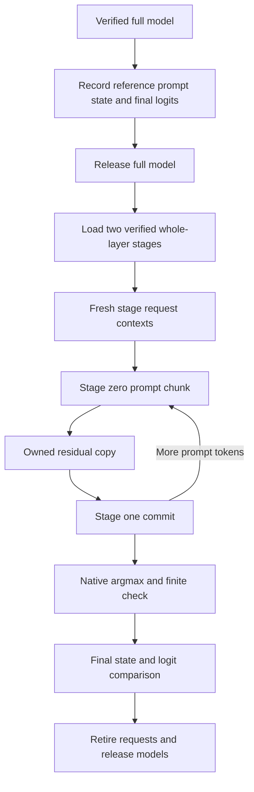

# Qwen stage prefill compute control

> Last updated: 2026-09-14 · commit `e4df336bc`

The registered Qwen3.5-9B prefill control passed on an M4 Pro with 24 GiB of
memory. Its candidate executes three prompt chunks without taking a state
snapshot or copying a vocabulary row after each chunk. Final state digests,
native-logit equality and the first selected token agree with a separate full
model request. This record qualifies that bounded compute path; it contains
no throughput measurement.

## Execution and comparison

`--mode qwen-layer-stage-prefill-check` runs the full model first, releases it,
then loads both verified whole-layer stages in one process. The same immutable
token history drives both requests. The candidate owns one fresh context per
stage, copies each residual to the consumer, and retains only small CPU commit
records during the prompt. After the final chunk it selects the first token,
captures one native logit row and both final stage states, compares them with
the baseline, and retires the contexts and loaded models.

The earlier [recorded baseline and stage comparison](QWEN_LAYER_STAGE_REAL_VALIDATION.md)
retains all six state frontiers and four output rows. This control uses only
its first three prefill frontiers as the historical reference. It does not
reinterpret the earlier teacher tokens as greedy output.

| Property | Executed value |
|---|---|
| Execution host | M4 Pro, 14 CPU cores, 20 GPU cores, 24 GiB; Mac16,7 |
| Operating system | macOS 26.6.2, build 25G83 |
| Process layout | One native process; baseline followed by both resident stages |
| Registered artifact aggregate | `127de76b4ef82b7aaa0acaac0ee31c784cff066eda64291f521f051469b7c24b` |
| Input | Saved natural-text prefix, 65 token IDs |
| Schedule | Chunk 32; committed frontiers 32, 64, 65 |
| Output | One selected token, no teacher tokens or decode forward |
| Execution path | `cbv2-contiguous`, native BF16 activations, MTP disabled |
| Explicit candidate captures | Zero per-frame state/logit captures; two final state snapshots; one final logit capture |
| Other candidate operations | Three owned residual copies and one native token selection |
| Native process result | Exit 0; exactly two JSONL records; empty stderr |

Both active stages retain their original full-width arithmetic. Their 463 and
464 active tensors account for 2,519,016,704 and 2,519,024,896 bytes respectively.
The verified source contains 927 canonical text tensors; excluded vision/MTP
headers do not count as stage parameters.

## Independent CPU result

The unchanged CPU oracle passed this actual run after its 34 prospective
fixture/mutation tests. It binds the new output-one request separately from
the old output-four request, verifies source/storage identities and every
stage commit, and reconstructs the full current and historical baseline BF16
rows, including signed zero.

| Check | Result |
|---|---|
| Candidate commits | Three frames per stage, final frontier 65 |
| Final state | All 72 component metadata/digest entries exact; 53,641,248 logical bytes |
| Historical reference | All three baseline prefill frontiers exact across the two execution hosts |
| Final logits | Shape `[1, 248320]`, BF16, 496,640 logical bytes |
| Final logit digest | `55c93eed36f83fd53404c045b949fd20a5e5cd55d0a6fedee4738d61fc65422c` |
| Final complete-state digest | `5ae9b873bfaadec86d79dbec8785cccd1136029964c34e4c576773a74d48292a` |
| Selected token | 2526; unique maximum logit 18.875 |
| Candidate raw rows reconstructed by CPU | Zero; the candidate exports metadata and digest only |

The native comparator checks the candidate's private copied `Data` against the
baseline's private native bytes. The CPU audit independently verifies the
exported metadata/digest and the baseline values; it cannot reconstruct the
candidate row from that digest. State equality likewise uses exported
component metadata/digests, without raw state arrays. Retirement and weak
model-release checks are source-bound native assertions.

## Resources and ownership

The SSH launcher staged a pinned executable bundle into a fresh private run
directory on the execution host. It verified the actual remote model and
bundle before and after execution; no model weights were copied. The initial
actual-free screen observed 6,709,100,544 bytes before remote bundle staging or
model hashing. The later post-hash reading was 6,425,264,128 bytes free and
16,340,287,488 bytes estimated reclaimable. The initial screen is not a
guarantee of that much free memory at native launch.

All 14 saved observations reported pressure level 1 and zero swap use. The
process-wide MLX peak was 5,281,957,248 bytes; after stage-model release and
cache clearing, MLX reported 8,024 active bytes and zero cached bytes. This peak
also includes the preceding full-model reference. It cannot isolate candidate
memory or establish a general admission budget.

The local SSH client exited and was reaped. The remote supervisor owns native
process-group cleanup; both its final observation and a separate root
postflight found no test processes. Remote PID observations do not establish
an independently observed remote `waitpid`. Sampled RSS is not an allocation
peak. Separate remote Python 3.9 process clocks are not used to infer a common
monotonic timeline.

## Reproducibility and scope

| Archived evidence | SHA-256 |
|---|---|
| Executed native binary | `48931adacab531e289063dbe3f5a03871ee3fd420f3767be82024e7699d74f46` |
| Complete native stdout | `10971a2556dbbfecf6557ba67375646a035483b4c3cbe937a67b7f22adfb8597` |
| Remote launcher receipt | `74065cafc7e9341707dc25cd1e90b3ccc5ed65c8a47ffa77712ceeaf889ff752` |
| Independent CPU comparison | `a85b412eb9065276ba55f42d8e0f61678fb2f5efde45dc4753326e2f62d5ac73` |
| Frozen CPU helper | `4bc20dfff992f6c7c8085a8f60bb565b34d883e6a9578e79db8c8ef963bc494c` |
| CPU validator test receipt | `797f5990994085abd3e28a9fb88fdc43e299ed8c9bb5a664bc3e94d8977cb78e` |
| Root remote postflight | `b22e0f11b772f993f4d95aa3a3b134d14e16f982e14fcb2d7061b397c4651678` |
| Independent source/archive/resource audit | `6e99794150b7ad22f4c73e77c9933d208274856cff08389e8da198c2d9d19712` |

Private archives retain 197 source files, dependency identities, the exact
bundle, remote controls, input history, model metadata and observations.
The CPU provenance audit verifies the archived file hashes, exact native
arguments, all 15 control records and resource arithmetic. Remote model
verification is bound to the saved controls; this audit neither rehashes the
model payload nor reproduces the build.
Credentials, machine addresses, model payloads and private archives are
excluded from the repository.

The candidate still pays the existing session's root evaluations, ownership
checks, state-geometry/device-offset reads, residual checksums/copies and
synchronization. Removing per-frame diagnostic captures does not demonstrate
a speedup. There is no first-token clock, interprocess model transport,
physical Thunderbolt transfer, long-prompt qualification or M3 Ultra result
in this run.

## Code map

| Concern | Source |
|---|---|
| Bounded CLI admission | `Sources/ClusterInference/QwenLayerStagePrefillAdmission.swift` |
| Baseline/load/release orchestration | `Sources/ClusterInference/QwenLayerStagePrefillCheck.swift` |
| Request-owned native compute | `Sources/ClusterInference/QwenLayerStagePrefillComputeContext.swift` |
| Native selection and final diagnostics | `Sources/ClusterInference/QwenLayerStagePrefillFinalObservation.swift` |
| CPU receipts and private logit bytes | `Sources/ClusterInference/QwenLayerStagePrefillComputeTypes.swift` |
| Two-stage comparison | `Sources/ClusterInference/QwenLayerStagePrefillComparison.swift` |
| Complete state and selected-token checks | `Sources/ClusterInference/QwenLayerStagePrefillComparisonValidation.swift` |

Related: [isolated probe](README.md), [two-process prompt lookahead](QWEN_LAYER_STAGE_LOOKAHEAD_VALIDATION.md),
[distributed goal](../../../docs/design/distributed-inference-goal.md).
