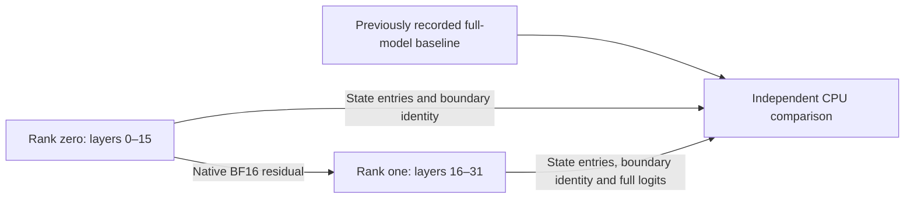

# Registered 9B inference across two stage processes

*Last updated: 2026-09-14*

The registered dense Qwen3.5 9B checkpoint completed inference with layers 0–15
and 16–31 in separate local processes. Both native ranks exited 0. Independent
CPU replay confirmed exact agreement with the separately recorded full-model
baseline: all 432 state entries and all four full-vocabulary BF16 logit rows.
This is a correctness result on one Mac using TCP loopback. It does not qualify
two-machine performance, Thunderbolt, RDMA or distributed serving.

The [baseline and sequential split record](QWEN_LAYER_STAGE_REAL_VALIDATION.md)
fixes the source artifact, native arithmetic and actual prompt/teacher tokens.
The [transport record](STAGE_P2P_VALIDATION.md) covers raw native transfer,
bounded framing and whole-cohort timeout/peer-loss cleanup.

## Execution and comparison

`qwen-layer-stage-rank-check` admits a pinned saved dense Qwen artifact, actual
token files, native CBv2 execution, a fresh common cohort epoch and explicit
loopback transport. It retains the diagnostic limits: batch one, prompt at most
128 tokens, chunks at most 32, at most four output rows and timeout at most
180 seconds. Loader payload and state/boundary limits still apply.

Each rank loads only its verified stage. Stage zero forwards tokens, commits
local state and sends the residual with its actual source/frame/token identity.
Stage one validates owned receive storage and bytes, forwards the residual,
commits its local state and captures CPU evidence before sending the consumed
ACK. Frame completion follows that handshake. Any failure retires the local
request and transport; the parent cancels both processes.

The baseline has a different request UUID. The audit independently validates
the new cohort's request fingerprints, then compares explicit artifact, token,
frame, state and logit content. It does not rewrite the old evidence or require
unrelated cohort fingerprints to be identical.

## Observed result

| Item | Result |
| --- | --- |
| Prompt and continuation | Same 65-token prefix and three teacher tokens as the baseline |
| Prompt chunks | 32, 32 and 1 token |
| Committed frontiers | 32, 64, 65, 66, 67 and 68 |
| Active stage parameters | 463 on rank zero; 464 on rank one |
| Active stage weight bytes | 2,519,016,704 and 2,519,024,896 |
| State coverage | 36 entries per rank at every frontier; complete 72-entry global union |
| State comparison | All 432 component metadata/digest pairs exact |
| Logit comparison | Four × 248,320 values; all 1,986,560 native BF16 bytes exact |
| Residuals | Six `[1,M,4096]` BF16 arrays; 557,056 total payload bytes |
| Process outcome | Both exited 0; requests retired and model objects released |

The audit regenerates request, state and wire-header fingerprints. It joins
disjoint state components by global layer index and compares them with the full
baseline. It reconstructs complete native BF16 logit bytes from the emitted
finite values, including signed zero, before comparing them.

Boundary digests agree across the two ranks and bind the regenerated headers.
The old baseline did not capture its internal cutpoint residual. This check
therefore makes no independent baseline comparison of that internal residual;
native sender/receiver byte validation and exact end-state/logit agreement are
the relevant evidence. State arrays are represented by complete metadata and
digests, not exported raw buffers.

## Resources and provenance

The original model was fully verified before and after execution, as well as
inside each owned rank supervisor and native stage loader. Configuration,
prompt/teacher inputs, executable resources and the saved 156-source snapshot
remained unchanged. The command-line adapter added 26 rejected input cases.
The independent audit also verified the prior baseline's 194-source archive
and passed 37 CPU tests, including coherently changed token histories, source
metadata, state digests and logit values.

Ten OS samples stayed at memory-pressure level 2 with no increase in reported
swap use. Native MLX active-memory peaks were 2,700,848,602 bytes on rank zero
and 2,701,118,800 on rank one. After releasing models and clearing caches, active
MLX memory was 2,016 and 2,008 bytes respectively. These are separate per-process
MLX observations, not total process RSS or a measured simultaneous combined
peak. The external RSS observer started after completion and captured no native
RSS measurement. A separate process inventory found no owned process left.

| Frozen item | SHA-256 |
| --- | --- |
| Registered artifact | `127de76b4ef82b7aaa0acaac0ee31c784cff066eda64291f521f051469b7c24b` |
| Source configuration | `c8e767de4953e58352fbc1acbf6615329075ed02fe16a36b8065714d85ee4423` |
| Stage plan | `2b5aa52cab49c12cfa44f2348326f956127d2ca15b1c55b5632f447901e56293` |
| Native executable | `db9c98e36cc0e2a9f4bf17cc2763ec670161bf0868311767b27325b70a3776f0` |
| Launcher execution receipt | `2048b2695e729ba187ee1e9aaa0cff1a7c1a417e11f6b741f75bc98b7fc6f50a` |
| Independent CPU comparison implementation | `489a4904d6ba947b33fabd7acf840c5f524bf37835ee2f6b81afaab80e0f0c9a` |
| Independent actual-run audit | `16c01dcf33b28a54b873c17dd97606c51df1f5aeb01094b58715c3eab6248d1b` |
| Independent CPU test receipt | `0ee1b1e0611abe424188bca349318fe89a1eb1d9a93d114675ab54e21b412a66` |
| Separate process/resource postflight | `8726f845171b2186b45b35f8b8f4991dd66e063bd2615f08fbe8478a06f819eb` |

The private run archive remains outside Git. Native completion and the launcher's
outer contract are separate from the independent numerical audit. All timings
remain disqualified as throughput measurements. Adjacent-prompt-chunk overlap,
long-context memory admission, physical peers and the target M3 Ultra workload
remain to be tested.
