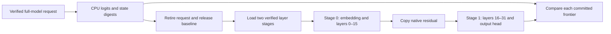

# Registered Qwen3.5 9B whole-layer comparison

> Last updated: 2026-09-14 · commit `e4df336bc`

The registered Qwen3.5 9B artifact, split into two full-width 16-layer stages,
matched the verified full-model baseline in all four complete logit rows and
all 72 state-component digests at six tested token frontiers. Execution was
sequential in one process on an M4 Max. This establishes bounded real-model
correctness for this split; throughput, two-machine transport and the M3 Ultra
27B target remain unqualified.

## Workload and implementation

Run `qwen-layer-stage-real9b-20260913` used a fixed 65-token text prefix in
chunks 32/32/1, followed by three fixed teacher-forced continuation inputs.
The complete vocabulary contains 248,320 logits. The artifact uses affine
W4/G64 weights, BF16 activations and quantization metadata, and 24 retained
Float32 `A_log` tensors. The F16-to-BF16 loader policy was enabled, but this
artifact has no stored F16 text tensors to convert. MTP and vision were inactive.

The comparison first loads the verified full model, executes a fresh CBv2
request, and records each committed state component's global layer, shape,
dtype, byte count and SHA-256. It retains copied native logit bytes and finite
Float32 representations of each complete row. It then retires request state,
releases the full model, checks a weak model reference, synchronizes and clears
the MLX allocator cache before loading either stage. Only CPU evidence crosses
that residency boundary.

Stage zero owns embedding and layers 0–15. Stage one owns layers 16–31,
final norm and output head. Each stage retains original projection widths and
the original attention/recurrent phase. The first stage completes and commits
each chunk, makes an explicit owned copy of the native residual, and then the
second stage consumes that residual through the existing CBv2 embedding-input
interface. There is no overlap, network transfer, TP reduction or changed
projection arithmetic in this run.

## Measured correctness

| Frontier | Phase | State components | Logical state bytes per side | Complete logit comparison |
|---:|---|---:|---:|---|
| 32 | Prefill | 72 | 52,559,904 | Evaluation handle only |
| 64 | Prefill | 72 | 53,608,480 | Evaluation handle only |
| 65 | Final prefill | 72 | 53,641,248 | All 248,320 native values byte-exact |
| 66 | Decode | 72 | 53,674,016 | All 248,320 native values byte-exact |
| 67 | Decode | 72 | 53,706,784 | All 248,320 native values byte-exact |
| 68 | Decode | 72 | 53,739,552 | All 248,320 native values byte-exact |

State coverage comprises 24 convolution/SSM pairs and eight attention
key/value/device-offset triplets. Both sides agree on every component's
metadata and digest after every commit: 432 component comparisons in total.
Raw paired state arrays are not retained by this separately resident check;
state equality is established through complete per-component SHA-256 equality.
The earlier [small-fixture check](QWEN_LAYER_STAGE_VALIDATION.md) compares raw
paired state bytes directly and separately covers failure and fresh requests.

All 993,280 native logit values across the four output rows match byte-for-byte.
The CPU audit also reconstructs source and candidate native floating bytes from
the captured values, verifies their digests and compares all four pairs. It
recomputes request, frame, baseline, state and storage-commitment fingerprints.
This is stronger than checking only selected tokens or an argmax.

| Storage ownership | Active tensors | Active logical bytes | Inactive logical bytes |
|---|---:|---:|---:|
| Stage zero | 463 | 2,519,016,704 | 16,384 |
| Stage one | 464 | 2,519,024,896 | 8,192 |
| Combined | 927 | 5,038,041,600 | 24,576 |

The independent inventory derives every retained tensor name, shape, dtype and
stage mapping from pinned configuration and safetensor headers. The raw source
headers contain 1,291 tensors: 927 retained text tensors, 333 vision tensors
and 31 MTP tensors. The verified loader's `sourceTensorCount` counts retained
source tensors after sanitization; for this one-part canonical artifact it is
927. It does not count excluded raw header entries.

## Execution, resource observations and preserved failure

Native execution completed with exit 0 from 06:58:12 to 06:58:23 UTC on
2026-09-14, on the local M4 Max with 36 GiB memory and 32 GPU cores. These times
include verified weight loading and evidence capture and are not TPS timings.
The supervisor sampled peak process RSS of 5,633,605,632 bytes. Memory pressure
stayed at level 2, with no new swap; existing system swap was present.

| Observation after synchronization | Active MLX bytes | Cached MLX bytes |
|---|---:|---:|
| Baseline model released, cache cleared | 4,016 | 0 |
| Both stages loaded | 5,038,051,774 | 3,346 |
| Stage requests retired, weights still held | 5,038,444,990 | 859,158,452 |
| Stage models released, cache cleared | 8,024 | 0 |

Reported peak active MLX memory since process start was 5,281,957,248 bytes.
Active/cached MLX accounting and sampled RSS measure different things; neither
is a hard whole-process memory bound. Startup admission used the prior measured
9B solo estimate plus an additional 1 GiB diagnostic reserve, requiring
8,266,034,790 estimated reclaimable bytes. Named state/snapshot/boundary tensors
also passed a separate conservative 512 MiB admission ceiling.

The original external driver receipt remains **failed**: after native success,
its CPU validator incorrectly expected the retained source count to equal all
1,291 raw header entries. The corrected validator derives 927 as raw minus
explicitly excluded entries. It replays the existing native output; inference
is not rerun to repair this bookkeeping error. A separate postflight verifies
the unchanged full artifact, frozen bundle and all 194 archived source entries,
and confirms native exit/reaping and no new swap. The original receipt, helper
and failure are preserved.

## Reproducibility and scope

The frozen run archives native output, exact input IDs, executable and
dependencies, source files, resource samples, and the original failed driver.
The separate CPU audit and postflight complete the evidence chain. Private
machine details and checkpoint payloads stay outside the repository.

| Identity | SHA-256 |
|---|---|
| Registered artifact aggregate | `127de76b4ef82b7aaa0acaac0ee31c784cff066eda64291f521f051469b7c24b` |
| Original configuration | `c8e767de4953e58352fbc1acbf6615329075ed02fe16a36b8065714d85ee4423` |
| Phase-aligned 16+16 plan | `2b5aa52cab49c12cfa44f2348326f956127d2ca15b1c55b5632f447901e56293` |
| Native executable | `959d409aef53165ba05f82119f09c830d3e22d94c764e218f332b4382d16e958` |
| Archived 194-entry source manifest | `f8cb1a8b4f30153bef720eaf69cc5d4dba50d00fefd9c12d16178ff5c832c227` |
| Two native JSONL records | `dac1248a0b02ffa6010cd641834d2a43e1e7c5e92634bc28613fc7f73aaaf551` |
| Independently derived inventory/state geometry | `da869c797a5f37c264e4f1e1ddcf5c5f021630a9aae672dc2d2fb55ecd967a99` |
| Corrected independent CPU audit | `54d0bb7ea744b31bf98e0d1802351c8d7c5a679448b5a7b7381ecf586738598e` |
| Separate full-artifact and process postflight | `5ea489b032b74cf160492f3d048665527d38f2b9296156b26dd5b86548e62fff` |

The corrected CPU helper also passes 24 regression tests, including the actual
real-model records and a coherently rehashed but incorrect retained tensor
count. The frozen original helper still reproduces the documented failure.

The corresponding mode is `qwen-layer-stage-compare`. It requires a pinned
saved model, actual prompt/teacher token files, native CBv2 execution,
prompt ≤128, chunk ≤32, output ≤4, one run, zero warmups and timeout ≤180.
It emits the completed baseline before attempting stage loading, preserving
useful evidence if a later comparison fails. The initial loader caps remain
6 GiB canonical weights, 8 GiB manifest payload and 512 MiB per source tensor.

This single fixed short prompt does not establish long-context correctness,
free-running generation quality, an overlapped pipeline, transport behavior,
MoE correctness or a distributed release. The next execution boundary is a
real two-process residual handoff. Any claimed prefill gain must then include
pipeline fill/drain, transfers and the first output token, and satisfy the
[distributed inference goal](../../../docs/design/distributed-inference-goal.md).
