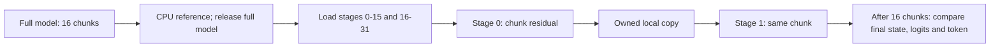

# Registered Qwen 8K whole-layer stage validation

> Last updated: 2026-09-14 · commit `e4df336bc`

Two full-width Qwen3.5-9B stages matched a fresh complete-model reference at
8,192 prompt tokens and chunk size 512. The native comparison, independent CPU
output audit, archive/provenance replay and remote process postflight all passed.
The match covers every final state entry's metadata and digest, the complete
final logit row's metadata and digest, and selected token 271. This was one
process on one 24 GiB M4 Pro, with no inference timer or interprocess transport.

| Executed property | Value |
|---|---|
| Host | M4 Pro, Mac16,7, 14 CPU cores, 24 GiB; macOS 26.6.2 build 25G83 |
| Model | Registered Qwen3.5-9B; original quantization preserved; MTP disabled |
| Workload | `long_prefill_8k_v1`; batch 1; 8,192 input tokens; chunk 512; output count 1 |
| Input | Pinned generated English prose with repeated paragraphs; no chat template or added special tokens |
| Arithmetic | `cbv2-contiguous`; BF16 activation; query block 128; BF16 policy 1; TF32 permission 1 |
| Absent overrides | `MLX_METAL_GPU_ARCH`, `MLX_SDPA_BLOCKS` |
| Requests | One fresh full-model baseline, then two fresh stage requests; no warmups, teacher tokens or decode forward |
| Completion | Native exit 0; exactly two JSONL records; empty stderr |

The [pair driver](Sources/ClusterInference/QwenLongPrefillPairCheck.swift) produced
its full-model reference with the same executable, artifact, prompt and sixteen
chunks. The full model and request retired before either stage loaded; the
checkpoint retained CPU evidence. This fresh reference has its own fingerprint
and is distinct from the [earlier reference run](QWEN_LONG_PREFILL_REFERENCE_VALIDATION.md).

The [comparison](Sources/ClusterInference/QwenLongPrefillPairComparison.swift)
made sixteen sequential producer/copy/consumer steps. Each boundary was BF16
`[1,512,4096]`, 4,194,304 bytes. Each stage committed frontiers 512, 1,024, …,
8,192. Locally constructed inner-v2/outer-v4 envelopes bound actual producer
metadata to the admitted request. They were decoded locally; no wire send,
receive, network acknowledgement or overlap was exercised.

| Final comparison | Result |
|---|---|
| Staged work | 16 frames; 32 stage commits; 16 native boundary copies |
| State coverage | 36 disjoint entries per stage; complete union of 72 entries |
| Logical state bytes | 159,973,392 per stage; 319,946,784 combined |
| Combined state fingerprint | `59659ed425cfadf4e184fcb8533f4c9fd16a4311f37b83df3f06fa48911009f6` |
| Final logit row | BF16 `[1,248320]`; 496,640 logical bytes |
| Final logit SHA-256 | `4dea769bd622b97b34a914e2c488ffe599701884561f1a42b1d4ee9dfde6dfe6` |
| Selection | Token 271; baseline maximum 21.25 with one maximum |
| Final captures | One state capture per stage; stage 1 alone captured logit metadata/digest and selected a token |
| Per-frame numerical captures | None; frame records contain commit and boundary metadata |

The independent CPU oracle passed 13 prospective tests before first accessing
candidate output; it was frozen after native execution had begun. It checked
the source/storage inventories, exact frame coverage, all final state metadata
and digests, logit metadata/digest and selected token. It also reconstructed
the sixteen canonical envelope hashes and the baseline's exported BF16 row
and first-index argmax. The candidate exports no full Float values or raw logit
bytes, so there was no direct candidate-byte comparison or candidate tie-count
measurement. The 64 numerical recurrent/KV state payloads and residual payload
hashes remain opaque; the eight baseline Int32 position-offset hashes were
independently reconstructed. No additional model forward was performed by the
CPU oracle.

Native finite selection, owned copies, commits, retirement and weak model-release
checks are assertions bound to the archived source and execution. The terminal
record reports both stage requests retired and stage models released. These
are not external profiler observations. The comparison performs final captures
after prefill and selection, but contains no timed post-stop ordering proof.

The launcher verified the remote artifact before and after and retained 277
source files, dependencies, executable bundle, raw inputs, controls and output.
Initial actual-free memory was 9,120,727,040 bytes; post-hash actual-free was
8,823,848,960 and estimated reclaimable memory was 16,153,034,752 bytes. The
6 GiB actual-free and 8 GiB reclaimable screens passed. All 45 saved pressure/swap
samples and the separate postflight reported pressure level 1 and zero reported
swap. These observations do not guarantee memory availability for another run.

| Memory observation | Bytes |
|---|---:|
| MLX-reported peak since process start | 6,500,375,576 |
| Active MLX, requests retired and stage weights resident | 5,038,444,990 |
| Cached MLX at that same observation | 4,056,279,244 |
| Active / cached MLX after stage model release and cache clear | 8,024 / 0 |
| Maximum of 41 sampled native RSS observations | 5,960,122,368 |

The MLX peak is cumulative across baseline and stages and was already reached
after the baseline; it does not isolate stage peak memory or represent a whole
process/all-cache peak. Cached values are individual observations. Sparse RSS
samples measure a different scope and are not a proven process peak; missing
samples are not zero. The named tensor admission estimate also excludes model
weights and native workspaces, so it is not a whole-process memory bound.

The local SSH client was reaped. Final launcher and separate postflight inventories
found no processes matching the owned remote paths; independent remote `waitpid`
proof is not asserted. Provenance replay verified the frozen archive and saved
resource/control records without comparing a later live source tree, reproducing
the build, retokenizing input or re-reading remote model payloads. Before/after
full-artifact checks remain pinned-control attestations.

The executed binary SHA-256 is
`883fa4125e873d4b9c5f83b96805a3bf48a15932937372ba31d552bf935097ce`.

| Retained evidence | SHA-256 |
|---|---|
| Artifact aggregate | `127de76b4ef82b7aaa0acaac0ee31c784cff066eda64291f521f051469b7c24b` |
| Raw prompt, 38,405 bytes | `ee6caf0be6391e00ec41df930f0fd6351613969622cbb247b1b4bdaf69afe997` |
| Fresh baseline fingerprint | `f47c9870884b9d94dba6ca646ce9a9102bccca69395cbfa0d9e4de48adfe3c77` |
| Native stdout, 2,805,652 bytes | `d4ca858a1d477568b51e81b90586a8b23b47f848945ad24cc2f5236e7b5aa23a` |
| Launcher receipt | `093332265c7dcb3b5f76d7009917adc392a532202026f94ee3babbef097fd693` |
| Independent CPU audit receipt | `19f9af3fd345a3476128867efc8d0ffad5d5dcc7404317b81c9c4bb2d03308ea` |
| Independent provenance audit | `e669469a631718549003e1d6ea8e9064adbcd82893fb9670fe57f6b9b2a31fd8` |
| Root postflight | `033f9915fa3da31431a3b30661be72c3267d2aa8bfaad3eddba8dac93c87e644` |

This qualifies the tested one-process whole-layer arithmetic and ownership path.
It establishes no inference TPS, physical Thunderbolt/RDMA transfer, distributed
scheduling speedup, decode continuation, 27B execution or M3 Ultra performance.
The repeated prose is not a representative production workload. See the
[pair contract](QWEN_LONG_PREFILL_PAIR.md), [inference checks](README.md) and
[distributed inference goal](../../../docs/design/distributed-inference-goal.md).
