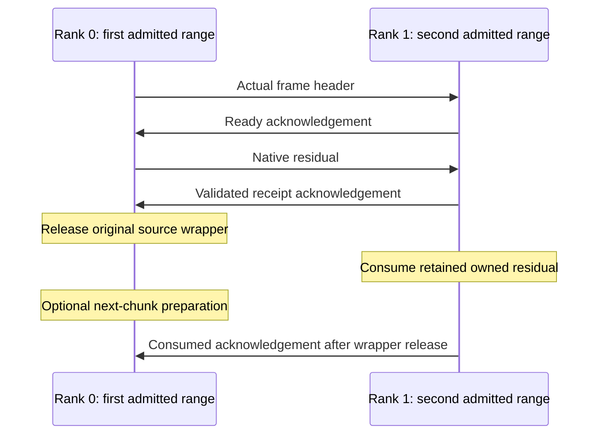

# Registered 9B long-prompt rank execution

> Last updated: 2026-09-14 · commit `e4df336bc`

`qwen-long-prefill-rank-check` runs one full-width Qwen3.5-9B stage in each
of two loopback processes for the exact 8,192-token, chunk-512 workload. The
additive v4 implementation passed
[guarded native serial and lookahead validation](QWEN_LONG_PREFILL_RANK_VALIDATION.md). It builds
on the [passing one-process comparison](QWEN_LONG_PREFILL_PAIR_VALIDATION.md)
and emits CPU evidence for an independent full-reference comparison.

## Admission and start

[QwenLongPrefillRankAdmission.swift](Sources/ClusterInference/QwenLongPrefillRankAdmission.swift)
requires the registered artifact and raw prompt hashes, native CBv2 arithmetic,
one output, one repetition, zero warmups, no teacher history and timeout at most
300 seconds. It requires explicit `loopback-test`, a fresh 32-digit lowercase
hexadecimal epoch, BF16 logits, and either `serial_v1` or
`prompt_lookahead_one_v1`. It accepts no baseline evidence file. The explicit
long profile preserves every earlier diagnostic's request and wire limits.

Optional `--stage-cut` selects the
[registered layer ranges](QWEN_LAYER_STAGE_CANDIDATES.md) on both ranks. Omission
requires the historical 16+16 plan. The runner binds the cut before constructing
the collective, and the existing v4 agreement binds actual stage/configuration
identities. The default split passed serial and lookahead checks; a subsequent
[12+20 serial check](QWEN_LONG_PREFILL_UNEQUAL_VALIDATION.md) also passed against
its separately qualified same-plan reference. Other cuts and unequal lookahead
remain unqualified.

[Main.swift](Sources/ClusterInference/Main.swift) admits the actual arithmetic
environment and retained raw prompt/configuration before initializing MLX.
[QwenLongPrefillRankCheck.swift](Sources/ClusterInference/QwenLongPrefillRankCheck.swift)
loads only that rank's verified stage and constructs the agreement from actual
source/storage/configuration receipts. The epoch determines one shared request
UUID. Both ranks independently derive identical prompt geometry and history.

[QwenLongPrefillRankReadiness.swift](Sources/ClusterInference/QwenLongPrefillRankReadiness.swift)
exchanges a namespaced agreement hash after local model admission. The driver
then emits its ready record before either fresh context or rank-zero clock.
Rank zero records start immediately before sending the v4 start packet. Each
rank constructs fresh state only after its start operation completes; repeated
source admission inside that constructor is part of the timed interval.

## Frame ownership and scheduling

[QwenLayerStageProfiledPrefillTransport.swift](Sources/ClusterInference/QwenLayerStageProfiledPrefillTransport.swift)
uses the unchanged completed Cmlx CPU-stream send/receive shim. New v4 controls
bind the profile, actual arithmetic, source, exact request history and scheduling
policy. The receiver admits each header against its local next frame before
allocating the native payload. Domain fingerprints and hashes of exact accepted
wire bytes are separate fields. Payloads remain limited to 16 MiB.

[QwenLongPrefillRankSender.swift](Sources/ClusterInference/QwenLongPrefillRankSender.swift)
permits one prepared native boundary and one pending CPU consumed ticket.
Serial preparation follows the predecessor's consumed acknowledgement.
Lookahead preparation occurs after source release and before that drain; a new
header still waits for the predecessor to finish. These scalar action records
describe order and ownership; they do not measure GPU overlap duration.

[QwenLongPrefillRankReceiver.swift](Sources/ClusterInference/QwenLongPrefillRankReceiver.swift)
consumes the actual owned payload and returns CPU commit metadata only. The
transport validates and releases its original receive wrapper before sending
consumed acknowledgement. Weak-wrapper checks do not prove that every possible
underlying storage alias is absent. Phase callbacks cannot run model work;
the admitted consumer is the sole model callback.

## First token, diagnostics and retirement

On the final frame, native finite argmax and token-packet validation precede
the consumed acknowledgement. Rank zero receives and validates the saved token
only after all sixteen consumed acknowledgements, then records stop. A distinct
token-bound post-stop release precedes both ranks' final state/logit digests and
request retirement. Initial model loading, prompt distribution and readiness
are excluded; fresh state, model forwards, boundary work, scalar tracing and
first-token return are included. This is a diagnostic interval, not qualified
cluster throughput or a kernel timer.

Each rank emits ready/report records with its actual source receipt, agreement,
sixteen exact envelope JSON strings and commits, scalar actions, token packet,
one final stage digest and memory observations. Rank one alone includes final
logit metadata and its native selection receipt. An independent CPU auditor
must compare the state union, final logits and token to the pinned full-model
reference. The native rank process performs no independent numerical comparison.

Errors permanently retire the transport and cancel any open local request,
preserving the original error and cleanup failures. CPU retirement cannot
interrupt a blocked backend call; an external deadline must fence both owned
processes. Successful request close is followed by model-release checks and
cache clearing in the outer driver. Physical Thunderbolt/RDMA, decode
continuation, resident serving, 27B execution and M3 Ultra performance remain
separate work.

Related: [long profile](QWEN_LAYER_STAGE_LONG_PREFILL.md),
[reference validation](QWEN_LONG_PREFILL_REFERENCE_VALIDATION.md),
[inference checks](README.md).
