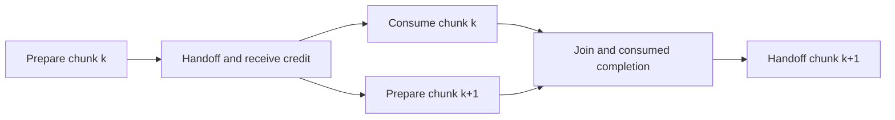

# Offline prefill cost planning

> Last updated: 2026-09-14 · commit `e4df336bc`

This experimental planner ranks supplied per-chunk cost scenarios for two-stage
prefill. It exposes missing measurements and memory constraints before choosing
an experiment. It does not launch a plan or qualify performance. The arithmetic
is independent of a particular model; model adapters still own legal cuts,
parameter/state placement and runtime admission.

## Run an analysis

From the repository root, with Python 3.9 or newer:

```sh
PYTHONPATH=experiments/cluster python3 -B -m planning /path/to/costs.json
python3 -B -m unittest discover -s experiments/cluster -p test_planning.py
```

The command reads at most 2 MiB of JSON, rejects duplicate fields and non-finite
values, and prints JSON with the input's SHA-256. It performs no SSH, model load
or process launch. Source references in the input are caller-supplied and are
retained without verification. Output may contain the caller's device labels;
keep private profiles and results outside the repository.

Generate a **fabricated** schema example with:

```sh
PYTHONPATH=experiments/cluster python3 -B -m planning.fixtures
```

The example uses tiny invented durations and placeholder identities. Its TPS
values have no hardware interpretation. The CPU tests cover credit-limited
overlap, unequal chunk costs, final selection, missing data, memory exclusion,
shared devices, scenario ordering and solo comparisons.

The [recorded Qwen service adapter](measurements/README.md) imports pinned rank
reports and phase traces, associates exact ownership with the native candidate
catalog, and can emit a separately labeled independent-device assumption. Its
unknown transport and target memory costs remain visible to this planner.

## Input contract

[costs.py](costs.py) defines the closed `cluster_prefill_costs_v1` schema. All
durations use integer nanoseconds. An observed or assumed range has exactly
`low`, `typical`, `high`, in nondecreasing order. These are supplied scenarios,
not confidence intervals or guaranteed physical bounds. Use `null` for a
missing quantity; zero explicitly asserts that its modeled cost is zero.

| Field | Meaning |
|---|---|
| `workload` | Artifact and raw-token SHA-256, arithmetic identifier, prompt and chunk lengths, batch size one, `cache_mode: uncached` |
| `baseline` | Optional single-device prepared-input-to-first-token cost, identifier, device and evidence references; the caller must choose an eligible, matched baseline |
| `candidates` | At most 128 candidates, each with an identifier, plan digest, ordered producer/consumer device identities, policy and cost data |
| `evidence_kind` | `assumed` or `measured_services`; this is the caller's description, not an independently verified claim |
| `source_sha256` | Nonempty source references for each candidate or baseline, including the hardware/runtime/workload profile used to obtain the costs |
| `memory` | Two records, each with `peak_bytes` range or null and positive `budget_bytes` or null; include weights, state, activation/staging transients and other reservations in the supplied peak |
| `startup_ns`, `return_token_ns` | Cost before first preparation and after final consumed completion, respectively; cover the remainder of the defined request interval |
| `frames` | Exactly one record per prompt chunk, including a partial last chunk; costs must match that chunk's length and committed context |

Each frame has four costs:

| Cost | Required boundary |
|---|---|
| `prepare_ns` | Complete producer prepare call, with its evaluated/committed state and checks |
| `handoff_ns` | Modeled rendezvous after preparation: envelope/residual copy and hash, header/ready exchange, payload staging/evaluation/validation, received ACK and original producer wrapper release |
| `consume_ns` | Complete consumer call and validation; the final frame includes vocabulary projection, finite argmax and first-token selection |
| `completion_ns` | Modeled consumed ACK/drain and frame bookkeeping after both fork branches are ready |

The startup scalar is a collapsed model assumption. The native processes can
create contexts at different times and rank zero can start preparing before
rank one is ready. Do not obtain this scalar by summing local setup intervals
or subtracting timestamps from different machines.

## Schedule and interpretation

[schedule.py](schedule.py) models the actual protocol's bounded preparation
window. In `prompt_lookahead_one_v1`, the producer can prepare chunk *k+1* while
the consumer processes chunk *k*. It must drain chunk *k*'s consumed ACK before
sending another header. The native source of these constraints is
[the long sender](../inference/Sources/ClusterInference/QwenLongPrefillRankSender.swift)
and [the profiled receiver](../inference/Sources/ClusterInference/QwenLayerStageProfiledPrefillTransportReceiver.swift).



Let `P[k]`, `C[k]`, `H[k]`, `D[k]` denote the four per-frame costs. For *n* chunks,
the modeled lookahead interval is:

```text
startup + P[0]
  + sum(H[k] + max(C[k], P[k+1]) + D[k], k = 0 .. n-2)
  + H[n-1] + C[n-1] + D[n-1] + return_token
```

For `serial_v1`, replace this with startup + the sum of all four costs for every
frame + return_token. A single chunk has no overlap opportunity. Handoff and
completion are deliberately outside the parallel branch. In the native code,
the two received-credit endpoints occur at different local instants and some
ACK work may overlap preparation. This collapsed model is therefore a scenario
for screening experiments, not an exact replay of the recorded clocks.

Per-chunk costs matter: changing context, attention intervals, unequal stage
placement and the last vocabulary head can change the critical path. The
`typical_breakdown_ns` output separates consumer time from producer time that
remains exposed under this model. Its fields sum to modeled TTFT.

`zero_overhead_scenario_ns` sets startup, handoff, completion and token return
to zero while retaining all compute costs. It helps test whether communication
optimization alone could plausibly help. It is an explicitly idealized scenario,
not a hardware performance bound. Missing compute prevents even this output;
missing overhead prevents a full estimate and ranking.

Both policies require `independent_devices` to produce estimates. Two processes
on one GPU must use `shared_device`, which returns no estimate. Serial traces
from one GPU can supply compute observations for a separately labeled assumption
about two devices; they cannot prove independent service under concurrency.
Current local header/ACK/payload waits also contain peer work and cannot be
reclassified as measured Thunderbolt latency.

## Ranking and remaining integration

[rank.py](rank.py) groups comparisons by the same unordered physical device
pair, preserving role-swapped placements as separate candidates. It includes
the supplied solo baseline only when its device belongs to that pair. Candidates
with missing costs or memory data, or high memory scenarios above the supplied
budget, remain visible and are excluded from ranking. Memory evidence is a
screen, not a proof of safe native allocation.

The output orders typical estimates and identifies a winner across supplied
ranges only when its high latency is strictly below every competitor's low
latency. Overlapping ranges and ties leave that winner unset. A single remaining
candidate without a baseline also has no comparative winner. Numerical parity,
runtime compatibility and all admission checks remain independent obligations.

The next integration is to attach measured target-device services and real
physical handoff costs to legal adapter candidates, then test shortlisted plans
against actual end-to-end runs. Selective tensor parallelism, MoE placement,
decode, replicas for aggregate throughput and state handoff require their own
cost graphs; this two-stage prefill model does not estimate them.
