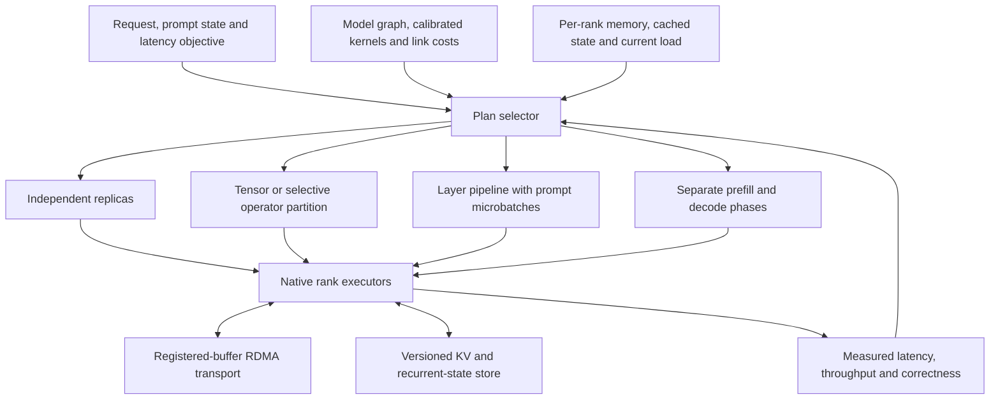

# Darkbloom cluster inference: initial architecture and estimates

2026-09-13. This is a research/design artifact, not an implemented cluster engine or a benchmark result. The immediate target is the two connected M4 Pro Macs, each with a 14-core CPU and 20-core GPU, with 48 GB and 24 GB of memory respectively. Both report RDMA enabled and an active Thunderbolt port; the physical link reports 80 Gb/s. Actual RDMA payload bandwidth and collective latency have not yet been measured.

The objective is to improve uncached prefill, accepted-token decode, and useful throughput under latency constraints. These are separate objectives; the optimal execution plan can differ for each.

## Sources and reproducibility

- Darkbloom checkout: `../d-inference`, commit `e4df336bc`.
- Exo source: `exo/`, commit `21a54c5ea0230a3bec1e1a786d200126c7e34ec6`; inspected, not installed or benchmarked.
- Live catalog snapshot: `catalog-2026-09-13.json`, fetched from https://api.darkbloom.dev/v1/models/catalog. The unauthenticated `/v1/models` request returned HTTP 401; this report describes registered catalog entries, not verified live capacity for every model.
- Qwen configuration: `qwen38-config.json`, fetched from https://huggingface.co/Qwen/Qwen3.8-27B/resolve/main/config.json; the redirect identified revision `1d4bf0f2ff6012fd82039f2fa52739d0dd7c60c0`.
- Apple M4 Pro specifications: https://support.apple.com/en-us/121554 (273 GB/s memory bandwidth per chip).
- Apple RDMA technical note: https://developer.apple.com/documentation/technotes/tn3205-low-latency-communication-with-rdma-over-thunderbolt ; local copy `apple-rdma.md`.
- Calculated scenarios and assumptions: `qwen38-estimate.json`. No cluster benchmark was run during this investigation.

## Live Darkbloom catalog

Sizes are decimal GB of the registered artifact, including auxiliary files. Minimum memory and capabilities are the current catalog's single-provider requirements; they are not per-rank memory requirements for a future sharded engine.

| Catalog ID | Status | Artifact GB | Minimum RAM GB | Notes |
|---|---|---:|---:|---|
| `gpt-oss-20b` | active | 12.10 | 24 | MoE, about 3.6B active parameters |
| `Qwen3.5-9B` | active | 6.11 | 24 | Dense hybrid VLM, embedded MTP |
| `qwen3.6-35b-a3b-vl-mtp-mxfp8` | active | 21.31 | 32 | MoE VLM; the name's MXFP8 refers to the MTP artifact, not uniform target precision |
| `qwen3-vl-30b-a3b-instruct` | active | 18.27 | 32 | MoE VLM |
| `EigenLabs/Qwen3.8-27B-4bit-mtp` | active | 16.32 | 36 | Dense hybrid VLM; requires `apple_m5` and `mlx_nax` |
| `gemma-4-26b` | active | 27.99 | 36 | 8-bit MoE artifact |
| `gemma-4-26b-qat-4bit` | beta | 15.64 | 36 | QAT 4-bit MoE, assistant metadata |
| `qwen3.5-35b-a3b` | beta | 20.89 | 36 | MoE VLM, embedded MTP; metadata still marks structural verification |
| `nvidia-nemotron-3.5-lightning` | beta | 18.54 | 48 | Hybrid Mamba2/attention/MoE; MTP requires compatible runtime |
| `gemma-4-26b-8bit` | beta | 27.99 | 64 | Rollback entry; same aggregate weight hash as the active 8-bit Gemma entry |

The two M4 Pro Macs do not satisfy Qwen3.8's current production capability gate. Its architecture is implemented through the Qwen3.5 family, but a cluster implementation needs an explicitly validated M4-compatible experimental path. Do not remove the production gate merely to run the experiment.

## Qwen3.8 27B: what must be distributed

The official configuration describes a dense FFN in every layer, with 64 layers and hidden width 5,120. The mixers alternate in groups of three Gated DeltaNet layers followed by one full-attention layer: 48 recurrent layers and 16 full-attention layers. Full attention uses 24 query heads, four KV heads, and head width 256. Linear attention has 16 key heads and 48 value heads, each width 128. There is one MTP layer.

Two-way head partitioning is dimensionally natural. Three-way full KV-head partitioning is not; a general planner needs KV replication or a different plan when divisibility fails. The GDN projections and convolution state require segment-aware partitioning, not a blind contiguous slice of their fused dimensions. Exo already implements these distinctions.

The FFN weights alone contain `64 × 3 × 5120 × 17408 ≈ 17.1B` parameters. The dense text forward is roughly 50–54 GFLOP/token under the ordinary multiply/add accounting convention, excluding context-dependent attention and auxiliary vision/MTP work. Quantization changes how the hardware executes this work; nominal FLOPs do not predict effective kernel throughput by themselves.

### An explicit prefill cost model

For a conventional two-way plan with one mixer-output and one FFN-output reduction per layer:

`time/token ≈ [f + (1−f)/(2η)] / P1 + (2L × d × s)/B + (2L × α)/C`

- `P1`: measured one-Mac prefill TPS for the same artifact, context and chunk shape.
- `f`: fraction of baseline execution time not divided between the ranks.
- `η`: efficiency of the smaller sharded kernels relative to ideal partitioning.
- `L=64`, `d=5120`, activation element width `s=2` bytes in the BF16 scenario.
- `B`: effective one-way payload bandwidth for the two-rank exchange. It is not the physical link's advertised bitrate.
- `α`: fixed end-to-end latency per collective, including dispatch/fence costs not otherwise represented.
- `C`: prompt tokens processed per chunk.

The two-rank exchange sends about **1.25 MiB per prompt token per rank**, or **10 GiB per rank for an 8,192-token prefill**, excluding auxiliary traffic. Send and receive proceed concurrently in the assumed full-duplex implementation. Other collective algorithms or buffer formats change this term.

Scenario assumptions: effective payload 7 GB/s, 30 microseconds fixed latency per reduction, 512-token chunks, `f=0.10`, `η=0.90`. They are hypotheses, not measurements. The hardware link caps raw payload below its nominal 10 GB/s per direction; software may achieve substantially less than 7 GB/s.

| Assumed single M4 Pro prefill TPS | Calculated TP2 TPS | Speedup |
|---:|---:|---:|
| 125 | 200 | 1.60× |
| 150 | 238 | 1.59× |
| 200 | 313 | 1.56× |
| 250 | 385 | 1.54× |
| 300 | 456 | 1.52× |
| 400 | 590 | 1.48× |

**Working planning range: 200–450 uncached prefill TPS on the pair**, with about 300 TPS as an initial central hypothesis. A more efficient plan could approach 1.7–1.8× a measured solo baseline. Neither this range nor its assumed solo range is a measured confidence interval. A measured baseline outside the assumed 125–300 TPS interval must replace the estimate.

For example, at the 200→313 TPS scenario, an 8K prompt takes approximately 41 seconds solo or 26 seconds on the pair, excluding loading, queueing, image processing and first-token overhead. This is why a same-hardware baseline is essential before choosing a performance target.

For target-only batch-one decode, a provisional range is **18–30 accepted tokens/s** for the pair. An assumed 12–18 TPS solo baseline, near-halved resident weight reads, and several milliseconds of synchronization per token produce this range. MTP is an additional experiment, not a multiplicative speedup to assume in advance. Draft cost, acceptance, verification width, output-head work and batching can erase the benefit.

### Other-model planning ranges

These are low-confidence engineering priors for a successful future two-Mac implementation. They are **not Exo measurements or Darkbloom cluster results**. Use text-only, batch-one, 2K–8K uncached prompts, short-to-moderate decode context, the exact catalog artifact, no swapping, MTP off and thermally stable hosts. MoE routing, kernel shapes and actual collective latency can make TP regress rather than improve performance.

| Model | Assumed solo prefill TPS | Provisional TP2 prefill TPS | Provisional TP2 target-only decode TPS |
|---|---:|---:|---:|
| Qwen3.5 9B | 300–450 | 450–750 | 35–65 |
| Qwen3.8 27B | 125–300 | 200–450 | 18–30 |
| Qwen3.5 / Qwen3.6 35B-A3B | 500–1,000 | 750–1,550 | 60–115 |
| Qwen3-VL 30B-A3B | 400–900 | 600–1,350 | 50–95 |
| GPT-OSS 20B | 700–1,300 | 1,000–2,000 | 65–115 |
| Gemma4 26B QAT 4-bit | 500–1,000 | 750–1,600 | 60–105 |
| Gemma4 26B 8-bit, including rollback alias | 450–900 | 650–1,400 | 45–85 |
| Nemotron3.5 Lightning | 500–1,200 | 650–1,800 | 50–110 |

Nemotron is the least constrained estimate. All clustered rows require per-rank memory admission; the 24 GB Mac cannot independently run most of these catalog entries under their current production minimums.

Evidence used to constrain, rather than assert, these priors:

- Darkbloom's [Qwen9 validation](../d-inference/docs/reports/2026-08-28-qwen35-9b-validation-and-mtp.md) measured roughly 731 prefill TPS at 2K and 46 target-only decode TPS on a 40-GPU-core M4 Max. Scaling to a 20-core M4 Pro is only a rough prior.
- Its [Qwen prefill report](../d-inference/docs/reports/2026-08-24-qwen-openrouter-timeout-fix-and-release.md) records about 1,531 TPS for a particular M4 Max Qwen MoE 8K posture, with explicit revision limitations.
- The local `~/qwen36_27b_4bit_bench.json` reports about 22.36 decode TPS on an M4 Max for a related dense model. Its 56 prompt tokens across five runs do not establish long-prompt prefill speed; Qwen3.6 is also not the exact Qwen3.8 artifact.
- Historical GPT-OSS and Gemma reports explicitly mark contended hosts or obsolete execution modes. They cannot establish a clean current baseline.
- The [Qwen3.8 M5 pilots](../d-inference/docs/reports/2026-09-06-q38-qat-backend-pilots.md) include normal MTP and a different accelerator. Their approximately 46–52 decode TPS are not measurements of this M4 pair.

## What Exo already does, and the specific opportunity

[Exo's README](https://github.com/exo-explore/exo/blob/21a54c5ea0230a3bec1e1a786d200126c7e34ec6/README.md) advertises up to 1.8× with two devices. It already has tensor and pipeline strategies, hybrid Qwen partitioning, continuous batching, and [remote prefill](https://github.com/exo-explore/exo/blob/21a54c5ea0230a3bec1e1a786d200126c7e34ec6/src/exo/worker/engines/mlx/generator/remote_prefill.py). Reimplementing those features is not evidence of superiority.

In the inspected [placement path](https://github.com/exo-explore/exo/blob/21a54c5ea0230a3bec1e1a786d200126c7e34ec6/src/exo/master/placement.py), candidate selection favors the smallest fitting cycles and then download availability and available memory. Its [pipeline allocator](https://github.com/exo-explore/exo/blob/21a54c5ea0230a3bec1e1a786d200126c7e34ec6/src/exo/master/placement_utils.py) distributes layers in proportion to available memory. This is a concrete target for improvement, not an audit of every Exo path.

Our equal-GPU, unequal-RAM pair illustrates the distinction. A memory-proportional 2:1 work split makes the bigger-memory Mac the compute bottleneck. Begin with approximately equal compute work when both ranks fit, then use spare memory for state and useful replicas. Choose node count and placement by measured time and service objectives.

## Proposed framework

1. **Calibrated graph and plan selection.** Model adapters expose FFNs, attention heads, recurrent heads, experts, vocabulary projection, vision and MTP dependencies, including quantization-group boundaries. Compile a small set of legal plans offline; choose among them online using prompt length, batch width, KV size, queue pressure, temperature, precision and measured link costs. Optimize TTFT and token latency subject to per-rank memory and throughput objectives. Avoid changing weight layout every token.

2. **Two logical planes.** Keep Go routing, admission, ownership leases and job epochs outside per-layer execution. Native Swift/C++ rank executors handle arrays and collectives through an explicit RDMA interface. Extend the existing provider engine boundary rather than duplicating all model implementations in another service. Load assigned weight shards directly, preserving scales, biases, packing groups and tied-weight relationships.

3. **Phase- and operator-specific alternatives.** For Qwen27 compare full TP2 with FFN-only TP plus replicated mixers. The latter halves collective count but duplicates substantial mixer computation, state and weights; it wins only when saved synchronization exceeds that extra work. Chunked layer pipelines can improve prompt throughput with fewer transfers but generally do not halve the latency of a single sequential decode stream. Treat independent replicas as a first-class plan: for Qwen9 and eligible GPT-OSS requests, they may deliver better aggregate service throughput than joining both chips for every request.

4. **State placement and bounded phase transitions.** Keep full-attention KV and GDN/Mamba state with their head owners. A transfer contract must include the artifact hash, token/prompt contract, positions, head/layer mapping, dtype/layout, recurrent state, convolution tail, MTP rollback state and job epoch. Publish a new owner only after complete transfer and synchronization. Retain decoder state when locality saves more than rebalancing costs; migrate at phase boundaries only when predicted saved execution time exceeds migration cost.

5. **Exact work reduction as a separate policy.** Use authenticated prefix reuse and target-verified MTP to reduce repeated work and expensive target steps. Track actually computed prompt tokens and accepted output tokens separately from cached or proposed tokens. For MoE, compare tensor-sharded experts with locality-aware expert placement and selective replication of hot experts; bulk prefill routing and tiny decode routing have different all-to-all costs. A small active parameter count alone does not predict throughput.

6. **Transport with explicit ownership and failure handling.** Pre-register reusable buffers and batch control traffic. Measure Metal completion, buffer visibility, dispatch and CPU synchronization; shared physical memory does not eliminate those costs. Apple's documented transport supports SEND/RECV rather than arbitrary one-sided remote reads/writes, so use explicit state-transfer messages. Every participating executor joins the prompt trust boundary; cluster membership, tenant isolation, cancellation and transport identity must preserve Darkbloom's existing security contract. A rank failure must invalidate the step/epoch rather than allow a partial result to be committed.

### Why state handoff may be cheaper than it first appears

For Qwen27, the 16 full-attention layers use 64 KiB of BF16 KV per token. An 8K request therefore has 512 MiB of KV. If each recurrent matrix uses FP32, 48 layers × 48 value heads × 128 × 128 × 4 bytes adds approximately 144 MiB per sequence, plus convolution/other state. A half-state transfer is about 344 MB and takes roughly 49 ms of wire time at the assumed 7 GB/s, before packing, fencing and extra state.

This makes prefill-on-two/decode-on-one a worthwhile candidate when the 48 GB node can retain the full model and the other node has more valuable work. It is not free additional compute: the first node participates in both phases, and new paired prefills can interfere with its active decodes. Benchmark the scheduling tradeoff rather than multiplying isolated gains. At long context or large batch width, state migration becomes much more expensive.

### A build detail that matters immediately

The checked-out MLX Swift dependency already includes the distributed C API and JACCL sources, but `libs/mlx-swift/Source/Cmlx/mlx-conditional/jaccl_conditional.cpp` selects the real backend only when both SDK and deployment target are at least macOS 26.2. The provider package currently declares macOS 14. A normal successful provider build and an RDMA-enabled OS do not prove that the executable has a usable JACCL backend. A separate cluster target/build configuration must verify the real backend, correct signing/runtime requirements and an actual collective. The current Metal distributed implementation also makes host/device synchronization an explicit design concern.

## First experimental milestone

1. Record sustained RDMA payload bandwidth and end-to-end collective cost at decode-sized buffers (~10 KiB), medium buffers (1 MiB), and prompt-sized buffers (5–20 MiB), including GPU-produced inputs. Compare against actual TB IP transport. Use an isolated harness and verify payloads.
2. Establish single-node baselines on both Macs for exact artifacts at 512/2K/8K/32K prompts, batch 1/2/4, fixed generated-token counts, cache off and MTP off. Capture temperature, memory, swapping, energy where available, and time in queue/prefill/decode/transport separately.
3. Use Qwen3.5 9B as the first supported correctness pilot. Compare replicated inference, TP2, and selective FFN TP. Then validate the M4-compatible Qwen27 path without changing production eligibility.
4. Compare against pinned Exo using the same weights, quantization, prompts, generated token counts, cache state, MTP mode and warmed/uncached definitions. Measure single-request latency and equal-hardware aggregate throughput independently.
5. Validate numerical error and stable-margin greedy decisions, sampling behavior, recurrent-state/head mapping, mixed request lengths, cache reuse, cancellation, reconnects and speculative rejection rollback. Do not require or promise bitwise equality across reordered floating-point reductions; do require the declared model/precision correctness contract.
6. Select the next implementation from measured bottleneck evidence. Stop using any placement hypothesis that fails to beat the best eligible single-node or replica baseline for its intended objective.

With two comparable chips and the same executed work, ideal compute scaling is approximately 2× before overhead. Larger gains require eliminating redundant work, better kernels, batching or speculation; report those gains separately so the cluster contribution remains falsifiable.
