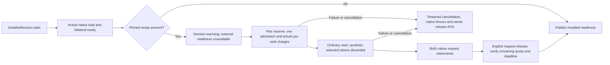

# Startup preparation before installed readiness

This is an isolated source candidate. MAIN and the installed c408 runtime are unchanged. No Swift compiler, fixture, model, GPU, SSH or physical inference was run for this candidate. Root reviewed the nine runtime files with no source blocker; the new fixtures remain unexecuted and await the coordinated compiler slot. `source-checks.json` records only hash, shell syntax and read-only patch applicability checks.

The optional adapter recipe runs one ordinary owned request before the installed session returns from `start()`. A successful recipe consumes one of the existing sixteen admissions, leaving fifteen external requests and less of the unchanged 300-second lifetime. It does not create a seventeenth request, change a user request deadline or advertise a new memory allowance.

## Contract and flow

`ClusterRuntimeCapability.startupPreparation` is optional. Omission preserves the old canonical descriptor bytes and performs no preparation. A present object has the closed `configuredChunkAndDecode_v1` kind, exactly one request, a bounded pattern of vocabulary-valid token IDs and a bounded output count. Its canonical bytes are part of the existing pinned capability; the installed preflight still validates the capability, executable, profile and selected plan. There is no new caller environment override or Benchmark SPI path.

The registered 9B adapter supplies `[1]` with two selected output tokens. The prompt repeats that adapter pattern to exactly the configured chunk size; stop IDs are empty. This exercises one admitted prefill chunk and one decode step. Every request has a fresh UUID. The unchanged ordinary generation driver constructs fresh request state and requires both retirements. Prefix reuse remains false.

The preparation deadline is the earlier of the original startup deadline and the Pair's local lifetime ceiling. The startup deadline is already fixed at launch as `min(ownerLifetime, launchUptime + 90 seconds)`; it is not restarted after load. The ordinary request retains its admission limit and independent deadline/cancellation watchdog. Waiting for retirement never substitutes elapsed time, EOF or a sent cancellation for the existing native cleanup proof. Session stop, task cancellation and errors retain the already-created Pair/endpoints through the normal owner cleanup and release-ACK path.

`DistributedInstalledSessionStatus.warming` and `diagnosticObservation.ready == false` describe in-progress preparation. `startupPreparationResult` contains only the internal request ID, prompt/selected counts, actual reserved bytes, elapsed local time and remaining admissions. This internal request bypasses the user engine/HTTP/coordinator usage stream. Completion is startup initialization, not user-billed inference or an external TTFT measurement. `admissionState` continues to report the actual remaining lifetime/admissions.

The current HTTP host awaits `session.start()` before creating its registry entry or binding/publishing HTTP discovery. This candidate therefore does not advertise external readiness during preparation. Native ready events remain internal load/control evidence. The unchanged actual Ready capacity and native live reserve/start resource checks remain authoritative; warmup can itself refuse on the 6 GiB floor or other existing resource limits.

## Limits

This recipe does not warm every 8K attention/context shape, run multi-chunk lookahead, prove later TTFT, clear allocator/file caches or retain a prompt prefix. Two selected tokens require one decode forward; no token text is published. Resource/cache effects can reduce later headroom and cause a legitimate refusal. No performance claim follows from these source changes or model-free fixtures. The first measured candidate needs a separately rebuilt executable/capability, explicit reconfiguration and physical validation by root.

The new native metadata extension is in a separate `QwenResidentStartupPreparation.swift`; `QwenResidentAdapterDefinition.swift` is untouched to avoid the independently frozen 27B overlay. The current producer remains exact registered 9B. This candidate does not qualify or enable 27B startup preparation.

## Integration and validation

`integration.json` maps all seventeen proposed files to exact MAIN baselines (twelve replacements, five additions), classifies nine runtime and eight test/runner files and names the three focused runners. `overlay.patch` is the combined patch; `runtime.patch` and `fixtures.patch` are review views. `source-inputs.json` pins the effective proposed/MAIN source closure and native/host evidence used here. No Package manifest changes are needed because production targets discover their source files; the explicit pure metadata runner adds the new adapter extension.

After root authorizes compilation in an applied private checkout, run the three existing repository runners in `integration.json`. They compile actual source modules with small contract values/fake children, never native model code or remote hosts. The capability tests cover legacy byte preservation, canonical recipe roundtrip, geometry, profile/quota bounds, malformed/unknown/missing fields and unchanged request deadline/capacity. The metadata fixture checks the actual producer's recipe and preserves its historical golden descriptor after removing only the two separately advertised optional additions.

The installed fixture adds five scenarios to the six existing lifecycle scenarios: successful preparation plus exactly fifteen external requests; explicit stop while warming; task cancellation while warming; native-start failure; and deadline expiry after observed warmup admission. Each failure refuses readiness and requires actual fake-native cleanup; reuse requires the existing owner release ACK. These assertions are source only until the runner executes. The existing legacy fixture and sixteen-request exhaustion case remain in the same runner.

No automatic deployment, runtime selection, SLA change, epoch rotation or journal clearing is included. Source review and future tests do not replace actual installed warmup, cancellation, resource and latency qualification.
