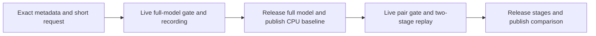

# Registered dense-Qwen short parity probe

> Last updated: 2026-09-14 · commit `e4df336bc`

This experimental command compares one full-model recording with a sequential
two-stage replay for the exact registered 9B or 27B checkpoint. It reuses the
existing native recorder and byte-exact comparator. Native compilation and pure
entry checks pass; actual short forward parity remains unqualified.



[`QwenDenseShortParityCLI`](Sources/ClusterInference/QwenDenseShortParityCLI.swift)
requires exactly these eight argument pairs, each once:

| Flag | Value |
|---|---|
| `--mode` | `qwen-dense-short-parity-check` |
| `--model-dir` | Absolute directory containing the exact registered checkpoint. |
| `--registered-dense-profile` | `registered_qwen35_9b` or `registered_qwen38_27b`. |
| `--tokens-file` | Absolute file containing three JSON integer token IDs. |
| `--tokens-sha256` | Exact lowercase SHA256 of the raw prompt file. |
| `--teacher-tokens-file` | Absolute file containing one JSON integer teacher ID. |
| `--teacher-tokens-sha256` | Exact lowercase SHA256 of the raw teacher file. |
| `--timeout-seconds` | Canonical integer from 1 through 300. |

Each token file is a regular file of at most 4096 bytes, captured through one
checked descriptor. The [existing request admission](Sources/ClusterInference/QwenDenseShortReferenceAdmission.swift)
(`QwenDenseShortReferenceAdmission.admit`) checks strict integer JSON, vocabulary
bounds and raw hashes. A fresh request UUID binds chunk size two, output count
two, capacity five and frontiers 2/3/4. The Plan remains 16/16 for 9B or 32/32 for
27B. No cut, precision, resource, repeat or warmup override is exposed. The
[arithmetic contract](Sources/ClusterInference/QwenLongPrefillArithmeticEnvironment.swift)
(`QwenLongPrefillArithmeticEnvironment.admit`) requires its exact process values
and absent overrides before model construction.

[`runQwenDenseShortParity`](Sources/ClusterInference/QwenDenseShortParity.swift)
records and retires the full request inside the private full owner. Model and
verified-file release, synchronization, cache clearing and a final resource check
precede baseline publication and pair loading. Both stage models remain owned
through the unchanged
[`compareQwenLayerStageRecordedRequest`](Sources/ClusterInference/QwenLayerStageRecordedComparison.swift).
It compares every global state component's metadata and digest at all three
frontiers and both complete native logit rows byte for byte. The baseline model
is absent during replay; only its copied CPU evidence is retained.

The [full-reference](QWEN_DENSE_SHORT_REFERENCE_LOADING.md) and
[pair](QWEN_DENSE_SHORT_PAIR_LOADING.md) live gates retain the 6 GiB actual-free
floor, zero swap and their dynamic `R`, `H` and
[short request `Q`](QWEN_DENSE_SHORT_LEDGER.md) conditions. Estimated reclaimable
bytes are diagnostic only. Both lazy inert allowances remain reserved through
pair completion. The headroom values are operational policy, not a whole-process
peak guarantee. Independent parent deadline and process fencing remain required.
The existing loading-only APIs and their no-forward behavior are unchanged.

The [output types](Sources/ClusterInference/QwenDenseShortParityTypes.swift) are
`qwen_dense_short_baseline_checkpoint`, then `qwen_dense_short_parity_report`,
both schema version 1. The unchanged numerical DTOs are nested under `baseline`
and `pair.comparison`. Each complete JSONL record is capped at 32 MiB including
its newline, with 64 MiB total. The
[publisher](Sources/ClusterInference/QwenDenseShortParityOutput.swift)
(`QwenDenseShortParityOutput`) fails closed on encoding, deadline, reentry or
write errors. A retained baseline alone does not establish parity. Nested pure
budget/decision flags describe those operations, even when observations are
collected during the enclosing forward pass.

Run the pure entry fixture from the repository root on macOS:

```sh
bash experiments/cluster/inference/Tests/ShortParity/run.sh
```

The [runner](Tests/ShortParity/run.sh) compiles 40 sources with Swift 6 warnings
as errors, reuses the shared retained metadata and removes temporary output on
exit. An optional argument selects another reviewed production source directory.
Root's standalone fixture passed **19 accepted / 83 rejected** checks with empty
stderr, including raw file boundaries and no-write publication failures. The
native target compiled and retained all 41 prior adapter records unchanged.
Public runner execution and actual forward parity remain pending. These checks
do not run private loading gates, qualify 27B materialization, establish provider
eligibility or measure throughput.
