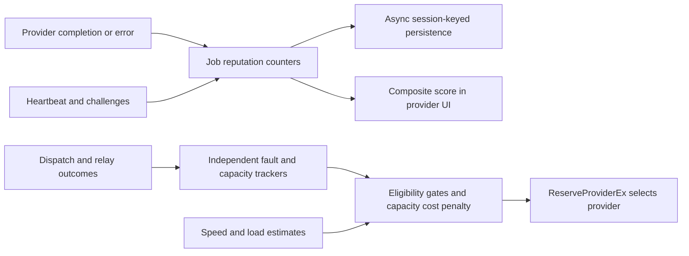
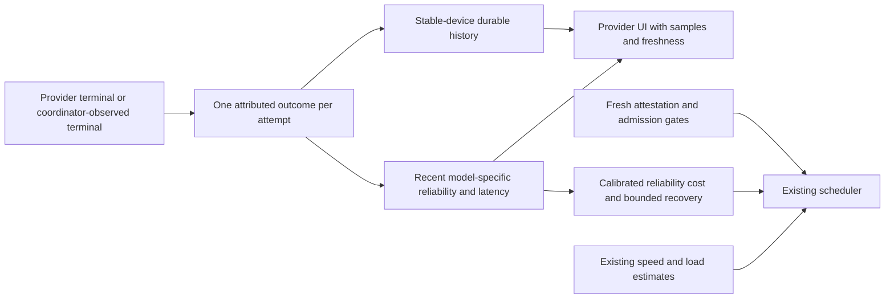

**Darkbloom reputation audit — September 5, 2026**

**Recommendation: rebuild the reputation and outcome-feedback layer incrementally, retaining the current scheduler, admission controls, and attestation gates.** The displayed score is a weak operational summary with confirmed accounting/persistence defects. The routing protections are substantially better, but general reliability feedback and recovery control have gaps. Changing the four score weights would not resolve these problems.

Reviewed local master at `4d9811f7c240b37f2915a6475f8476d7db01340e`. This is a source and local-test assessment. It does not establish how often the defects occur in production or quantify a routing improvement. No production access, code modification, deployment, or PR was performed. Pre-existing workspace changes were preserved; this audit adds only its report and evidence directory.

**What the system actually does**

The score is `0.4 × job success + 0.3 × cumulative uptime credit + 0.2 × challenge pass rate + 0.1 × latency factor`. Job/challenge rates are lifetime ratios; only latency uses an EWMA. Uptime saturates after 24 cumulative hours and never subtracts offline time. The score appears in provider APIs and UI. It is not a scheduler cost term or a payout multiplier in the inspected code.

Routing separately applies trust/servability gates, model/shape failure cooldowns, node fault breakers, stable-device health ejection, capacity rejection controls, and cost ranking based on load, speed, system pressure, and capacity rejection rate. `HealthMs` reflects system metrics, not the composite reputation score. See [score](/Users/gaj/Documents/Builds/d-inference/coordinator/registry/reputation.go:113), [scheduler cost](/Users/gaj/Documents/Builds/d-inference/coordinator/registry/scheduler.go:2286), and [routing gates](/Users/gaj/Documents/Builds/d-inference/coordinator/registry/scheduler.go:1750).



**What is worth keeping**

- Fresh attestation remains a hard eligibility requirement; historical score cannot purchase trust. Restoration deliberately caps stored trust and requires fresh verification.
- Typed cancellation, request-shape, deadline-policy, and capacity outcomes have explicit exemptions. These are essential distinctions: an unhealthy node and a healthy busy node require different responses.
- Fault state uses stable device identity and survives session churn within a coordinator lifetime. Model/shape cooldowns keep a tools-specific failure from automatically poisoning ordinary text traffic.
- Capacity rejection rate already supplies a recent, model-specific soft cost penalty; admission and queue/throughput estimation should remain intact.
- Existing focused registry and API tests passed, including score/latency behavior, node breakers, health ejection, and selected non-fault/settlement paths.

**Confirmed defects and design limitations, in priority order**

1. **P1 — Session restoration can select obsolete history.** Postgres returns provider rows newest first, but `LoadStoredProviders` overwrites the same serial/key on each iteration, selecting the oldest matching row. The server builds that lookup only at startup. Subsequent reconnects fetch reputation using that old session ID, even when a newer session has accumulated and persisted more jobs. New devices absent from the startup map have no reputation restoration through this path. These are separate defects: correcting sort selection alone does not fix same-process reconnects. Reproductions selected `oldest` instead of `newest` for both serial and SE key, and restored 10 jobs when the latest session held 100. This affects historical reputation and other fields restored from that record; fresh trust remains separately gated. [Lookup overwrite](/Users/gaj/Documents/Builds/d-inference/coordinator/registry/persistence.go:40), [Postgres ordering](/Users/gaj/Documents/Builds/d-inference/coordinator/store/postgres.go:4452), [reconnect caller](/Users/gaj/Documents/Builds/d-inference/coordinator/api/provider.go:3174), [reputation restore](/Users/gaj/Documents/Builds/d-inference/coordinator/registry/persistence.go:148).

2. **P1 — Persistence can move counters backward.** Each save launches an independent goroutine and snapshots under the provider lock, then writes after releasing it. The upsert unconditionally replaces all counters and latency. A delayed older snapshot can arrive after a newer one. The deterministic store-barrier reproduction wrote two jobs, then let the older write land: durable jobs became one. The test uses a store wrapper to force this valid scheduling order, with the same overwrite semantics visible in Postgres; it is not a production database reproduction. A bounded writer per stable identity or generation-checked snapshot upsert is needed. Simply taking the maximum of each field is insufficient for latency and consistent snapshots. [Async save](/Users/gaj/Documents/Builds/d-inference/coordinator/registry/persistence.go:318), [unconditional upsert](/Users/gaj/Documents/Builds/d-inference/coordinator/store/postgres.go:4692).

3. **P1 — Reputation does not count all attributable failed attempts.** Job failure is recorded at the provider error-frame handler. Synthetic disconnect flushes and coordinator-observed stalls feed the routing trackers through different paths. A real encrypted-WebSocket test made provider A accept a request, emit a role preamble, then abruptly disconnect; provider B completed the failover. A retained `total_jobs=0` and `failed_jobs=0`. This is a counter/denominator defect, not evidence that the routing breakers ignore disconnects. Stalls follow the same architectural split by source inspection. Consolidate attempt attribution before computing any new reliability rate. [Failure recorder](/Users/gaj/Documents/Builds/d-inference/coordinator/api/provider.go:2903), [disconnect flush](/Users/gaj/Documents/Builds/d-inference/coordinator/registry/registry.go:5068), [stall recorder](/Users/gaj/Documents/Builds/d-inference/coordinator/api/dispatch.go:2236), [breaker funnel](/Users/gaj/Documents/Builds/d-inference/coordinator/api/consumer.go:395).

4. **High-priority design gap — Intermittent genuine faults have no general soft ranking penalty.** Node quarantine requires five consecutive faults or more than 80% faults in a 20-outcome ring within two minutes. Stable ejection targets still more extreme failure. The existing soft rate penalty covers capacity rejects. A registry-level replay of 50 alternating fault-503s and successes left both fault gates closed and the capacity penalty at zero; the faster unreliable provider remained selected from a two-provider pool. The test establishes that reliability history adds no cost in this case, not that always preferring the slower provider is optimal. A measured failure/retry cost should influence the choice. [Thresholds](/Users/gaj/Documents/Builds/d-inference/coordinator/registry/provider_breaker.go:47), [rate test](/Users/gaj/Documents/Builds/d-inference/coordinator/registry/provider_breaker.go:260), [capacity-only penalty](/Users/gaj/Documents/Builds/d-inference/coordinator/registry/capacity_rate.go:58), [cost composition](/Users/gaj/Documents/Builds/d-inference/coordinator/registry/scheduler.go:2293).

5. **Recovery policy gap — Node half-open is time-based reopening without a dedicated probe limit.** After expiry, ordinary reservations can enter before any recovery result arrives. A local scheduler probe reserved two requests on the recovering node with no intervening outcome, despite a healthy alternative. Ordinary admission limits still apply; this is not unlimited concurrency. A single success also clears the node quarantine/backoff. When node breakers alone prevent routing, the scheduler deliberately bypasses them, so the fallback can admit repeated requests rather than a bounded health probe. Preserve availability policy, but make the recovery traffic budget explicit. The capacity cooldown already has a probe claim that can inform this implementation. [Node expiry](/Users/gaj/Documents/Builds/d-inference/coordinator/registry/provider_breaker.go:296), [single-success reset](/Users/gaj/Documents/Builds/d-inference/coordinator/registry/provider_breaker.go:225), [fail-open pass](/Users/gaj/Documents/Builds/d-inference/coordinator/registry/scheduler.go:973), [capacity probe claim](/Users/gaj/Documents/Builds/d-inference/coordinator/registry/scheduler.go:769).

6. **P2 — The score and UI overstate what is measured.** The following are exact outputs of the current implementation, with 24 cumulative hours, passing challenges, and 500 ms adjusted latency:

   | History | Composite score |
   | --- | ---: |
   | 1 successful job | 1.000000 |
   | 100,000 successful jobs | 1.000000 |
   | 50 successes, 50 failures | 0.800000 |
   | 100,000 successes followed by 100 failures | 0.999600 |

   There is no confidence/sample-size treatment, time decay of job history, model/version separation, or actual uptime denominator. Low traffic and old success can dominate what looks like current quality. Separately, the UI labels `avg_response_time_ms` as “Avg TTFT,” although it is a prefill-subtracted EWMA sampled only on qualifying content-bearing attempts; it is not raw average user-visible TTFT. The warning tells providers to recover “routing priority” through reputation even though the composite is not used in routing. [Score formula](/Users/gaj/Documents/Builds/d-inference/coordinator/registry/reputation.go:119), [latency normalization](/Users/gaj/Documents/Builds/d-inference/coordinator/api/dispatch.go:3766), [UI label](/Users/gaj/Documents/Builds/d-inference/console-ui/src/app/providers/dashboard/CardEarningsRow.tsx:48), [warning text](/Users/gaj/Documents/Builds/d-inference/console-ui/src/app/providers/warnings.ts:244).

**Proposed replacement**

Define reliability as the estimated chance that an eligible provider completes a request successfully within the applicable deadline, with explicit supporting evidence. Keep separate estimates for admission acceptance, first-content deadline attainment, and clean completion. Client cancellation is not proof of provider fault or success; only attributable stalls should penalize the provider. Attestation eligibility and economic rewards remain independent decisions.

Use one coordinator-owned attempt outcome record, keyed by request and attempt, carrying stable device identity, model artifact, provider version, bounded request-shape/size categories, cache participation, phase, fault owner, and timestamps. Reuse the existing request actor and route-outcome infrastructure where possible. Both actual provider terminals and synthetic timeout/disconnect terminals must converge on it exactly once. It must retain no prompt/output content. Adoption should reconcile existing event coverage before creating another parallel event system.

Maintain bounded recent aggregates with time decay and effective sample counts. Use pooled model/hardware evidence as a prior for sparse device/model buckets, with controlled exploration for new and recovered nodes. Keep lifetime counters for history only. Preserve device identity across reconnects and software releases; version-specific performance evidence can decay or branch without erasing machine history. Do not blindly sum old session reputation rows: they may contain copies of earlier cumulative counters.

Feed an empirically calibrated reliability cost into the existing ranking, accounting for expected failed-attempt/retry time and deadline risk. Start with a bounded, inspectable penalty in shadow mode. Do not directly multiply the current score into cost, and do not assume that capacity rejection and served failure share a denominator. Preserve hard trust, capability, token-budget, and physical-memory gates. Use bounded half-open probes, gradual recovery, and an explicit fleet-wide fallback budget.



The separation of locally observed failures from upstream responses and the use of minimum sample volumes have established precedent in [Envoy outlier detection](https://www.envoyproxy.io/docs/envoy/latest/intro/arch_overview/upstream/outlier). Explicit retry budgets and randomized backoff are also consistent with [Google SRE guidance on cascading failures](https://sre.google/sre-book/addressing-cascading-failures/). These support the design direction; Darkbloom-specific thresholds still need its own measurements.

**Implementation order and acceptance checks**

1. Fix selection of persisted identity/history and snapshot ordering. Add deterministic reconnect, duplicate-session, delayed-write, and restart tests. Prefer durable stable identity with revisioned snapshots over session-row copying. Correct the UI wording and metric definition immediately.
2. Unify outcome attribution and run it alongside existing counters. Reconcile each attempt against request actor/route evidence. Cover abrupt disconnect, silent stall, neutral cancellation, graceful drain, capacity refusal, hedged loser, duplicate terminal, and post-commit partial failure.
3. Shadow the recent reliability estimator and recovery policy. Replay existing routing traces, extending the simulator to model terminal outcomes and retries where needed. Compare clean completion within deadline, first-content deadline attainment, retries per request, false exclusions, recovery delay, low-volume fairness, and added router latency.
4. Enable a small canary only after those comparisons justify it, with a kill switch and explicit production approval. Consolidate overlapping node breakers only after preserving their present fault/capacity distinctions in tests.

No numerical latency or success-rate gain is claimed from this audit. Live trace analysis and a canary are the evidence gates for those claims. The amount of historical counter loss is also unmeasured; recover history from deduplicated attempt evidence where available rather than pretending current reputation rows are an authoritative ledger.

**Verification and reproduction**

Existing focused tests passed for both `./coordinator/registry` (1.657 s) and `./coordinator/api` (5.359 s), using Go 1.25.4. This was not a full suite, race-detector run, or production database test.

Seven added audit probes ran against unchanged source through Go's overlay mechanism. Four assertions failed as expected for the confirmed defects: oldest-session selection, stale reconnect restoration, stale-write regression, and omitted abrupt-disconnect failure. Three characterization probes passed, recording score examples, intermittent-fault ranking, and multiple half-open reservations. The failure logs are evidence of current defects, not fixes.

Evidence files beside this report: `existing-tests.log`, `registry-probes.log`, `api-probe.log`, `registry-probes.go.txt`, `api-probe.go.txt`, and `overlay.json`. The latter contains absolute paths for this checkout. From the repository root, reproduce all seven with:

```sh
go test -overlay reports/2026-09-05-reputation-audit/overlay.json \
  ./coordinator/registry ./coordinator/api -run '^TestAudit' -v -count=1 -timeout=45s
```

Expected exit status on the audited commit: 1, with the four failures above. The `.go.txt` suffix keeps the evidence probes outside ordinary package discovery.
