# MINDMAP — Qwen 3.6 35B-A3B prefill

Linked idea graph. Every node has a note or a report. Status:
`open` | `active` | `kept` | `dead` | `roofed` | `needs-measure`.

```mermaid
flowchart TB
  GOAL["GOAL: 2.5x aggregate CBv2 prefill"]

  GOAL --> PHYS[Physics]
  GOAL --> SCHED[Scheduler / CBv2]
  GOAL --> MOE[MoE / experts]
  GOAL --> ATTN[Attention / GDN]
  GOAL --> BYTES[Extra traffic]
  GOAL --> HW[Metal / M3 Max]
  GOAL --> CORR[Correctness + merge]

  PHYS --> P1[Prefill reads weights per chunk not per token]
  PHYS --> P2[E=256 almost fully touched at 512+ tokens]
  PHYS --> P3[4-bit packed vs bf16 dequant roof]
  PHYS --> P4["B=4 unpacked ~ 1x aggregate"]

  SCHED --> S1[Solo stripe 2048]
  SCHED --> S2[Packed prefill capability vs actual fire]
  SCHED --> S3[Chunk 512 vs 2048 vs one-shot]
  SCHED --> S4[Mean-TTFT cap - policy not throughput]
  SCHED --> S5[Prefix cache off]

  MOE --> M1[Expert-tile E=256 trust]
  MOE --> M2[Fused gate_up - shipped]
  MOE --> M3[Direct expert reduction - rolled back 0.8.9]
  MOE --> M4[Mega-kernel - dead 63-71 percent slower]
  MOE --> M5[Router fusion - dead wash]

  ATTN --> A1[10 full-attn L-squared]
  ATTN --> A2[30 GDN serial scan]
  ATTN --> A3[D=256 Steel - correct unmeasured]
  ATTN --> A4[GDN 4-in-1 proj - rolled back 0.8.9]
  ATTN --> A5[Sparse 32K+]

  BYTES --> B1[LM-head narrowing]
  BYTES --> B2[Last-query tail]
  BYTES --> B3[Mask+softmax QK epilogue]
  BYTES --> B4[Logits transient stripe amplification]

  HW --> H1[Zero kernel overlap 24 percent peak]
  HW --> H2[maxBufferLength 80.6 GiB]
  HW --> H3[Power posture LPM 2x lie]
  HW --> H4[164 GiB fatal on this Mac]

  CORR --> C1[Greedy temp0 match]
  CORR --> C2[KV / GDN / MoE routing]
  CORR --> C3[No decode regression]
  CORR --> C4[Tests + reviewer]
```

## Edges that matter (do not lose these)

- `P4 → S2`: the 4x-requests=1x-throughput fact **is** the packed-prefill
  business case. If S2 already fires, P4 must be re-measured; the 2026-08-19
  number may be stale relative to 0.8.6 claims.
- `P3 → GOAL`: if weights dequant to bf16, B=1 2.5x is **roofed**. Move
  the 2.5x onto aggregate B=2/B=4.
- `S1 + M1`: stripe only pays after trust removes expert-descriptor
  drains. Stripe alone is a wash. LPM stripe is a regression.
- `M3 + A4 → C3`: v0.8.8 taught us prefill wins that punch decode are
  not keeps. Reviewer veto.
- `H1`: concurrent encode is a structural 2x **if** MLX can submit
  independent kernels. Needs a real overlap counter, not hope.
- `H2 + H4`: any shape that asks Metal for >80 GiB dies. Vision and
  huge logit tensors are in this blast radius.
- `S4`: FCFS / max concurrent partial prefills halves **mean TTFT** at
  constant aggregate. Do not confuse that with the 2.5x metric.
- `A1`: L² only dominates long full-attn layers. At 8K, 10 layers of
  8K² may or may not beat MoE weight traffic. Measure, don't assume.

## Ranked bets (2026-08-24, post B=1 + burst)

Baseline killed the "packed is off" story. Packed `[4,512]` already
hits the tile allowlist max (M=16384). See `notes/009` and `notes/018`.

| Rank | Node | Expected | Risk | Why now |
|---:|---|---|---|---|
| 1 | Extend tile allowlist M=32768 / 65536 | Unlocks 2.0× / 4.0× tokens per weight stream | Descriptor alloc, metallib | **E1 measured** (`notes/021`). Tile hits; 1.06× vs legacy (1.3× kernel bar missed). Isolated QMM linear in M. Allowlist stays; spend it in E2. |
| 99 | S3 wide packed cohort `[B,C]` | **Measured 1.034×** | **Checksum mismatch** | Dead. `[4,1024]` changed 2/4 greedy outputs (`notes/027`). Do not run `[4,2048]`. |
| 3 | A1 query-block width sweep | 0–8% B1; 0–12% B4 | Numerics, score bytes | Retune D=256 for wider cohorts |
| 4 | B2 final-layer tail narrowing | 2–8% B1/B4 | Frontier logits | Delete discarded final-layer rows |
| 5 | A1 packed row-local SDPA batching | 5–15% B4; B1 unchanged | Isolation, maxBufferLength | Delete B−1 attention dispatch chains |
| 6 | M2 reuse expert route plan | 1–5% B1; 2–10% B4 | Routing order | Delete duplicate metadata, keep GEMMs separate |
| 7 | A2 GDN chunkwise WY | 5–10% B1/B4 | Numeric tolerance, scratch | Thirty recurrent layers |
| 8 | A3 D=256 Steel adjacent A/B | 3–12% B1; 5–15% B4 | Kernel/numerics | Correct candidate lacks stable-power speed result |
| 99 | Raise chunk without new M | **negative** (legacy fallback) | Proven by contracts | Dead as a solo move |
| 99 | M4 mega-kernel | negative | Proven | Dead |

B=1 one-shot 8K is a no-regression cell, not a 2.5× path (011: illegal on
this ALU roof). B=4 2.5× is **not** available from packing alone: E1+011
say one rectangle is ~1.1×. If E2 confirms that, the remaining 2×-class
lever is gathered 4-bit QMM efficiency, not cohort width.

E2 closed packing: `[4,1024]` was +3.4% and changed greedy output. The
next ranked objective is a numerically equivalent faster gathered W4 QMM
at the existing 512/2,048 geometry.

E3 measured that W4 gather (10.9 TFLOPS), dequantized BF16 gather
(10.9), and even an illegal monolithic BF16 matrix (12.3) are separated
by only 1.13×. A dense expert cache and dequantization deletion are dead;
the exact arithmetic roof itself is below the 2.5× requirement
(`notes/028`).

E4 found FP16 is only 1.03–1.06× on W4 and flat on dense/monolithic
kernels (`notes/029`): no hidden half-precision 2× lane.

E5 forced half accumulation to access that nominal lane and failed 30
correctness cases before timing (`notes/033`). FP32 accumulation is a
model contract, not removable overhead.

E6 forced MLX's existing portable MPP/NAX path onto M3. It executed but
failed 11 QMM/Qwen correctness cases before timing (`notes/034`). A
custom byte-identical MPP loader is the only remaining TensorOps variant.

E7 ported upstream FP32 affine dequantization. Correctness passed, but
the combined routed gain was only 1.030× (`notes/035`), below its
full-model continuation bar.

E8 set portable MPP to strict FP32 accumulation; the M3 fallback
produced the same 11 errors as relaxed E6 (`notes/036`). Existing MPP
cannot preserve the incumbent reduction contract.

Primary denominator is now real (`notes/037`): B=4×8K = 1,557.4 tok/s
/ 21.0375 s, so 2.5× requires 3,893.5 tok/s / 8.4150 s. B=2×8K =
1,500.7 tok/s / 10.9165 s.

The complete one-binary B=1/2/4 × 512/2K/8K matrix is locked in
`notes/038`; no remaining experiment may use an extrapolated denominator.

E9 BK64 preserved numerics but was flat (best 1.008×); halving outer
barriers cannot move the FP32 MMA ceiling (`notes/039`).

E10 BM64×BN64 preserved numerics and gained 3–8% only at large M, while
regressing T1024 ~42% (`notes/040`). Retiling cannot supply 2.5×.

Native uint4 MPP executes on M3, but affine factoring changes the
per-weight BF16 rounding boundary and failed 512/512 adversarial outputs
(note 041). TensorOps Candidate B is closed before timing.

E12 found supported MPP cooperative load/store is bit-identical at
static K16; dynamic K8 passes existing tolerances. MLX NAX failed because
its manual cooperative-register mapping is invalid on M3 (`notes/042`).
Candidate A survives to a Qwen-shape timing gate.

E13 closes the tested M16×N32 Candidate-A schedule: strict MPP = 13.72
TFLOPS versus Steel 13.68; dynamic K8 = 3.35. If that ceiling applies,
B=4×8K linears alone take 11.64 s > 8.415 s (`notes/043`). Broad M3
closure remains pending a bounded MPP tile/scope sweep and counter proof.

E14 covers 99.9966% of real linear shapes at M=2,048: static MPP 12.65
weighted TFLOPS, 37.3m outputs bit-identical (`notes/044`). E15 covers
threshold M=8,192/65,536: static 12.02, dynamic K8 3.16 plus long-K
tolerance failure (`notes/045`). Both miss ≥22 decisively.

E16 sweeps 60 strict MPP combinations across five output tiles, K16/K32,
1/2/4-SIMD-group scopes, and cooperative/tensor inputs. Thirty-five compile
and pass 807.4m bit-identical output checks; the bounded maximum is only
13.4182 TFLOPS versus 22 (`notes/046`). The enumerated matrix is closed, but
this remains a bounded measurement rather than a hardware theorem; counter
saturation and independent structure/routing closure are still pending.

Owner override (`notes/055`): only model weight bytes are immutable.
Checksum identity is no longer an automatic veto; quality decides.
E17–E19 timed half accumulation, native uint4 factoring, and relaxed MPP,
but all were flat/slower (`notes/056`). New active branches are work
deletion and direct cache/state construction.

E20 adaptive prefill MoE is the first large end-to-end component:
top-4 = 1.192× and top-1 = 1.379× at B=4×8K (`notes/057`). Top-1
still needs 1.813×; quality-aware layer/token/state reduction is active.

E21 audits every quantized matrix in the fixed snapshot: exact
rank/zero/duplicate deletion is bounded at 24.31% of linear MACs and
routed aligned-zero removal at 0.6775% (`notes/058`). Exact structure is
insufficient; approximate work deletion remains active.

Reverse-state closure (`notes/050`): layers 0–38 need every hidden row; only
layer 39 has exact dead hidden work (1.023–1.032x ceiling). Exact state-only
GDN, cache quantization, WY, and projection fusion cannot supply 2.5x.
Artifact-only skipped layers are the direct cold path: GDN state-only plus
attention K/V-only on 32 layers, with `0-3,36-39` full, has a 2.59–2.74x
arithmetic ceiling but extreme quality risk. Exact warm-prefix reuse reaches
2.5x at >=60% overlap and remains a separate product metric.

E22 proves the raw 2.5× target is reachable across B1/B2/B4, but blind
layer skipping fails quality (`notes/065`). Top-k4 is the quality-passing
1.192× component. E27 maps block sensitivity: 28–31 is 97.1% agreement,
while 0–3 is 2.6% (`notes/066`). Exact prefix-state reuse is now the
quality-preserving multiplier.

Exact state reuse (`notes/068`) crosses the goal without quality loss:
warm full-prompt B1/B2/B4 = 15×–403×; cold simultaneous B4 identical
prompts = 3.01×/3.25× at 512/8K; B4 90% common-prefix 8K = 2.627×.
The cached/forked object is complete K/V + GDN state + position + logits.

Durable longest-prefix boundaries (`notes/069`) extend this to sequential
distinct suffixes. The final canonical exact-cache profile gives native-relative
B4×8K prefill speedups of **2.629×** at 75% and **5.076×** at 87.5%, with
100% 64-token equality over three iterations. Cache-free paths are unchanged;
opt-in exact-cache cold misses pay the canonical 256-token/unpacked cost.
E47 blind quality retains **99.56%** of native with 11/12 identical
continuations and no candidate-only fatal failure (`notes/074`).

E49 full-frontier state river reaches **2.80×** cold B4×2K at E=4, but
quality collapses to 40% of native with six candidate-only fatal failures.
E=8 improves quality to 66% while missing speed at 2.41×. Both are closed
(`notes/077`): exact frontier computation cannot recover discarded historical
hidden-state information.

Wavefront / concurrent encode (013) is not a scheduler knob: one process
GPU stream + `evalLock`. Occupancy at 2048 tokens is already saturated.
