# MINDMAP — Qwen 3.6 35B-A3B prefill

Linked idea graph. Every node has a note or a report. Status:
`open` | `active` | `kept` | `dead` | `roofed` | `needs-measure`.

```mermaid
flowchart TB
  GOAL["GOAL: 2.5x aggregate CBv2 prefill"]

  GOAL --> PHYS[Physics]
  GOAL --> SCHED[Scheduler / CBv2]
  GOAL --> MOE[MoE / experts]
  GOAL --> ATTN[Attention / GDN]
  GOAL --> BYTES[Extra traffic]
  GOAL --> HW[Metal / M3 Max]
  GOAL --> CORR[Correctness + merge]

  PHYS --> P1[Prefill reads weights per chunk not per token]
  PHYS --> P2[E=256 almost fully touched at 512+ tokens]
  PHYS --> P3[4-bit packed vs bf16 dequant roof]
  PHYS --> P4["B=4 unpacked ~ 1x aggregate"]

  SCHED --> S1[Solo stripe 2048]
  SCHED --> S2[Packed prefill capability vs actual fire]
  SCHED --> S3[Chunk 512 vs 2048 vs one-shot]
  SCHED --> S4[Mean-TTFT cap - policy not throughput]
  SCHED --> S5[Prefix cache off]

  MOE --> M1[Expert-tile E=256 trust]
  MOE --> M2[Fused gate_up - shipped]
  MOE --> M3[Direct expert reduction - rolled back 0.8.9]
  MOE --> M4[Mega-kernel - dead 63-71 percent slower]
  MOE --> M5[Router fusion - dead wash]

  ATTN --> A1[10 full-attn L-squared]
  ATTN --> A2[30 GDN serial scan]
  ATTN --> A3[D=256 Steel - correct unmeasured]
  ATTN --> A4[GDN 4-in-1 proj - rolled back 0.8.9]
  ATTN --> A5[Sparse 32K+]

  BYTES --> B1[LM-head narrowing]
  BYTES --> B2[Last-query tail]
  BYTES --> B3[Mask+softmax QK epilogue]
  BYTES --> B4[Logits transient stripe amplification]

  HW --> H1[Zero kernel overlap 24 percent peak]
  HW --> H2[maxBufferLength 80.6 GiB]
  HW --> H3[Power posture LPM 2x lie]
  HW --> H4[164 GiB fatal on this Mac]

  CORR --> C1[Greedy temp0 match]
  CORR --> C2[KV / GDN / MoE routing]
  CORR --> C3[No decode regression]
  CORR --> C4[Tests + reviewer]
```

## Edges that matter (do not lose these)

- `P4 → S2`: the 4x-requests=1x-throughput fact **is** the packed-prefill
  business case. If S2 already fires, P4 must be re-measured; the 2026-08-19
  number may be stale relative to 0.8.6 claims.
- `P3 → GOAL`: if weights dequant to bf16, B=1 2.5x is **roofed**. Move
  the 2.5x onto aggregate B=2/B=4.
- `S1 + M1`: stripe only pays after trust removes expert-descriptor
  drains. Stripe alone is a wash. LPM stripe is a regression.
- `M3 + A4 → C3`: v0.8.8 taught us prefill wins that punch decode are
  not keeps. Reviewer veto.
- `H1`: concurrent encode is a structural 2x **if** MLX can submit
  independent kernels. Needs a real overlap counter, not hope.
- `H2 + H4`: any shape that asks Metal for >80 GiB dies. Vision and
  huge logit tensors are in this blast radius.
- `S4`: FCFS / max concurrent partial prefills halves **mean TTFT** at
  constant aggregate. Do not confuse that with the 2.5x metric.
- `A1`: L² only dominates long full-attn layers. At 8K, 10 layers of
  8K² may or may not beat MoE weight traffic. Measure, don't assume.

## Ranked bets (2026-08-24, post B=1 + burst)

Baseline killed the "packed is off" story. Packed `[4,512]` already
hits the tile allowlist max (M=16384). See `notes/009` and `notes/018`.

| Rank | Node | Expected | Risk | Why now |
|---:|---|---|---|---|
| 1 | Extend tile allowlist M=32768 / 65536 | Unlocks 2.0× / 4.0× tokens per weight stream | Descriptor alloc, metallib | **E1 measured** (`notes/021`). Tile hits; 1.06× vs legacy (1.3× kernel bar missed). Isolated QMM linear in M. Allowlist stays; spend it in E2. |
| 2 | S3 wide packed cohort `[B,C]` | **1.08–1.25×** (011+E1), not 2.0–3.5× | Decode delay, memory | E2 measures 011. Isolated QMM is 11 TFLOPS and linear in M (`notes/023`). |
| 3 | A1 query-block width sweep | 0–8% B1; 0–12% B4 | Numerics, score bytes | Retune D=256 for wider cohorts |
| 4 | B2 final-layer tail narrowing | 2–8% B1/B4 | Frontier logits | Delete discarded final-layer rows |
| 5 | A1 packed row-local SDPA batching | 5–15% B4; B1 unchanged | Isolation, maxBufferLength | Delete B−1 attention dispatch chains |
| 6 | M2 reuse expert route plan | 1–5% B1; 2–10% B4 | Routing order | Delete duplicate metadata, keep GEMMs separate |
| 7 | A2 GDN chunkwise WY | 5–10% B1/B4 | Numeric tolerance, scratch | Thirty recurrent layers |
| 8 | A3 D=256 Steel adjacent A/B | 3–12% B1; 5–15% B4 | Kernel/numerics | Correct candidate lacks stable-power speed result |
| 99 | Raise chunk without new M | **negative** (legacy fallback) | Proven by contracts | Dead as a solo move |
| 99 | M4 mega-kernel | negative | Proven | Dead |

B=1 one-shot 8K is a no-regression cell, not a 2.5× path (011: illegal on
this ALU roof). B=4 2.5× is **not** available from packing alone: E1+011
say one rectangle is ~1.1×. If E2 confirms that, the remaining 2×-class
lever is gathered 4-bit QMM efficiency, not cohort width.

Wavefront / concurrent encode (013) is not a scheduler knob: one process
GPU stream + `evalLock`. Occupancy at 2048 tokens is already saturated.
