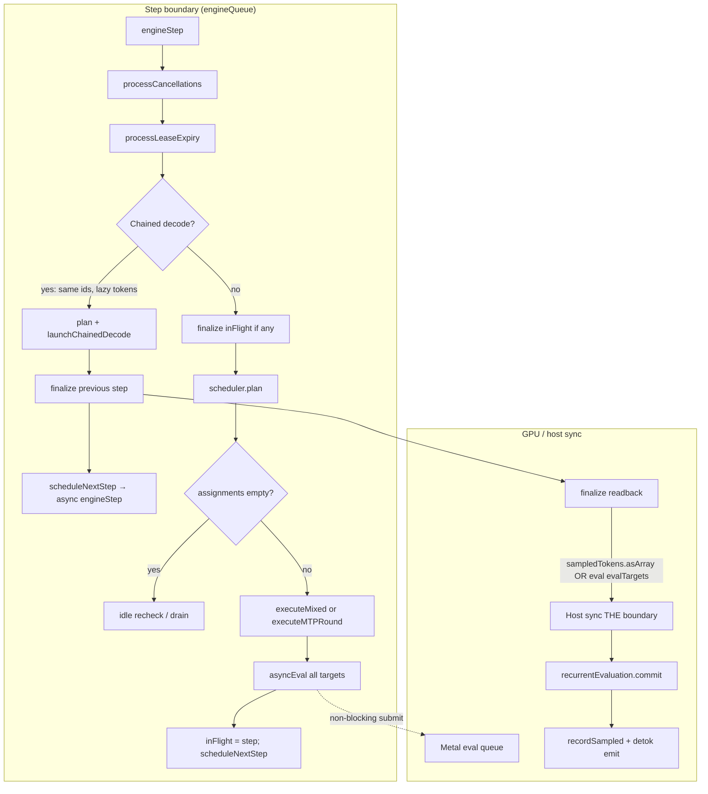
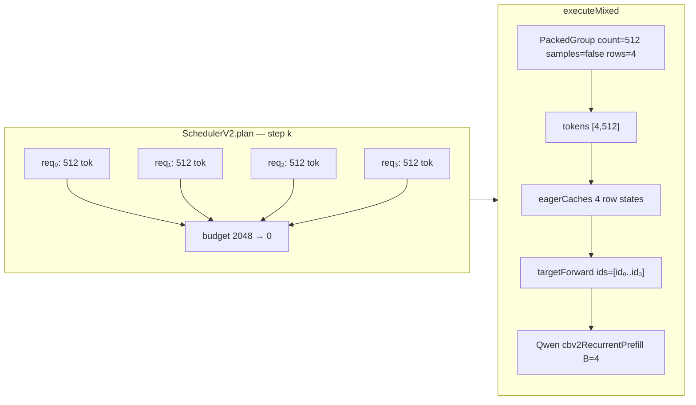
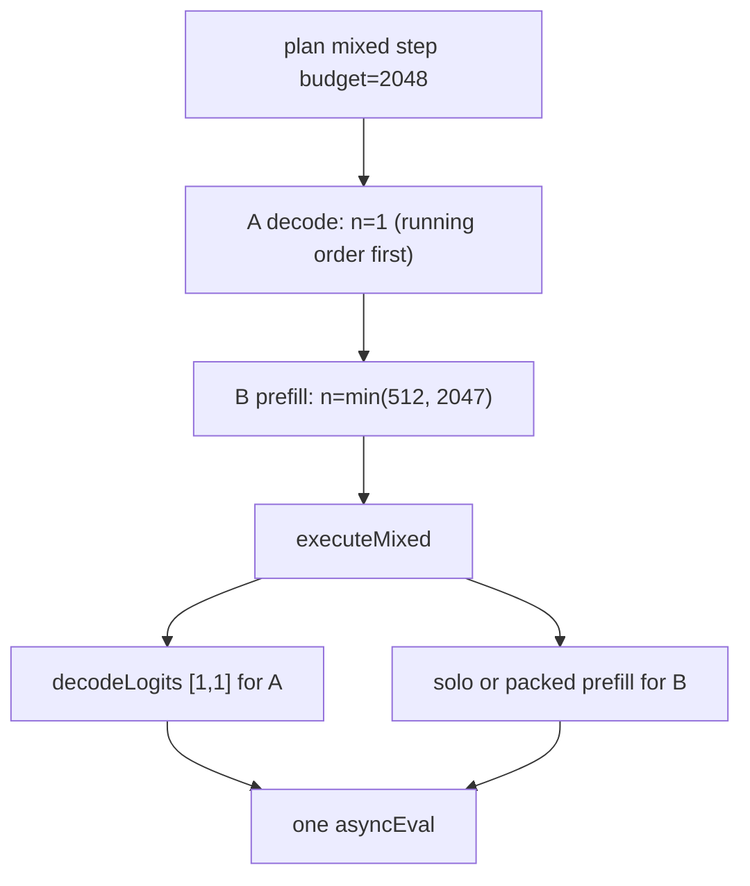

# 014 — Explorer: CBv2 EngineLoopV2 + SchedulerV2 (Qwen 3.6 TEXT prefill)

Status: code-map (no runtime claims)

Scope: **TEXT-only** prefill for Qwen 3.6 35B-A3B on the Darkbloom CBv2 path.
Excludes vision tower, mRoPE spans, MTP rounds, prefix-cache adoption, and
paged-vs-contiguous backend differences except where they affect packed prefill.

Primary sources (mlx-swift-lm @ workspace):

| Symbol / file | Role |
|---|---|
| `SchedulerV2.plan()` | Token-budget assignment, solo stripe, partial-prefill cap |
| `EngineLoopV2.engineStep()` | Step boundary, cancel, finalize, chain |
| `EngineLoopV2.executeMixed(_:)` | Graph build: decode batch + prefill (solo or packed) |
| `EngineLoopV2.targetForward(...)` | Qwen recurrent bind + narrowed prefill seam |
| `EngineLoopV2.finalize(_:now:)` | Host readback, recurrent commit, sample confirm |
| `Qwen35TextConfiguration.cbv2LayerKinds` | 10 full-attn KV rows |
| `Qwen35TextConfiguration.cbv2RecurrentStateSpec()` | 30 GDN layer states per request |
| `Qwen35TextModel.cbv2RecurrentPrefill` | Prompt narrowing (no full-vocab on mid-chunks) |
| `EngineV2Factory.soloPrefillStripeTokens` | Serving defaults: stripe 2048, optional DARKBLOOM_* caps |

---

## 1. Architectural frame (no “prefill phase”)

CBv2 follows the vLLM-V1 optimistic-advance model (`SchedulerV2.swift` header):

- Each request holds `tokens` (prompt + confirmed outputs), `numComputedTokens`
  (fed through the model), and optionally `pendingSamples`.
- **`plan()`** assigns `min(remaining, chunkCap, budget)` tokens per row each step.
- Prefill rows have `remainingTokens > 1`; decode-ready rows have exactly one
  uncomputed known token (`isDecodeReady`).
- The engine does **not** maintain a separate prefill queue — scheduling is
  unified under one step token budget (`maxBatchedTokensPerStep`, default **2048**).

Darkbloom serving defaults (`CBv2SchedulerConfig` built in provider-swift
`EngineV2Factory` scheduler block, ~lines 817–824):

| Knob | Default | Override variable |
|---|---|---|
| `prefillChunkSize` | **512** | (fixed in config struct) |
| `maxBatchedTokensPerStep` | **2048** | (fixed) |
| `maxConcurrentRequests` | product slot count (≤8) | — |
| `soloPrefillStripeTokens` | **2048** | `DARKBLOOM_CBV2_SOLO_PREFILL_STRIPE` |
| `maxConcurrentPartialPrefills` | **nil** (unlimited interleave) | `DARKBLOOM_CBV2_MAX_PARTIAL_PREFILLS` (>0 only) |
| `mixedStepPrefillTokenCap` | **nil** (disabled) | `DARKBLOOM_CBV2_MIXED_PREFILL_CAP` |

Prompt LM-head narrowing: on unless `DARKBLOOM_CBV2_PREFILL_NARROWING=0`
(`EngineLoopV2.prefillNarrowingEnabled`).

---

## 2. Qwen-specific state (TEXT)

### 2.1 Layer stack (40 transformer layers)

From `Qwen35TextConfiguration`:

- **`cbv2LayerKinds`**: **10** `CBv2LayerKind` entries — full attention at layers
  3, 7, 11, …, 39 (`(index+1) % fullAttentionInterval == 0`, interval **4**).
  Each owns a per-request **KV sequence** (`CBv2SequenceKV`) updated every chunk.
- **`cbv2RecurrentStateSpec()`**: **30** GDN (`linear_attention`) layers — all layers
  that are *not* full-attention. Per request, fixed tensors:
  - `conv`: `[1, 3, convDim]` (bf16 by default), `convDim = 2×keyDim + valueDim`
  - `ssm`: `[1, 64, 128, 192]` (fp32) — matches GOAL.md GDN dims

### 2.2 mRoPE / position state (TEXT)

- **TEXT requests**: `CBv2Request.positionState == nil`.
- RoPE positions for full-attn layers come from **KV cache absolute offsets**
  (`CBv2PositionState.decodePositionIds` in `decodeLogits`; absent in text prefill
  solo path).
- Packed prefill **explicitly excludes** rows with `positionState != nil`
  (`executeMixed`, recurrent packing gate) — mRoPE vision rows take the solo
  `[1, chunk]` path. This note is TEXT-only, so packing applies.

### 2.3 Recurrent (GDN) lifecycle per step

For each prefill/decode forward touching GDN layers (`targetForward`):

1. `CBv2RecurrentRequestState.bind()` → `CBv2RecurrentStateEvaluation` (one per batch row).
2. Model forward stages updated conv/ssm via `evaluation.stage(...)`.
3. `evaluation.evaluate()` → roots appended to step `asyncEval` set.
4. At **`finalize`**: `evaluation.commit()` (or `rollback()` if row discarded).

Chained decode reads the **latest pending** generation without committing early
(`RecurrentStateV2.swift` — bind uses `pending.last ?? committed`).

Packed cohort: `targetForward(tokens: [B,L], ids: [id₀…id_{B-1}], …)` binds **B
independent** recurrent states; row order == batch row order
(`Qwen35TextModel` prefill comment: packed row ≡ solo semantically).

### 2.4 Prefill output seam (narrowing)

Intermediate chunks: `CBv2PrefillRequirement.evaluationOnly`

- Qwen returns `hidden[..., -1, 0:1]` — graph handle forcing full trunk + KV +
  GDN writes without vocab projection (`Qwen35TextModel.cbv2RecurrentPrefill`).

Final prompt chunk (samples first token): `.lastPositionLogits`

- Qwen applies `norm` + `lmHead` on **last position only** → `[B, vocab]`.

---

## 3. Scheduler mechanics (`SchedulerV2.plan`)

### 3.1 Solo-prefill stripe (2048)

Armed when (`SchedulerV2.swift` ~288–336):

1. `soloPrefillStripeTokens` (2048) **>** `prefillChunkSize` (512), and
2. Candidate row is text-only, not paused/cancelled, `remainingTokens > 1`, and either:
   - **Exactly one** live request (running+waiting, excluding paused semantics), **or**
   - `maxConcurrentPartialPrefills == 1` with ≤1 active prefill, **no decode-ready**
     row, no deferred multimodal block waiter.

Effects when armed for request `S`:

- `prefillChunkCap(S) = 2048` (others stay 512).
- Step `budget = max(maxBatchedTokensPerStep, 2048)`.
- KV reservation failure on oversized stripe: **one** shrink to 512 before preemption.

**Disarmed** when: multiple live requests *and* cap≠1 policy path; any decode-ready
row; multimodal deferred block pending; paused/cancelled armed row.

### 3.2 `maxConcurrentPartialPrefills` — policy vs throughput

| Value | Behavior |
|---|---|
| **nil** (Darkbloom default) | Up to `floor(2048/512)=4` prefill rows can receive 512-token chunks **in one plan** if admitted and budget allows. Maximizes **aggregate prefill tok/s**; all burst TTFTs track the **makespan** (equal worst-case TTFT). |
| **1** (opt-in via env) | At most **one** row receives prompt work per `plan()` (`midPrefillAssigned` slot). Waiters queue FCFS. **Same aggregate throughput** in steady state for equal-length bursts, but **mean TTFT ~ halves** (1×/2×/3×/4× solo stagger). Does **not** increase weight reuse; it serializes *who* runs each step. |
| **≤0** | Treated as **unlimited** (fail-open — cap 0 would starve waiters forever). |

Stripe + cap=1 interaction (test `testCapOnePlusStripeStripesTheActiveRowDespiteWaiters`):

- Active row still stripes **2048** despite waiters (policy serializes *work slots*,
  not chunk size for the head row).
- Stripe disarms once a row becomes decode-ready (decode “company”).

### 3.3 Mixed prefill + decode — does prefill shrink?

**Separate mechanisms:**

| Mechanism | Default | Effect on prefill chunk size |
|---|---|---|
| Decode row in same step | always | Decode row consumes **1** token from the 2048 budget first (running order). Remaining budget goes to prefill rows — prefill still **512/chunk** unless stripe armed (unlikely with decode present). |
| `mixedStepPrefillTokenCap` | **OFF** | When ON *and* step has decode-ready row: **total prefill tokens** in that plan capped (second budget). Prefill rows skipped when quota exhausted; **pure-prefill steps uncapped**. |
| `maxConcurrentPartialPrefills` | **OFF** | Limits **count of rows** receiving prefill, not chunk size. |

So: with Darkbloom defaults, mixed steps do **not** shrink individual chunk sizes —
they only shrink **how many prefill tokens fit** in the shared 2048 budget after
decode rows take their share. Opt-in `DARKBLOOM_CBV2_MIXED_PREFILL_CAP` explicitly
shrinks prefill **per mixed step** to protect decode latency (policy, not throughput).

### 3.4 Optimistic advance + rollback

- `numComputedTokens += n` at plan time.
- Failed/unexecuted plan: `scheduler.rollback(plan)`.
- Executed but rejected suffix (MTP): `rollbackComputed` — not used in plain text prefill.

---

## 4. Engine loop — yield points and boundaries

### 4.1 Thread model

- Single **`engineQueue`** serial thread: graph build + `asyncEval` only.
- Detokenization/emission may run on `detokQueue` (passthrough requests).
- Cancel: `requestCancel` → `pendingCancels` (lock); **`processCancellations()`**
  at **start of each `engineStep()`** → `finishRequest(.cancelled)`.

### 4.2 One engine step (general path)



**Yield / sync points (TEXT prefill):**

| # | Location | What blocks |
|---|---|---|
| Y1 | End of `executeMixed` → `asyncEval(toEval)` | Submits GPU work; **does not** host-sync |
| Y2 | Next step's `finalize(previous)` | **Host readback** of prior step's samples or `evalTargets` |
| Y3 | Chained decode only | Step N+1 builds on step N's **lazy** tokens; finalize(N) overlaps with GPU(N+1) |
| Y4 | All-prefill steps | No chain; finalize blocks on `evalTargets` eval — **no decode overlap** |
| Y5 | `scheduleNextStep` | Immediately queues next `engineStep` (pipelining at most **2** deep) |
| Y6 | Watchdog | `stepTimeout` (default 30s) — health signal, not a scheduling yield |

Intermediate prefill chunks attach **`evaluationOnly`** handles to `evalTargets`;
finalize runs `eval(step.evalTargets)` when no samples — commits KV/GDN without
reading logits to host.

### 4.3 Cancel path

1. `EngineLoopV2.requestCancel(id)` → `pendingCancels`.
2. Next `engineStep` → `processCancellations()`:
   - If scheduler record exists → `finishRequest(.cancelled)`.
   - In-flight step: row added to `step.discard`; KV rollback if sampled;
     `recurrentEvaluation.rollback()` at finalize.
3. `scheduler.requestCancel` also sets `cancelRequested`; **`plan()` skips** such rows.
4. Early cancel (before enqueue): `consumeEarlyCancel` prevents start.

Cancel is **O(1) mark**; cleanup at **next step boundary** (not mid-kernel).

---

## 5. Execution — `executeMixed` (prefill paths)

For each `(id, numTokens)` in `CBv2StepPlan.assignments`:

```text
start = rec.numComputedTokens - n        // chunk begin in prompt
samples = (numComputedTokens == effectiveTokenCount)  // frontier?
isDecode = (n==1 && samples && start==tokens.count-1 && !imageSpan)
```

### 5.1 Packed cohort formation

Gates (`EngineLoopV2.executeMixed` ~1692–1807):

1. `packedPrefillSupported` =
   `cacheProvider.supportsPackedPrefill` **AND**
   `(model as CBv2PackedPrefillSteppableModel)?.supportsPackedPrefill`
   — Qwen: both **true** (paged cache: `keepsRowsIndependentWhenPackedByConstruction`).
2. Group non-decode rows by **`(count, samples)`** equality.
3. Groups with **≥2 rows** → rectangular `[B, count]` forward.
4. TEXT: no span, no `positionState` → recurrent **`targetForward`** packed path.
5. Solo rows (singleton groups) → `[1, count]` loop at bottom.

Evidence counters: `packedPrefillRowsExecuted`, `packedPrefillGroupsExecuted`
(increment **only** when rectangular forward runs — capability ≠ execution).

### 5.2 Solo prefill forward (one row)

```text
inputs = tokens[start:start+count] reshaped [1, count]
caches = eagerCaches([[kvStates[id]]])
targetForward(..., requirement: .evaluationOnly | .lastPositionLogits)
  → Qwen cbv2RecurrentPrefill (narrowed)
asyncEval: evalTargets OR sampled token + cacheInnerState + recurrent roots
```

---

## 6. Scenario A — one solo 8K prompt, stripe 2048

**Assumptions:** only request live, TEXT, defaults, stripe armed, paged/contiguous OK.

### 6.1 Scheduler plan sequence

| Step | `numComputedTokens` after plan | Assignment | Stripe? | Samples? |
|---:|---:|---:|:---:|:---:|
| 1 | 2048 | 2048 | yes | no |
| 2 | 4096 | 2048 | yes | no |
| 3 | 6144 | 2048 | yes | no |
| 4 | 8192 | 2048 | yes | **yes** (first token) |
| 5 | — | decode `n=1` | no | yes |

Four prefill forwards, one weight pass per **2048** tokens (MoE expert-tile geometry:
up to 16 384 assignments = 2048×top-8).

### 6.2 Step 1 mermaid (representative intermediate chunk)

```mermaid
sequenceDiagram
  participant Sch as SchedulerV2.plan
  participant Loop as EngineLoopV2
  participant TF as targetForward
  participant Q as Qwen35TextModel
  participant GPU as asyncEval
  participant Fin as finalize

  Sch->>Sch: soloStripe armed budget=2048
  Sch->>Sch: assign id₀ n=2048 numComputedTokens→2048
  Loop->>Loop: ensureKVState → 10× KV row + RecurrentState
  Loop->>TF: tokens [1,2048] requirement=evaluationOnly
  TF->>TF: recurrentStates[id₀].bind ×1
  TF->>Q: cbv2RecurrentPrefill → hidden handle [1,1]
  TF->>TF: evaluation.evaluate → GDN roots
  Loop->>GPU: evalTargets + cacheInnerState + recurrent roots
  Note over Loop,GPU: scheduleNextStep (no host sync yet)
  Loop->>Fin: next boundary finalize
  Fin->>Fin: eval(evalTargets) host sync
  Fin->>Fin: recurrentEvaluation.commit
```

Steps 2–3 identical with `start` 2048, 4096. Step 4 uses `.lastPositionLogits`,
sampler produces token, `markPendingSamples`, readback in **next** finalize.

---

## 7. Scenario B — four simultaneous 8K TEXT prefills

**Assumptions:** 4 requests enqueued, `maxConcurrentPartialPrefills=nil`,
`maxConcurrentRequests≥4`, no decode rows yet.

### 7.1 Admission + first plans

- First `plan()`: running empty → up to 4 waiters admitted while `budget>0` and
  `midPrefillAssigned` uncapped.
- Each admitted row: `chunk = min(8192, 512, budget, …)` → typically **512** if
  budget shared equally: **4×512 = 2048** in one step when all four run.

**Solo stripe: DISARMED** (4 live requests).

### 7.2 Packed forward (when 4 rows get same chunk size)



- **16 steps** of 512×4 to reach 8192 tokens/request (8192/512 = 16 chunks each).
- Each packed step: **one** layer-major MoE traversal for 4 rows — weights read
  once per layer for the cohort (the structural lever for aggregate tok/s).
- **Per-request GDN state**: 4× independent `CBv2RecurrentRequestState`; bind
  commits 4 evaluations per packed step.
- **Per-request KV**: 4 row slots in cache bank; no cross-row attention.

TTFT for request *i* (FCFS running order): ~(16 × step_latency) if strictly
interleaved 512/req/step — all four finish prefill at similar wall time when
chunk assignments stay symmetric.

### 7.3 With `maxConcurrentPartialPrefills=1` (policy)

- Only **one** row receives 512 (or 2048 if stripe+policy path) per plan.
- Others wait FCFS → TTFT stagger 1×/2×/3×/4× solo; aggregate burst tok/s
  unchanged in ideal FCFS model (`CBv2SoloStripeTests` / `CBv2Contracts` docs).

---

## 8. Scenario C — mixed prefill + decode

**Setup:** Row A decode-ready (1 token/step). Row B mid-prefill (TEXT 8K).

### 8.1 Default (no mixed cap)



- B's chunk size stays **512** (stripe disarmed — decode company).
- B may receive up to **2047** tokens only if scheduler assigned multiple chunks
  in one plan (single row can consume remaining budget in one plan via one assignment
  of min(remaining,512,budget) — actually one assignment per row per plan pass;
  so **512** for B after A takes 1).

### 8.2 With `mixedStepPrefillTokenCap = C` (opt-in)

- Armed because decode-ready A exists.
- Total prefill tokens assigned this plan ≤ **C** (after decode assignments).
- If `C < 512`, B gets **C** tokens or is **skipped** (waits next step).
- Pure-prefill steps (no decode row): quota **disarmed** — full 2048 budget.

**Answer:** prefill **shrinks** in mixed steps only when the mixed cap env is set;
otherwise it only **shares** the step budget with decode (512 typical remainder).

---

## 9. Symbol index (quick lookup)

| Concern | Primary symbols |
|---|---|
| Plan / budget | `SchedulerV2.plan`, `CBv2SchedulerConfig`, `CBv2StepPlan` |
| Solo stripe | `soloStripe`, `prefillChunkCap(for:)`, `soloPrefillStripeTokens` |
| TTFT policy cap | `maxConcurrentPartialPrefills`, `midPrefillAssigned` |
| Decode latency cap | `mixedStepPrefillTokenCap`, `prefillHeadroom()` |
| Step orchestration | `EngineLoopV2.engineStep`, `executeMixed`, `finalize` |
| Packed prefill | `packedPrefillSupported`, `PackedGroup`, `targetForward` |
| Qwen narrowing | `CBv2RecurrentLanguageModelPrefillForwardable`, `cbv2RecurrentPrefill` |
| GDN state | `CBv2RecurrentRequestState`, `CBv2RecurrentStateEvaluation` |
| KV (full attn) | `cbv2LayerKinds`, `CBv2SequenceKV`, `eagerCaches` |
| Cancel | `requestCancel`, `processCancellations`, `finishRequest`, `step.discard` |
| Activity probe | `EngineV2.packedPrefillActivity()` |

---

## 10. Open measurement hooks (GOAL alignment)

Code map only — confirm on M3 Max before claiming throughput:

1. **`packedPrefillGroupsExecuted > 0`** during 4×8K burst ⇒ rectangular path fired.
2. If groups stay **0** while capability true ⇒ investigate admission/plan shapes
   or early finish — see `notes/006-packed-prefill-code-surface.md`.
3. Compare **`maxConcurrentPartialPrefills=nil` vs `1`** for mean TTFT vs aggregate
   — policy shift, not MoE weight reuse.
4. Solo 8K should show **4×2048** plans with stripe default; profile whether
   expert-tile path hits 16 384 assignments.

---

## 11. Related tests (executable spec)

| Test file | Pins |
|---|---|
| `CBv2SoloStripeTests.swift` | Stripe arming, cap=1+stripe, successor plain chunk |
| `CBv2MixedStepPrefillQuotaTests.swift` | Mixed-step prefill shrink (opt-in cap) |
| `CBv2SchedulerTests.swift` | Budget never exceeded |
| `CBv2PackedPrefillActivityTests.swift` | Packed execution counters |
| `CBv2RecurrentStateTests.swift` | GDN bind/commit/rollback |
