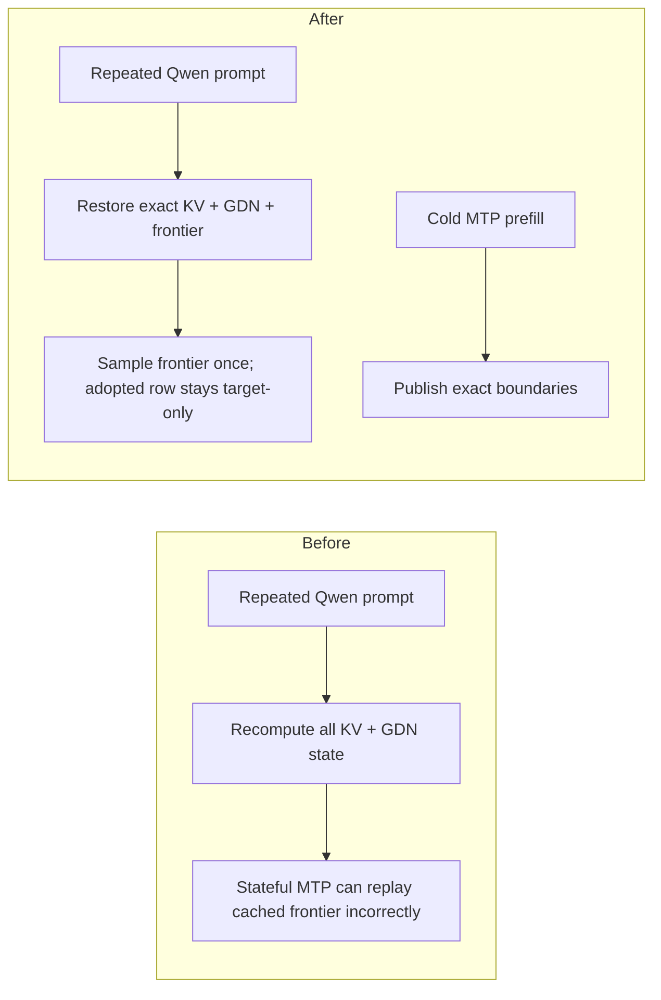
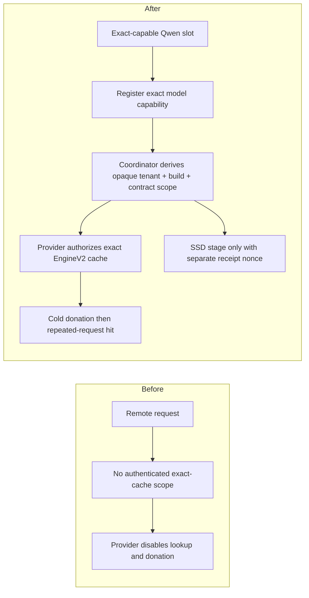

# 083 — Qwen exact prefix-cache PR handoff

Status: **implementation approved by both final reviews; publication requires
a collaborator because the bot cannot push the nested branch (GitHub 403)**

## Branches

### Nested `mlx-swift-lm`

```text
repository  Layr-Labs/mlx-swift-lm
base        main / ab73a827c9dde6f8802507003aa0be71605aab8e
branch      cursor/qwen-exact-prefix-cache-74d1
commit      15a88f6284757fde70d0a339e866501f90ceb644
tree        8c65c1eab7ecf57098dc9221d85cbebaf5c9a583
bundle      artifacts/qwen-exact-prefix-cache-15a88f6.bundle
bundle sha  a0d044d4d10a9589568f0125f794f887c3102e409d417a4814f10e5a8d74a522
```

The nested branch contains the exact durable cache plus default-off prompt
fork. It also closes the final review findings:

- cold stateful-MTP prefills donate exact boundaries;
- full exact hits sample their cached frontier without re-feeding the final
  prompt token, including mixed MTP plans;
- adopted rows remain target-only because an exact snapshot does not contain
  the request-stateful assistant's private history;
- a partial hit can upgrade a same-length block-only entry with frontier
  logits.

Initial rollout must leave prompt fork disabled.

### Root `d-inference`

```text
repository  Layr-Labs/d-inference
base        master / 545345e4fca1a327f584f5afd97656844427aa28
branch      cursor/qwen-prefix-cache-final-74d1
commit      23752bbfa08c1ebb88829cb9ac6d394dfe351867
tree        d94b7d238c7f6d1c9e6ce3531d89dcf6b41b3d6a
gitlink     15a88f6284757fde70d0a339e866501f90ceb644
patch       artifacts/qwen-prefix-root-23752bbf.patch.gz
patch sha   cb1486f5e8a774065b881c42d5f440150dc0e20fa30346e63a181ff618ff18e6
```

The root branch contains provider integration, authenticated coordinator scope
transport, privacy-safe telemetry/status, tests, and the gitlink update. It
excludes the autoresearch notes and rejected experiments. Provider serving
pins simultaneous prompt forking off explicitly; only sequential cache reuse
is deployable.

## Human publish sequence

The agent's nested push fails with:

```text
Permission to Layr-Labs/mlx-swift-lm.git denied to cursor[bot] (HTTP 403)
```

A collaborator can publish both bundles:

```bash
# 1. Nested repository
cd d-inference/libs/mlx-swift-lm
git fetch ../../research/qwen36-prefill/artifacts/qwen-exact-prefix-cache-15a88f6.bundle \
  cursor/qwen-exact-prefix-cache-74d1:cursor/qwen-exact-prefix-cache-74d1
git push -u origin cursor/qwen-exact-prefix-cache-74d1

# Open nested PR: cursor/qwen-exact-prefix-cache-74d1 -> main

# 2. Root repository (only after the nested commit is remotely fetchable)
cd ../..
git switch -c cursor/qwen-prefix-cache-final-74d1 master
gzip -dc research/qwen36-prefill/artifacts/qwen-prefix-root-23752bbf.patch.gz \
  | git am
git push -u origin cursor/qwen-prefix-cache-final-74d1

# Open root PR: cursor/qwen-prefix-cache-final-74d1 -> master
```

The root branch is already pushed, but the PR API rejected the bot as a
non-collaborator. A collaborator can open it from
`https://github.com/Layr-Labs/d-inference/compare/master...cursor/qwen-prefix-cache-final-74d1?expand=1`
after publishing the nested SHA.

## Final clean-tree validation

The Mac checkout used the final source tree and nested commit `15a88f6`:

- exact-cache engine regressions: **9 tests pass**;
- stateful-Qwen MTP regressions: **30 tests pass**;
- nested suite: **860 tests / 115 suites pass**;
- provider exact-cache policy regressions: **11 tests pass**;
- live encrypted remote-cache integration: **4 tests pass**, including a real
  hybrid `EngineV2` miss/donation followed by a hit without another prefill;
- provider suite: **2,171 tests / 225 suites pass**;
- release `darkbloom` build: pass at the remote-cache head; the final
  prompt-fork-only delta passed the full debug suite, while its redundant
  release rerun was blocked by the Mac test host going offline;
- coordinator `go test ./...`: pass;
- console UI: **57 files / 499 tests pass**, ESLint has zero errors.

A final 512-prompt real-model run on Qwen 3.6 produced 100% first/full-token
equality in all seven scenarios. Identical B1/B2/B4 warm hits measured
6.64x/10.60x/13.83x. That benchmark construction does not supply an MTP
drafter, so active cache+MTP coexistence is proven by the focused integration
suite; an installed-provider MTP canary remains a post-publication gate.

Walkthrough artifacts:

- `/opt/cursor/artifacts/qwen_prefix_cache_e56_validation.txt`
- `/opt/cursor/artifacts/qwen_prefix_cache_real_canary_e56_corrected.txt`
- `/opt/cursor/artifacts/qwen_prefix_cache_remote_e57_validation.txt`

## Required PR diagrams

Nested PR:



Root PR:



## Initial rollout posture

```bash
# Coordinator canary (human-operated; master key remains in Secret Manager)
EIGENINFERENCE_CACHE_ROUTING_MODE=on
EIGENINFERENCE_CACHE_ROUTING_PERCENT=1

# Qwen provider canary
DARKBLOOM_EXACT_PREFIX_CACHE=1
DARKBLOOM_EXACT_PREFIX_CACHE_MAX_BYTES=2147483648
DARKBLOOM_EXACT_PREFIX_CACHE_MAX_FRACTION=0.125
```

Provider serving ignores `DARKBLOOM_CBV2_PROMPT_FORK` and pins simultaneous
prompt forking off.

The profile is default-off, Qwen-capability-gated, contiguous-backend-only,
tenant-scoped, model/prompt/policy-identity-bound, and charges resident plus
in-flight donation bytes to one hard carve. The opaque HMAC scope is stable
across providers for the same tenant/model/build/contract, so providers can
correlate equality of that opaque value; it does not expose the account
identity or prompt content.

Measured tradeoff:

- 75%/87.5% exact-prefix TTFT: 2.629x / 5.076x versus native;
- canonical/native blind quality: 99.56%;
- cache-enabled cold misses: ~1.5x slower;
- cache-free engines: unchanged.

Roll out to a small Qwen-only cohort and retain only where exact-prefix hit
rate covers the cold-miss tax.
