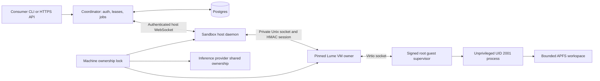

# Darkbloom macOS sandbox runtime

This package implements Darkbloom's opt-in macOS CPU sandbox service. The
coordinator owns account access, durable leases, idempotent operations and
command history. A separate signed host daemon owns VM admission and cleanup;
it does not link MLX or the inference engine. Tenant programs run as fixed
unregistered numeric UID/GID 2001 inside a dedicated macOS VM.



The current supported profile is `isolated-v1`: CPU jobs, exact argv execution,
bounded stdout/stderr, cancellation, fixed 25/50 GiB workspaces, resumable uploads
and revision-bound downloads. Each VM has its own boot disk and credential.
The device profile has no IP network interface, shared host folders, clipboard,
audio or input devices. Dependency installation therefore uses uploaded files;
there is no package-download gateway or GPU capability in this profile.

The CPU profile never creates a tenant user or group record. Startup and each
execution require successful password/group database lookups proving UID/GID
2001 remain absent; resolver errors and occupied IDs reject work. Privilege
dropping and workspace ownership use kernel numeric credentials. Apple's
`crontab` and `at` require a resolvable user before accepting submissions, so
the supervisor does not modify protected scheduler spools or unload system
schedulers. Launchd-domain cleanup and tenant-process checks remain required.
These checks are specific controls, not a claim that every OS service or
delegated queue has been cancelled; the dedicated VM remains the outer boundary.

Account-dependent software is not assumed compatible. `whoami`, passwd/group
lookups, SSH clients and Node's `os.userInfo()` may fail without a registered
account; Python's `pwd` lookup likewise has no tenant record. `HOME=/workspace`
and `TMPDIR=/workspace/.tmp` support ordinary file-based tools but do not create
a username. Actual required build tools must pass guest acceptance tests before
a release is declared ready; username-dependent workflows need explicit product
support rather than registering an account behind this policy.

The guest root supervisor authenticates the host session over Virtio sockets,
drops user/group privileges irreversibly for tenant commands, and verifies
cleanup before admitting further work. Uncertain command/file termination stops
the VM while retaining its lease and workspace. Explicit `start` rotates the
fencing token and verifies authenticated guest readiness before reporting ready;
it preserves the lease deadline and storage. A queued stop from the previous
run cannot stop the resumed VM. Deletion first persists an identity-bound intent,
then stops the VM, removes its private files and command journal, durably releases
capacity, and clears the intent. Startup/expiry reconciliation resumes incomplete
cleanup, including a crash after capacity release.

Service enablement and admission are separate coordinator switches, both off by
default. Account allowlisting and a qualified host are required for new work.
Closing admission keeps owner inspection, cancellation, stop and deletion
available while the service remains enabled. The host starts in durable draining
mode and never silently clears an operator's drain. Inference holds shared
machine ownership through engine cleanup; the sandbox daemon and actual VM
process retain exclusive ownership, including when the daemon dies.

Transport uses HTTPS/WSS and an authenticated private host/guest channel.
The coordinator and host process command contents and file bytes. This sandbox
service does not inherit inference's confidential-computing privacy claim.
Raw VM/control/workspace files require verified FileVault-encrypted APFS backing.
The separate artifact encryption library below is not integrated into VM
snapshots, restore, or per-VM cryptographic erasure.

**Readiness remains conditional on physical acceptance.** Unit tests and signed
builds do not prove guest boot, actual device isolation, quota exhaustion,
post-crash cleanup or two-VM performance. The signed guest installation replaces
the known `lume` bootstrap identity before a base receives its qualification
receipt. Development SSH execution is restricted to base-image preparation and
opt-in tests; it is never the tenant execution channel. See
[release and physical validation](Resources/RELEASE_VALIDATION.md),
[consumer CLI](../docs/consumer/sandbox-cli.md), and
[API contract](../docs/reference/sandbox-api.md).

The development bootstrap executor captures stdout and stderr independently,
drains both streams without retaining unbounded data, and returns at most 1 MiB
per stream in a versioned result envelope with explicit truncation flags. Host
child processes also start with close-on-exec-by-default descriptor isolation.
Managed-process release starts a detached bounded cooperative, `SIGTERM`, then
`SIGKILL` shutdown and retains its execution authority until the child exits.
The reaper observes direct-child exit without reaping, disables concurrent
signals under the same lock, cleans the reserved process group, and only then
reaps the leader, so PID/PGID reuse cannot redirect a later signal.

Artifact authentication binds sandbox generation, disk role, and a random
per-encryption revision ID, so chunks from separate revisions cannot be spliced.
It does not establish which of two complete, valid ciphertext revisions is
newest. Cached-image restore therefore remains disabled until the
coordinator-backed artifact manifest supplies and verifies a monotonic revision.

Storage destinations must be inside an extended-ACL-free `0700` directory
owned by the daemon's dedicated Unix identity. Staging and committed files are
also rejected if they carry extended ACL entries. The codec writes to an
unlinked file descriptor and publishes it with APFS `fclonefileat`, so there is
no temporary pathname to replace and an existing destination is never
overwritten. A post-clone sync failure is reported as `publicationUncertain`:
the destination may exist and must be reconciled, never blindly deleted.
Wrapped-key envelopes additionally require exactly one hard link and no
extended ACL before and after descriptor-bound reads.
Filesystem permissions are not a security boundary against another hostile
process running as that same Unix identity; production launchd packaging must
reserve the identity for the sandbox broker.

## Build and test

The package requires Apple Silicon macOS 14 or newer with a full Xcode
toolchain.

```bash
swift build --package-path sandbox-macos
swift test --package-path sandbox-macos
```

The Apple restore-catalog test is opt-in because it makes a live network
request. SwiftPM does not attach custom entitlements to its XCTest runner, so
the test ad-hoc signs the package's debug daemon with
`com.apple.security.virtualization` and executes the real
`VZMacOSRestoreImage.fetchLatestSupported` path in that entitled process:

```bash
DARKBLOOM_SANDBOX_LIVE_RESTORE=1 swift test \
  --package-path sandbox-macos \
  --filter SandboxRuntimeVZTests
```

## Host proof

Sign the debug executable with the sandbox entitlements before running the
strict host check:

```bash
bin_path="$(swift build --package-path sandbox-macos --show-bin-path)"
codesign --force --sign - \
  --entitlements sandbox-macos/Resources/DarkbloomSandboxDevelopment.entitlements \
  "$bin_path/darkbloom-sandboxd"
"$bin_path/darkbloom-sandboxd" doctor --json
"$bin_path/darkbloom-sandboxd" restore-image latest --json
```

The development entitlement grants Virtualization.framework access only.
`DarkbloomSandbox.entitlements` is the production profile input and additionally
names the provisioned keychain access group; macOS kills an ad-hoc binary that
claims that provisioned group.

`--development-unsigned` downgrades only the missing virtualization entitlement
to a warning. It does not bypass architecture, hypervisor, capacity, Aqua, or
Secure Enclave checks.

Production persistence uses the dedicated
`SLDQ2GJ6TL.io.darkbloom.sandbox` keychain access group. Ad-hoc signatures can
exercise transient Secure Enclave cryptography but cannot prove production
keychain persistence; that path must be verified with the provisioned release
identity.

## Host capacity and inference coexistence

`SandboxHostCapacityArbiter` stores a host mode and crash-durable leases under a
caller-owned, extended-ACL-free `0700` directory. Authority paths are opened
component by component without following symlinks; state and lock files must be
private, single-link regular files and are revalidated through their open
descriptors. State replacement is synchronized in file-before-directory order,
and a post-rename directory-sync failure is reported as an uncertain
publication rather than a clean failure. The broker must quarantine the host
and reconcile durable state before accepting another mutation; a matching
immediate read proves visibility, not reboot durability. Lume operation locks,
VM ownership
markers, workspace configuration, provenance, and guest-command journals apply
the same owner, mode, ACL, hard-link, and ancestor-path checks. Staged ownership,
configuration, commitment, and result bytes are unlinked before writing and
published from their descriptors. These controls assume the production broker
runs under a dedicated Unix identity; processes with that exact credential can
change owner-controlled mode and file flags, so sharing the broker identity
with tenant jobs is prohibited.

The state machine requires
`inference -> draining -> sandbox_dedicated` before accepting sandbox work, and
requires all leases to be released before returning to inference mode. Every
reservation receives a monotonically increasing fencing token. A bounded,
durable per-sandbox generation high-water mark survives release and restart;
equal or older generations fail closed instead of reclaiming prior authority.
Capacity state also binds the canonical runtime storage path, directory inode,
and device. Version 4 additionally persists the complete effective admission
policy and a compare-and-swap revision. Version 3 is atomically migrated into
`draining` quarantine with the startup policy durably bound; a crash before
publication leaves version 3 to retry, while an uncertain post-rename
publication remains draining. All pre-v3 state is rejected because neither
complete released generation history nor the runtime storage identity can be
reconstructed.
The alpha history admits 4,096 distinct sandbox IDs and then fails closed.
Resetting that history is safe only during host reprovisioning after the broker
is stopped, the host is drained, and every VM/artifact on the bound storage
directory has been destroyed; deleting capacity state alone is unsafe.
Retries are idempotent only when sandbox generation, VM name, CPU, memory,
workspace reservation, boot disk, and reserved growth charge match.
`LumeLeaseFencedVirtualMachineRuntime` is the public workload mutation surface:
create, start, inspect, stop, and release carry the complete operation scope.
The OpenSSH-backed `execute` path and its enabling base-image/development
bootstrap policy are package-scoped; public configuration always disables
guest commands.
Release stops and verifies the owned VM, durably records its deletion intent,
and removes the exact owned directory before its package-internal capacity
release. The VM-operation and lease-operation locks remain held through the
capacity-state commit. A pending deletion blocks new execution even after a
crash; callers cannot remove capacity directly. The
underlying Lume actor is package-only, validates the scope before creating a
per-VM operation lock and again while holding it, and binds create
authorization to the reserved CPU, memory, workspace, and boot-disk bytes.
Every listed workload is also checked against one three-way resource
commitment: capacity lease, ownership marker, and observed Lume CPU, memory,
and disk must agree before inspect, start, execute, stop, release, delete, or
expiry cleanup can succeed. Missing or drifting values fail closed and retain
capacity. Mutations use a deterministic fixed set of 64 inter-process
lease-lock slots, so attacker-selected identifiers cannot grow authority
storage without bound. Inspection authorizes immediately before and after its
VM-locked Lume observation, so renewal and release do not wait on external I/O
and any observation made under a rotated or released token is discarded.
Host drain blocks create, start, execute, and renewal. Existing owners may still
inspect their VM, download files, inspect uploads, or abort uploads until the
lease expires; expired or stale scopes cannot read. Stop and delete retain
cleanup authority after expiry. Public release and expiry stop and destroy the
ephemeral VM, including its isolated command journal, before releasing capacity.
Deletion first persists the stopped installation and directory identity outside
the VM tree, so an interrupted recursive deletion can resume without allowing
new commands or erasing a replacement directory.
Each workload VM also carries a fail-closed ownership marker binding its
installation to the sandbox ID and generation plus its CPU, memory, disk, and
image source. Renewed fencing tokens retain access to that same generation, but
a later generation cannot reuse its VM or disks. Base templates use a distinct
marker role, and clones commit the source template installation ID; workload
VMs cannot be used as clone templates. Legacy unscoped markers are rejected and
must be rebuilt rather than inferred.

The alpha policy admits exactly two running sandboxes, fixes the sparse macOS
boot disk at 100 GiB, and reserves each clone's worst-case boot-disk CoW growth,
25/50 GiB workspace, and 1 GiB host overhead. Aggregate CPU, memory, and growth
admission runs under an inter-process `flock` on the already-bound state
directory inode. Policy initialization and adoption acquire all lease slots in
ascending order before the state-directory lock, then atomically persist CPU,
memory, growth, storage-headroom, lease-duration, and sandbox-count limits.
Every reservation and renewal uses those durable limits rather than its
process-local startup configuration. A reduction that no longer covers durable
leases moves the host to `draining` before adoption returns. This waits for
in-flight mutations, rejects new work and renewals, and preserves stop/delete
authority. Widening is rejected by default and requires an explicit adoption
against the current durable policy revision; it never clears an existing
drain. Admission can resume only after all leases are cleaned up and an
operator explicitly returns the empty host to `sandbox_dedicated`.
The doctor's 300 GiB free-space floor qualifies a host for initial provisioning.
Service startup reports low or unavailable free space on the configured VM
storage volume as a warning so that expired VM cleanup can still run. Reopening
capacity under low space drains the host and preserves existing leases; every
new reservation still requires the live storage capacity check below.
Reservation and VM creation both require the configured
storage directory's live descriptor-bound filesystem capacity to cover all
reserved growth plus operator-configured headroom. Every fenced operation
revalidates that the configured path still resolves to the persisted directory
identity. This host reservation is not yet a guest-visible disk quota;
production quota enforcement still requires the signed guest-control agent and
a separately bounded workspace volume. Expiry reconciliation first persists a
new fencing token, then stops and verifies the owned VM before releasing that
exact token. A missing VM, replaced storage path, stop failure, or ownership
failure retains the fenced lease for retry or host quarantine, preventing a
stalled control plane from overbooking a host whose guest may still be running.
The pinned runtime treats a wedged or ambiguous run-lock probe as `unknown`,
never `stopped`. Each active-session marker durably binds the exact
`config.json` and `.run-owner.lock` device/inode pair to the owning process's
kernel-reported birth time before virtualization starts. Status keeps those
descriptors and any acquired proof locks through marker classification, never
deletes lifecycle authority, and reports `running` only after the framework
start succeeds; `starting` and `stopping` remain fail-closed states. A
same-process stop uses the in-memory virtualization service. Before spawning
`lume run`, the broker creates a private socketpair and gives the child one
endpoint. Closing the broker endpoint requests same-process `VM.stop`; EOF is
sticky even if the broker dies before the child begins monitoring, acquires run
locks, or publishes its marker. EOF also arms a non-MainActor 15-second
fail-stop watchdog before registration; production calls `_exit` if startup,
MainActor dispatch, or stop remains wedged. Only proof that registration never
occurred or completed terminal cleanup cancels that watchdog. The owner exits
normally only after the virtualization service reaches a terminal state and
clears the marker while still holding the run locks. `F_GETLK` PIDs remain
observations, never control capabilities, so a foreign owner or failed
cooperative stop remains inconclusive and keeps capacity reserved.
SIGTERM/SIGKILL are bounded emergency fallbacks and do not authorize release
without an independently observed stopped state.
The broker also fsyncs a one-per-VM start intent, bound to the ownership
installation, sandbox generation, and inherited lifecycle capability contract,
before spawning `lume run`. A restarted reconciler may clear that intent only
after stopped proof; unknown or owned states retain capacity.
Legacy markers, replaced inodes, reused PIDs, missing owner locks, and ambiguous
probes likewise retain capacity. Terminal cleanup clears the marker only while
holding the original run locks; if emergency framework stop fails, the
single-VM owner process exits instead of unwinding those locks around a live
guest. The proof never uses `lsof` opener lists or replaces `config.json`.

## Pinned Lume substrate

`ThirdParty/lume.lock.json` pins the exact Cua source commit, expected version,
and the ordered SHA-256 list of every Darkbloom patch. Build it without a
background service:

```bash
sandbox-macos/Scripts/build-pinned-lume.sh \
  "$HOME/.local/libexec/darkbloom-sandbox/lume/bin"
```

The build verifies and applies every pinned patch before compilation, then writes
`lume.provenance.json` beside the executable with the source commit, patch
digests, and post-signing SHA-256 for every runtime file. It signs that canonical
manifest separately as `io.darkbloom.sandbox.lume.provenance`, binding all
resource bytes to the release identity instead of trusting a self-authenticated
digest list. Production validation requires Apple-designated requirements for
both the executable and manifest under team `SLDQ2GJ6TL`; the
`--development-ad-hoc-lume` daemon flag is an explicit local-only bypass.
Publication first clears an inherited ACL, through its descriptor, from only
the newly created empty staging envelope. Sealing rejects ACL-bearing
descendants and multi-link regular files before mutating those inodes; it never
recursively repairs ACLs. The private staging envelope stays at `0700`. Darwin
permits filesystem-specific `EACCES` when renaming a write-disabled directory,
so publication uses fd-relative `renameatx_np(RENAME_EXCL)` before sealing the
final root to `0555`. The destination is never replaced, and the executable is
first launched from its stable final path. A post-rename failure retains and
reports the ambiguous destination. A pre-publication failure never deletes its
staging tree automatically. The helper opens and verifies the expected staging
inode, atomically moves the current parent entry with the same no-replace
syscall to a cryptographically unique `.darkbloom-lume-quarantine.*` name in
that parent, then verifies that name against the still-open descriptor. It
reports the quarantine path and retains the complete tree for inspection and
offline reclamation. A namespace replacement that wins before the rename is
also retained, causes verification to report ambiguity, and triggers no
recursive unlink or `rmdir`. Successful publication has no quarantine; a
missing staging name after a committed rename is a no-op and never targets the
destination. Neither initialization nor quarantine edits caller-owned parent
ACLs or modes.
Before executing Lume, the adapter requires the complete immutable directory
tree and provenance to match the audited lock; it rejects added, removed,
replaced, or modified runtime entries. The production installation must be
recursively root-owned and non-writable by the dedicated broker identity; the
validator rejects broker-owned production files even when their modes are
read-only. The operator must apply `chown -R root:wheel` after installing the
signed tree. Every invocation sets
`LUME_TELEMETRY_ENABLED=false` and `LUME_LOG_LEVEL=error`; the latter prevents
Lume informational diagnostics from corrupting its machine-readable JSON
output. Moving the pin requires source review plus the opt-in real-binary and VM
lifecycle tests.

Guest-command idempotency is enforced on the host, outside the guest's trust
boundary. Before launching a command, the runtime durably commits its VM
installation ID, idempotency key, and canonical request digest. Isolated journals
live inside the owned VM directory and are destroyed with that VM. A completed
result is replayed without a second execution. Reusing a key for different input,
or retrying a claim whose outcome was not durably recorded, fails closed.

Each VM installation admits at most 256 distinct command IDs across broker
restarts, VM stops/starts, and lease renewals. A new ID at that limit fails with
`command_limit_reached` before guest execution; the VM and lease remain usable
for files, cleanup, and historical command replay. Every accepted ID remains
reserved even when its command failed or its outcome is unavailable. Existing
journals above the limit still replay accepted results and reject new IDs. No
entry is evicted to make room; use a new sandbox for additional commands.

The storage bound uses the maximum permitted serialized result (2,797,232 bytes,
including base64 expansion), plus 64 KiB per command for allocation and metadata.
All 256 claims account for 732,868,608 bytes. Adding the 128 MiB control disk and
128 MiB safety allowance totals 1,001,304,064 bytes, within the existing 1 GiB
per-sandbox overhead reservation. The limit derives from those constants and
cannot exceed 256. Admission enumerates at most 256 existing entries under the
VM lock; incomplete claims consume slots, and recovery never trusts a separate
cached counter.

The default build is ad-hoc signed for local testing. A production build must
have the Darkbloom Developer ID identity installed and select it explicitly:

```bash
DARKBLOOM_LUME_CODESIGN_IDENTITY='Developer ID Application: Eigen Labs, Inc. (SLDQ2GJ6TL)' \
  sandbox-macos/Scripts/build-pinned-lume.sh /absolute/install/path
```

Run the focused publication contract without building Lume:

```bash
/bin/bash sandbox-macos/Scripts/run-lume-publication-contract-tests.sh
```

```bash
DARKBLOOM_SANDBOX_LUME_PATH=/absolute/path/to/lume \
  swift test --package-path sandbox-macos \
  --filter LumeRuntimeContractTests
```

Prepare and verify a stopped Tahoe base image through the production adapter:

```bash
darkbloom-sandboxd prepare-base \
  --lume /absolute/path/to/lume \
  --storage /absolute/path/to/vms \
  --ipsw /absolute/path/to/tahoe.ipsw \
  --name darkbloom-phase0-base \
  --json
```

The command installs macOS, applies Lume's no-secrets-alpha unattended preset,
boots the guest without VNC, and waits until a bounded, NIO-only,
launchd-supervised no-op returns a valid development proof envelope. It then
reads the guest OS and architecture and leaves the base stopped. The opt-in live
suite can clone and run exactly two guests concurrently, prove their filesystems
are isolated, and leave both clones stopped:

Run crash-retryable expiry cleanup as the dedicated broker identity. The command
returns exit status 75 if any lease remains fenced because stop, ownership, or
durability verification failed:

```bash
darkbloom-sandboxd reconcile-expired \
  --lume /absolute/path/to/lume \
  --storage /absolute/path/to/vms \
  --capacity-dir /absolute/path/to/capacity \
  --max-cpu 12 \
  --max-memory-gib 32 \
  --max-growth-gib 320 \
  --storage-headroom-gib 20 \
  --json
```

```bash
DARKBLOOM_SANDBOX_LIVE_VM=1 \
DARKBLOOM_SANDBOX_LIVE_TWO_VMS=1 \
DARKBLOOM_SANDBOX_LUME_PATH=/absolute/path/to/lume \
DARKBLOOM_SANDBOX_IPSW_PATH=/absolute/path/to/tahoe.ipsw \
DARKBLOOM_SANDBOX_VM_STORAGE=/absolute/path/to/vms \
  swift test --package-path sandbox-macos \
  --filter LumeRuntimeContractTests
```
